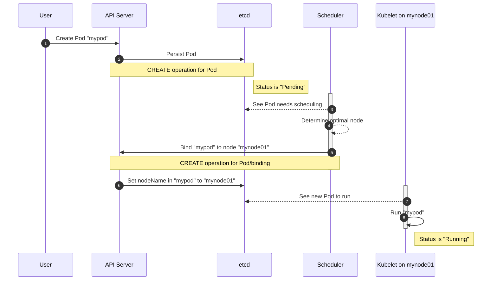

If you're running Kubernetes in production, especially in a public cloud, where a single cluster may span multiple availability zones, chances are you're configuring workloads with some awareness of your topology. Kubernetes has a few mechanisms to support zone awareness, but one common use case is how to propagate certain Node metadata, such as labels or annotations, to Pods to assist with this awareness. In this blog, we'll go into specifics of how Pod scheduling **really** works and share some tips for how Kyverno can mutate Pods to add Node metadata like labels. Even if you're not a Kyverno user, you'll most likely learn something you didn't know about Kubernetes.

When deploying Pod controllers with multiple replicas to a single cluster which has Nodes in different geographical areas, high-level organizations like "zones" or "availability zones" are important failure domains. You typically want to spread those replicas out amongst those zones so failure of any one does not take out the application. Kubernetes already has several methods for working with topologies like zones including [spread constraints](https://kubernetes.io/docs/concepts/scheduling-eviction/topology-spread-constraints/) with some [very recent enhancements in beta](https://kubernetes.io/blog/2023/04/17/fine-grained-pod-topology-spread-features-beta/). The label `topology.kubernetes.io/zone` is a [common Kubernetes label](https://kubernetes.io/docs/reference/labels-annotations-taints/#topologykubernetesiozone) to denote zone information for Nodes. This can be set automatically when using cloud provider integration or manually, for example when running on-premises and building your own concept of zones.

Having the Node's zone information available to the Pods running on it can be important, for example so Pods only respond to requests from that same zone and avoid making cross-region calls which can result in potentially expensive egress charges. And zone information aside, there can be a whole host of other information about the Node that a Pod would like to receive such as governance labels you apply, custom annotations, etc. The challenge is how to get this information because you don't know on what Node a Pod will be scheduled.

[Mutation](/docs/policy_types/cluster_policy//mutate.md) of Pods is no great feat and Kyverno was one of the first admission controllers to offer it. Making calls to the Kubernetes API server is also well known and [Kyverno does that too](/docs/policy_types/cluster_policy/external-data-sources.md). But, as those who have tried this before and failed, you don't know _what_ to ask for when you make that call. This is because the Kubernetes scheduler is the one to make the decision on which Node will receive the Pod. And understanding how and where the scheduler fits into the Pod lifecycle is both nuanced and not well documented, even in the official docs. So, without further ado, we'd like to present the complete(r) guide to how Pod scheduling actually works because this will be critical in understanding both why this is problematic and how you can do it with Kyverno. Pay attention to the step numbers on the sequence diagram as we'll reference these in the further discussion.

## Pod Scheduling in Kubernetes

Thanks to the magic of [Mermaid](https://mermaid.js.org/) for enabling a diagram like this written out of pure Markdown!

{}
This diagram shows connections to etcd from multiple components for ease of explanation when referring to persisting of fetching something. In actuality, etcd only has a single client: the API server.
{}



Ok, with this sequence diagram above, let's break this down. Refer to the step numbers for the matching description.

1. A user sends a request to create a Pod called "mypod". The assumption here is they are not statically defining which Node should be used via `spec.nodeName`.
2. The API server receives this request and performs a CREATE operation on a Pod. This gets persisted to etcd. Importantly, when this happens, the Node is NOT yet known since the scheduler hasn't kicked in. When it creates this Pod in etcd, the status is listed as "Pending".
3. Now the scheduler enters the picture. It sees there is a Pod which has been persisted but hasn't been scheduled so it leaps into action.
4. Using its (very sophisticated) internal logic, it determines the optimal Node. In this case, it selected "mynode01".
5. Once the target Node has been selected, it performs the binding. How it does this is by performing another CREATE but this time for a subresource called Pod/binding. We'll talk more about this soon. This binding is nothing more than an instruction to the API server which says "bind mypod to Node mynode01."
6. The API server receives this Pod/binding and reacts by setting the `spec.nodeName` field in `mypod` (which was persisted in step 2) to `mynode01`. Very importantly, when it does this it DOES NOT result in any sort of UPDATE operation. It's more or less "transparent".
7. Kubelet running on mynode01 is looking solely for Pods which have been assigned to it. It sees a new Pod pop up on its radar.
8. Kubelet then runs the Pod by pulling the container images and starting everything up. Only now is when the status for that Pod enters the "Running" phase.

Note that in the above description and diagram, the CREATE and UPDATE operations refer to the context where admission controllers, like Kyverno, participate and not the actual verbs from an RBAC perspective.

## Pod Bindings

If you refer back to step 5 you'll notice the binding event. In this step, the scheduler informs the API server which Node should run the Pod. It does this by what are called [subresources](https://kubernetes.io/docs/reference/using-api/api-concepts/) to a Pod. A subresource is essentially a way to "carve" out sections of a parent resource in order to control RBAC. For example `/status` and `/exec` are well-known other subresources to Pods. These control specific areas of a Pod, for example the `.status` object and Pod exec operations, respectively. A `/binding` is a similar albeit lesser-known subresource only sent by the scheduler.

Here's an example binding taken from a K3d (K3s) cluster. Notice here that the Pod definition is absent. The meat of this subresource is under `object.target` which is where the scheduler defines the kind of resource (`Node` in this case) and the name of that resource (`k3d-kyv1111-server-0` as shown here).

```yaml
uid: 21fb3d8e-b9c9-42fe-a987-d4374e74a084
kind:
  group: ""
  version: v1
  kind: Binding
resource:
  group: ""
  version: v1
  resource: pods
subResource: binding
requestKind:
  group: ""
  version: v1
  kind: Binding
requestResource:
  group: ""
  version: v1
  resource: pods
requestSubResource: binding
name: busybox
namespace: default
operation: CREATE
userInfo:
  username: system:kube-scheduler
  groups:
    - system:authenticated
roles:
  - kube-system:extension-apiserver-authentication-reader
  - kube-system:system::leader-locking-kube-scheduler
clusterRoles:
  - system:basic-user
  - system:discovery
  - system:kube-scheduler
  - system:public-info-viewer
  - system:volume-scheduler
object:
  apiVersion: v1
  kind: Binding
  metadata:
    creationTimestamp: null
    managedFields:
      - apiVersion: v1
        fieldsType: FieldsV1
        fieldsV1:
          f:target: {}
        manager: k3s
        operation: Update
        subresource: binding
        time: "2024-02-18T14:36:37Z"
    name: busybox
    namespace: default
    uid: fceccee4-4821-408a-b75b-44262392b93c
  target:
    kind: Node
    name: k3d-kyv1111-server-0
oldObject: null
dryRun: false
options:
  apiVersion: meta.k8s.io/v1
  kind: CreateOptions
```

Fortunately, these Pod/binding subresources can be sent to admission controllers like Kyverno. So now we have the Pod persisted, we can observe the binding which contains the Node name, then we can make a call to the API server to get information on that Node. Grand!

Not so fast. Before you click close on this blog, keep reading. It's a little more complex.

## Using Node Info in Pods

We know what we want and we know approximately how to get it now that bindings have been introduced. But how and where you use the Node information in a Pod matters when it comes to supplying it.

Typically, use cases which involve fetching Node information and presenting it to Pods require that the container(s) in the Pod know about it. Informing containers in Pods of Pod metadata is usually done using the [downward API](https://kubernetes.io/docs/concepts/workloads/pods/downward-api/). In Kubernetes, the downward API is used to present information about the Pod and/or its surroundings to the containers within it. It can do this in two primary ways: environment variables and volumes. Using either, the containers now understand their environment without them having to go and figure it out on their own. This is a boon because it's simpler for the app and it's more secure. It's also the only way, in many cases, to provide this sort of orientation to containers.

For example, you can use the downward API to tell a Pod's containers about the name of the Pod in which they are running with an environment variable named `POD_NAME`.

```yaml
  env:
    - name: POD_NAME
      valueFrom:
        fieldRef:
          fieldPath: metadata.name
```

And you could do the same thing with a volume and its mount.

```yaml
  volumes:
    - name: podname
      downwardAPI:
        items:
          - path: podname
            fieldRef:
              fieldPath: metadata.name
```

```yaml
    volumeMounts:
      - name: podname
        mountPath: /etc/podinfo
```

In the case of the former, the containers will get an environment variable `POD_NAME=mypod` and in the latter will have a file available at `/etc/podinfo/podname` which contains the word `mypod`.

But here's another important nuance which will be highlighted in the next section:  which way you choose to consume this information can matter when fetching it from Nodes.

Once Kubelet launches containers, providing this information later does nothing and it won't be available because the container has already started. When it comes to environment variables, these need to be defined before Kubelet begins its routine. Volumes are a bit less forgiving, especially for lengthier container pulls as it takes the Kubelet a little bit longer to establish all the connections. Keep this in mind because it matters whether or not you'll be successful in mutating those Pods.

## Mutations

Now comes the part you've been waiting for. We had to tee this section up in order for you to get the full picture. Let's talk about finally performing the mutations. Make sure you've fully read and understood the previous sections or this will be confusing.

When assigning Node metadata to Pods in Kyverno, you have a couple different options. What exactly you want to use that Node information for in the Pod determines which method you'll need.

### Mutating Bindings

The first and arguably "best" option for slapping Node info on Pods is to mutate the Pod/binding subresource directly. If you refer back to the scheduling sequence diagram [above](#pod-scheduling-in-kubernetes), you'll see that we mentioned these Pod/binding subresources are sent to admission controllers. Also recall from the example binding that this does NOT contain the full Pod representation. It's really an entirely different thing. There is only one type of mutation that matters in this context you can perform on a binding and that is to write annotations.

Kubernetes has a "secret" function called [`setPodHostAndAnnotations()`](https://github.com/kubernetes/kubernetes/blob/release-1.28/pkg/registry/core/pod/storage/storage.go#L202-L252) which will take any annotations on a binding and transfer them to the parent Pod resource. This only works for annotations which is why if you've tried to set labels you've found they just get dropped. If you are going to consume Node information via the downward API, either as an environment variable or volume, this is the recommended way on going about it since it's the most reliable and the annotation is guaranteed to be written before the Pod is started.

The sample policy is available [here](/policies/other/mutate-pod-binding/mutate-pod-binding/) and is shown below but updated with modifications to show assignment of the `topology.kubernetes.io/zone` annotation. This works since Kyverno 1.10.

```yaml
apiVersion: kyverno.io/v2beta1
kind: ClusterPolicy
metadata:
  name: mutate-pod-binding
  annotations:
    pod-policies.kyverno.io/autogen-controllers: none
    policies.kyverno.io/title: Mutate Pod Binding
    policies.kyverno.io/category: Other
    policies.kyverno.io/subject: Pod
    kyverno.io/kyverno-version: 1.10.0
    policies.kyverno.io/minversion: 1.10.0
    kyverno.io/kubernetes-version: "1.26"
spec:
  background: false
  rules:
    - name: project-foo
      match:
        any:
        - resources:
            kinds:
            - Pod/binding
      context:
      - name: node
        variable:
          jmesPath: request.object.target.name
          default: ''
      - name: zone
        apiCall:
          urlPath: "/api/v1/nodes/{{node}}"
          jmesPath: "metadata.labels.\"topology.kubernetes.io/zone\" || 'empty'"
      mutate:
        patchStrategicMerge:
          metadata:
            annotations:
              topology.kubernetes.io/zone: "{{ zone }}"
```

{}
Kyverno by default ignores requests for Pod/binding because these can create much noise and are generally not useful except in corner cases like this one. You will need to remove the two resource filters `[Binding,*,*]` and `[Pod/binding,*,*]` in Kyverno's ConfigMap to be able to mutate Pod bindings. Because this will involve more processing by Kyverno, you really should try and scope the match down as far as possible. See the docs [here](../../../docs/installation/customization.md#resource-filters) for more.
{}

#### Demo

Let's demonstrate this in action. For this, we'll use a simple K3d cluster with 3 nodes where one is control plane and the other two are worker nodes. Each of the two workers are in separate availability zones (abbreviated output of labels).

```sh
$ kubectl get no --show-labels
NAME                 STATUS   ROLES                  AGE     VERSION        LABELS
k3d-kyv11-server-0   Ready    control-plane,master   3h27m   v1.27.4+k3s1   
k3d-worker01-0       Ready    <none>                 13m     v1.27.4+k3s1   topology.kubernetes.io/zone=us-east-2a
k3d-worker02-0       Ready    <none>                 13m     v1.27.4+k3s1   topology.kubernetes.io/zone=us-east-2b
```

Remove the resource filters as described previously and install the ClusterPolicy.

Let's now create a Deployment of `busybox` with 4 replicas. We'll use some nodeAffinity here to ensure all four Pods land on one of the two worker nodes.

```yaml
apiVersion: apps/v1
kind: Deployment
metadata:
  name: busybox
  labels:
    app: busybox
spec:
  replicas: 4
  selector:
    matchLabels:
      app: busybox
  template:
    metadata:
      labels:
        app: busybox
    spec:
      automountServiceAccountToken: false
      containers:
      - image: busybox:latest
        name: busybox
        command:
        - env
        env:
        - name: ZONE
          valueFrom:
            fieldRef:
              fieldPath: metadata.annotations['topology.kubernetes.io/zone']
      affinity:
        nodeAffinity:
          requiredDuringSchedulingIgnoredDuringExecution:
            nodeSelectorTerms:
            - matchExpressions:
              - key: topology.kubernetes.io/zone
                operator: Exists
```

Once this is created, we expect Kyverno to mutate the Pod/binding resource to add the `topology.kubernetes.io/zone` annotation to each Pod (not to the parent Deployment since we disabled [rule auto-gen](/docs/policy_types/cluster_policy/autogen.md)). We're running the `env` program to simply write out all the environment variables. So we expect the Pods to be in a "Completed" state where we can inspect the logs and hopefully see the `ZONE` environment variable has been set with the value equaling the value of the `topology.kubernetes.io/zone` label on the parent Node.

Create the Deployment and let's check the Pods. You can see two got scheduled on each worker.

```sh
$ kubectl get po -o wide
NAME                       READY   STATUS      RESTARTS     AGE    IP           NODE                 NOMINATED NODE   READINESS GATES
busybox-6b869bf945-5hcn6   0/1     Completed   1 (3s ago)   4s     10.42.2.6    k3d-worker02-0       <none>           <none>
busybox-6b869bf945-bcbxv   0/1     Completed   1 (3s ago)   4s     10.42.2.5    k3d-worker02-0       <none>           <none>
busybox-6b869bf945-nb8sc   0/1     Completed   0            4s     10.42.1.4    k3d-worker01-0       <none>           <none>
busybox-6b869bf945-zvg2m   0/1     Completed   0            4s     10.42.1.5    k3d-worker01-0       <none>           <none>
```

Get the logs for one of the Pods on worker01.

```sh
$ kubectl logs busybox-6b869bf945-nb8sc
PATH=/usr/local/sbin:/usr/local/bin:/usr/sbin:/usr/bin:/sbin:/bin
HOSTNAME=busybox-6b869bf945-nb8sc
ZONE=us-east-2a
KUBERNETES_SERVICE_PORT=443
KUBERNETES_SERVICE_PORT_HTTPS=443
KUBERNETES_PORT=tcp://10.43.0.1:443
KUBERNETES_PORT_443_TCP=tcp://10.43.0.1:443
KUBERNETES_PORT_443_TCP_PROTO=tcp
KUBERNETES_PORT_443_TCP_PORT=443
KUBERNETES_PORT_443_TCP_ADDR=10.43.0.1
KUBERNETES_SERVICE_HOST=10.43.0.1
HOME=/root
```

And again for one on worker02.

```sh
$ kubectl logs busybox-6b869bf945-5hcn6
PATH=/usr/local/sbin:/usr/local/bin:/usr/sbin:/usr/bin:/sbin:/bin
HOSTNAME=busybox-6b869bf945-5hcn6
ZONE=us-east-2b
KUBERNETES_PORT=tcp://10.43.0.1:443
KUBERNETES_PORT_443_TCP=tcp://10.43.0.1:443
KUBERNETES_PORT_443_TCP_PROTO=tcp
KUBERNETES_PORT_443_TCP_PORT=443
KUBERNETES_PORT_443_TCP_ADDR=10.43.0.1
KUBERNETES_SERVICE_HOST=10.43.0.1
KUBERNETES_SERVICE_PORT=443
KUBERNETES_SERVICE_PORT_HTTPS=443
HOME=/root
```

As you can clearly see, our mutation worked and the Node's label was fetched, written to an annotation on the Pod/binding subresource, was merged into the Pod's annotations, and this was projected as an environment variable into the `busybox` containers.

### Mutating Pods

The second method for reflecting Node information on Pods is to mutate the Pod directly. If, for example, you absolutely must write labels to the Pod then you cannot mutate the Pod/binding resource as mentioned in the previous section. You must mutate the Pod directly. The same goes for any other type of mutation to the Pod.

The kicker here is that this style of mutation, what's known as a ["mutate existing" rule](/docs/policy_types/cluster_policy/mutate.md#mutate-existing-resources), is an **asynchronous process**. Why is this important? Since it's async there are no guarantees as to _when_ this mutation will be performed. It could be within 50ms of receiving the binding and it could be in a second or more depending on load and a variety of other factors. And, chances are, that mutation could happen after the Pod has already started. Once the Pod has started, any environment variables or volumes have already been set and cannot be influenced. So then, this method should really only be used if you don't care about consuming this Node information in the Pod's containers directly. For example, if you just want the Pod to have labels from its parent Node for purposes of reporting or costing, then this method is fine.

An example on how to perform a mutation on an existing Pod in response to a binding is shown below. But first, you'll probably need to grant the Kyverno background controller (the one responsible for all generate and "mutate existing" rules) some permissions it doesn't have since we're now changing existing Pods.

```yaml
apiVersion: rbac.authorization.k8s.io/v1
kind: ClusterRole
metadata:
  labels:
    app.kubernetes.io/component: background-controller
    app.kubernetes.io/instance: kyverno
    app.kubernetes.io/part-of: kyverno
  name: kyverno:update-pods
rules:
- apiGroups:
  - ""
  resources:
  - pods
  verbs:
  - update
```

```yaml
apiVersion: kyverno.io/v2beta1
kind: ClusterPolicy
metadata:
  name: add-node-labels-pod
  annotations:
    pod-policies.kyverno.io/autogen-controllers: none
spec:
  rules:
    - name: add-topology-labels
      match:
        any:
        - resources:
            kinds:
            - Pod/binding
      context:
      - name: node
        variable:
          jmesPath: request.object.target.name
          default: ''
      - name: ZoneLabel
        apiCall:
          urlPath: "/api/v1/nodes/{{node}}"
          jmesPath: "metadata.labels.\"topology.kubernetes.io/zone\" || 'empty'"
      mutate:
        targets:
        - apiVersion: v1
          kind: Pod
          name: "{{ request.object.metadata.name }}"
          namespace: "{{ request.object.metadata.namespace }}"
        patchStrategicMerge:
          metadata:
            labels: 
              # https://kubernetes.io/docs/reference/labels-annotations-taints/#topologykubernetesiozone
              topology.kubernetes.io/zone: "{{ ZoneLabel }}"
```
### Credits

Thanks to [Abir Sigron](https://github.com/abirsigron) for initiating the idea on Slack and conducting a POC.

## Closing

This was a lot of information but hopefully you learned something, even if you aren't a Kyverno user. To sum this blog post up, if you want to consume Node info in a Pod at runtime via environment variables or volumes, you should be mutating the Pod/binding subresource. Only annotations may be directly added to a Pod/binding. For all other use cases you should be mutating the existing Pod. Both can also be combined if need be. Example policies for both are provided but before selecting one you should know what they do and the result you can expect.
