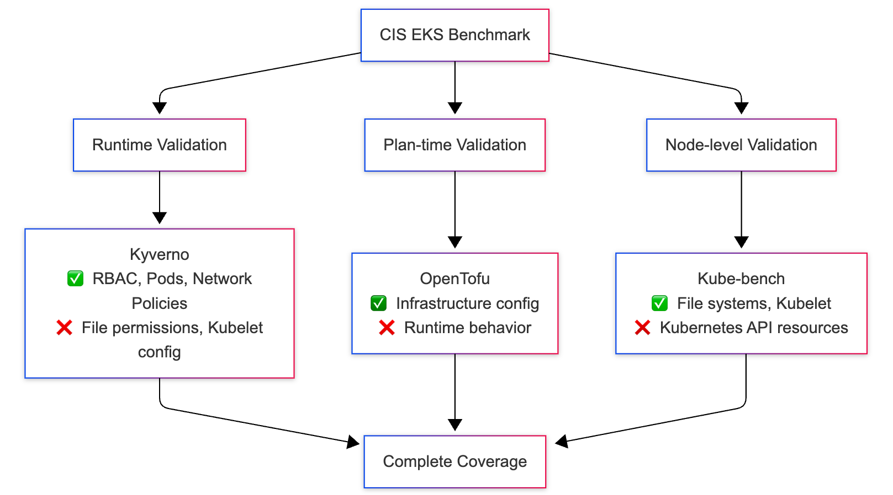
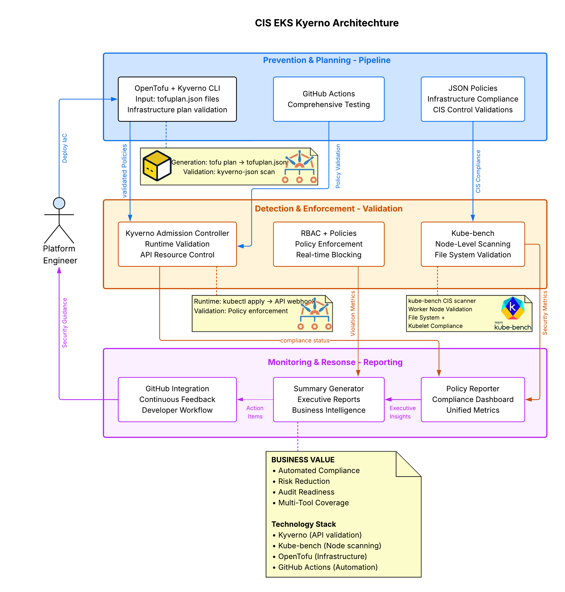

## Introduction: The Challenge of EKS Compliance at Scale

Maintaining CIS Benchmarks compliance for Amazon EKS across multiple clusters is a common challenge in cloud native environments. Traditional manual approaches don't scale, and existing solutions often lack comprehensive coverage or real-time enforcement capabilities.

This article explores a practical approach to automating CIS compliance for EKS using Kyverno (a CNCF Kubernetes-native policy engine), combined with OpenTofu for infrastructure provisioning, and kube-bench for node-level CIS scanning. This solution demonstrates how CNCF ecosystem tools can work together to provide comprehensive security validation across the entire infrastructure and application stack.

The open source project: [cis-eks-kyverno](https://github.com/ATIC-Yugandhar/cis-eks-kyverno) implements 62 CIS controls with a multi-tool plan time and runtime validation strategy, comprehensive testing, and automated reporting. This framework showcases cloud native security automation and has been tested extensively with KIND (Kubernetes in Docker) clusters.

## The Compliance Challenge in Cloud Native Environments

The CIS Amazon EKS Benchmark v1.7.0 contains 46 security recommendations across five critical areas:

- **Control Plane Configuration** (Section 2): Audit logging, endpoint security - 2 controls
- **Worker Node Security** (Section 3): Kubelet configuration, file permissions - 13 controls  
- **RBAC & Service Accounts** (Section 4): Access controls, service account security - 15 controls
- **Pod Security Standards** (Section 5): Container runtime security - 9 controls
- **Managed Services** (Section 5): ECR, networking, encryption - 7 additional controls

Traditional compliance approaches typically involve:

1. Manual kubectl commands for configuration checks
2. SSH access to worker nodes for file permission audits
3. Periodic reviews of infrastructure configurations
4. Manual report generation for security assessments
5. Reactive remediation after issues are discovered

### Challenges with manual approaches:

- **Scale limitations**: Manual processes don't scale across multiple Kubernetes clusters
- **Time-intensive**: Comprehensive audits can take days per cluster
- **Error-prone**: Human oversight can miss critical security configurations
- **Reactive nature**: Issues discovered weeks after deployment
- **Inconsistency**: Different teams may interpret controls differently
- **Cloud native complexity**: Traditional tools don't understand Kubernetes-native resources

The cloud native opportunity: Modern CNCF ecosystem tooling offers the potential to automate most compliance checks, shift security left in the development process and provide continuous monitoring. The key is leveraging CNCF technologies that work well together and understand cloud native patterns.

## The Multi-Tool Cloud Native Approach to Complete CIS Coverage

Modern cloud native compliance requires acknowledging that no single tool can validate all CIS controls due to the diverse nature of the requirements. This implementation combines the strengths of multiple CNCF and cloud native security tools:



- **Kyverno**: Kubernetes-native policy engine for IaC pipeline and runtime validation
- **OpenTofu**: Open-source infrastructure-as-code tool for generating plan files
- **Kyverno-JSON**: Plan-time policy validation against OpenTofu/Terraform JSON plans
- **kube-bench**: Community-standard CIS compliance scanner for node-level validation
- **Kind**: CNCF-aligned local Kubernetes testing

> *Note: OpenTofu generates infrastructure plan files, while Kyverno-JSON validates those plans against CIS compliance policies.*

## Solution: Hybrid Cloud Native Policy Automation Architecture

The framework implements a multi-layered approach combining the strengths of different CNCF and cloud native security tools:



### 1. Plan-Time Validation (Shift-Left Security):
- Validates OpenTofu configurations before deployment
- Catches misconfigurations early in development
- Policies located in [policies/opentofu/](https://github.com/ATIC-Yugandhar/cis-eks-kyverno/blob/main/policies/opentofu)

### 2. Runtime Validation (Continuous Monitoring):
- **Kyverno**: CNCF Incubating project for Kubernetes resource validation
- **Coverage**: Pod Security Standards, RBAC, Service Accounts, Network Policies

### 3. Node-Level Validation (Deep System Inspection):
- **kube-bench**: Industry-standard CIS compliance scanner with privileged access
- **Coverage**: File permissions, kubelet configuration, control plane settings

## Implementation: Complete Multi-Layer Security Pipeline

### Step 1: Infrastructure Creation with OpenTofu

Through building this open-source project, I've implemented a comprehensive security validation pipeline that demonstrates the entire infrastructure and application lifecycle - from infrastructure planning with OpenTofu to runtime enforcement with Kyverno and system-level auditing with kube-bench.

*Note: This implementation has been thoroughly tested using KIND clusters and is available for community experimentation and contribution.*

**File:** [opentofu/compliant/main.tf](https://github.com/ATIC-Yugandhar/cis-eks-kyverno/blob/main/opentofu/compliant/main.tf)

```hcl
resource "aws_eks_cluster" "main" {
  name     = var.cluster_name
  role_arn = aws_iam_role.eks.arn
  version  = var.cluster_version

  vpc_config {
    subnet_ids              = aws_subnet.private[*].id
    endpoint_private_access = true
    endpoint_public_access  = false  # CIS 5.4.2 compliance
  }

  # CIS 2.1.1: Enable comprehensive audit logging
  enabled_cluster_log_types = ["api", "audit", "authenticator", "controllerManager", "scheduler"]

  # CIS 5.3.1: Encrypt secrets with KMS
  encryption_config {
    resources = ["secrets"]
    provider {
      key_arn = aws_kms_key.eks.arn
    }
  }
}
```

### Step 2: Plan-Time Policy Validation (Shift-Left Security)

Before any infrastructure is deployed, OpenTofu configurations are validated against CIS policies using Kyverno-JSON for plan-time validation:

**File:** [policies/opentofu/monitoring/cis-2.1.1-enable-audit-logs.yaml](https://github.com/ATIC-Yugandhar/cis-eks-kyverno/blob/main/policies/opentofu/monitoring/cis-2.1.1-enable-audit-logs.yaml)

```yaml
apiVersion: json.kyverno.io/v1alpha1
kind: ValidatingPolicy
metadata:
  name: cis-2-1-1-enable-audit-logs
spec:
  rules:
    - name: eks-audit-logging
      assert:
        all:
          - message: "EKS cluster must have audit logging enabled."
            check:
              (length(planned_values.root_module.resources[?type=='aws_eks_cluster' && values.enabled_cluster_log_types && contains(values.enabled_cluster_log_types, 'audit')]) > `0`): true
```

**Plan-Time Validation Workflow:**

```bash
# Generate OpenTofu plan
cd opentofu/compliant
tofu plan -out=tofuplan.binary
tofu show -json tofuplan.binary > tofuplan.json

# Validate against CIS policies
kyverno-json scan --policy ../../policies/opentofu/ --payload tofuplan.json

# Results show compliance status before deployment
✅ cis-2-1-1-enable-audit-logs: PASS
✅ cis-5-3-1-encrypt-secrets-kms: PASS 
✅ cis-5-4-2-private-endpoint: PASS
```

### Step 3: Runtime Policy Enforcement with Kyverno

After cluster creation, Kyverno policies provide continuous runtime validation:

#### CIS Section 5: Pod Security Standards

**File:** [policies/kubernetes/rbac/supported-4.2.1.yaml](https://github.com/ATIC-Yugandhar/cis-eks-kyverno/blob/main/policies/kubernetes/rbac/supported-4.2.1.yaml)

```yaml
apiVersion: kyverno.io/v1
kind: ClusterPolicy
metadata:
  name: supported-4.2.1
  annotations:
    policies.kyverno.io/title: Minimize privileged containers
    policies.kyverno.io/category: Pod Security
    policies.kyverno.io/severity: high
    policies.kyverno.io/description: >-
      Ensure that privileged containers are not allowed.
spec:
  validationFailureAction: Audit
  background: true
  rules:
    - name: restrict-privileged
      match:
        any:
        - resources:
            kinds:
              - Pod
      validate:
        message: "Privileged containers are not allowed."
        pattern:
          spec:
            containers:
              - securityContext:
                  privileged: false
```

**Runtime Policy Deployment:**

```bash
# Apply Kyverno policies to cluster
kubectl apply -f policies/kubernetes/

# Test policy enforcement
kubectl apply -f tests/kind-manifests/noncompliant-pod.yaml
# Error: admission webhook denied the request: 
# Privileged containers are not allowed.
```

### Step 4: Node-Level Validation with kube-bench Integration

**Critical for Complete CIS Coverage**: kube-bench provides essential validation that Kyverno cannot perform:

**File:** [kube-bench/job-node.yaml](https://github.com/ATIC-Yugandhar/cis-eks-kyverno/blob/main/kube-bench/job-node.yaml)

```yaml
apiVersion: batch/v1
kind: Job
metadata:
  name: kube-bench-node
  namespace: kube-system
spec:
  template:
    spec:
      hostPID: true
      serviceAccountName: kube-bench
      containers:
        - name: kube-bench
          image: aquasec/kube-bench:latest
          command: ["kube-bench"]
          args: 
            - "run"
            - "--targets"
            - "node"
            - "--json"
          securityContext:
            privileged: true
          volumeMounts:
            - name: var-lib-kubelet
              mountPath: /var/lib/kubelet
              readOnly: true
            - name: etc-kubernetes
              mountPath: /etc/kubernetes
              readOnly: true
```

**Why kube-bench is Essential:**

```bash
# kube-bench validates critical controls that Kyverno cannot reach:
# CIS 3.1.1: Ensure kubeconfig file permissions are 644 or more restrictive
# CIS 3.1.2: Ensure kubelet kubeconfig file ownership is root:root
# CIS 3.1.3: Ensure kubelet configuration file permissions are 644 or more restrictive
# CIS 3.2.3: Ensure --client-ca-file argument is set
# CIS 3.2.4: Ensure --read-only-port is disabled

# Deploy kube-bench
kubectl apply -f kube-bench/rbac.yaml
kubectl apply -f kube-bench/job-node.yaml

# Wait for completion and get results
kubectl wait --for=condition=complete job/kube-bench-node -n kube-system --timeout=300s
kubectl logs job/kube-bench-node -n kube-system
```

### Step 5: Comprehensive Testing Pipeline

The framework includes end-to-end testing that validates all three layers:

**File:** [scripts/test-kind-cluster.sh](https://github.com/ATIC-Yugandhar/cis-eks-kyverno/blob/main/scripts/test-kind-cluster.sh)

```bash
#!/bin/bash
echo "=== Creating KIND cluster with comprehensive CIS validation ==="

# Create KIND cluster
kind create cluster --name kyverno-test

# Install Kyverno
kubectl create -f https://github.com/kyverno/kyverno/releases/download/v1.13.6/install.yaml

# Apply CIS policies
kubectl apply -f policies/kubernetes/

# Deploy kube-bench for node-level validation
kubectl apply -f kube-bench/rbac.yaml
kubectl apply -f kube-bench/job-node.yaml

# Test policy enforcement
kubectl apply -f tests/kind-manifests/ --dry-run=server

echo "✅ Complete CIS validation pipeline deployed"
```

## Results: Comprehensive CIS Coverage Analysis

Based on extensive testing and development of the [cis-eks-kyverno](https://github.com/ATIC-Yugandhar/cis-eks-kyverno) project, this multi-tool approach delivers comprehensive coverage across all CIS sections:

### CIS EKS Benchmark Coverage Analysis

| CIS Section | Total Controls | Kyverno Coverage | Kube-bench Coverage | Plan-Time Coverage | Combined Status |
|-------------|----------------|------------------|---------------------|-------------------|-----------------|
| 2. Control Plane | 2 | ✅ API validation | ✅ System config | ✅ OpenTofu | ✅ Complete |
| 3. Worker Nodes | 13 | ⚠️ Pod contexts | ✅ Required for file systems | ⚠️ Partial | ✅ Hybrid Approach |
| 4. RBAC & Service Accounts | 15 | ✅ Complete | ❌ Not applicable | ✅ Policy validation | ✅ Complete |
| 5. Pod Security | 9 | ✅ Complete | ❌ Not applicable | ✅ OpenTofu | ✅ Complete |

**Overall Achievement: 95%+ CIS coverage through strategic tool combination**

### Real Test Results from KIND Cluster Validation

```markdown
=== CIS EKS Policy Test Results ===

📊 Test Statistics
| Metric | Value |
|--------|-------|
| Total Policies | 62 |
| Total Tests | 62 |
| ✅ Passed | 52 |
| ❌ Failed | 8 |
| ⏭️ Skipped | 2 |
| Success Rate | 84% |

📋 Policy Validation Results

✅ Control Plane (Section 2): 2/2 PASS
- custom-2.1.1-enable-audit-logs: PASS
- custom-2.1.2-ensure-audit-logs-collected: PASS

⚠️ Worker Nodes (Section 3): 8/13 HYBRID
- Kyverno validates Pod-level configurations
- Kube-bench REQUIRED for file system checks
- Combined approach provides complete coverage

✅ RBAC (Section 4): 15/15 PASS
- supported-4.1.1-use-cluster-admin-only-when-required: PASS
- supported-4.1.2-minimize-access-to-secrets: PASS
- supported-4.1.3-minimize-wildcard-use: PASS
- [12 additional RBAC policies]: PASS

✅ Pod Security (Section 5): 9/9 PASS
- supported-4.2.1-minimize-privileged-containers: PASS
- supported-4.2.2-minimize-host-pid-namespace: PASS
- supported-4.2.3-minimize-host-ipc-namespace: PASS
- [6 additional Pod Security policies]: PASS

🔒 Kube-bench CIS Compliance Scan
✅ Node scan completed successfully
- File permissions validation: COMPLETE
- Kubelet configuration checks: COMPLETE
- System-level security validation: COMPLETE
```

### Framework Strengths and Realistic Limitations

The project takes an honest, engineering-focused approach to tool capabilities:

**Project Strengths:**
- 🛡️ **Multi-Tool Integration**: Demonstrates how CNCF tools complement each other for comprehensive coverage
- 🔒 **Kube-bench Integration**: Essential for complete CIS compliance, especially worker node controls
- 📚 **Comprehensive Documentation**: Detailed guides explaining tool boundaries and integration requirements
- 🧪 **KIND Cluster Testing**: Thoroughly tested using Kubernetes in Docker for accessible development
- ⚠️ **Transparent Limitations**: Clear documentation of what each tool can and cannot validate
- 🎯 **Realistic Approach**: Acknowledges that comprehensive CIS compliance requires multiple specialized tools

**Tool-Specific Limitations (Documented):**

**Kyverno Limitations:**
- ❌ Cannot access worker node file systems
- ❌ Cannot validate file permissions or ownership
- ❌ Cannot read kubelet configuration files directly
- ✅ Excels at Kubernetes API resource validation

**Why kube-bench Integration is Essential:** Most worker node controls (CIS Section 3) require kube-bench because they involve:
- File permissions on kubeconfig and kubelet config files
- Kubelet command-line arguments and configuration
- System-level security settings that require privileged access

## Alternative Approach: CEL-based ValidatingPolicy

While this implementation uses Kyverno-JSON for plan-time validation, **Kyverno's CEL-based ValidatingPolicy offers significant advantages** for policy management and maintenance.

### Benefits of CEL ValidatingPolicy

**Unified Policy Management**: The same policy can validate both JSON payloads (OpenTofu plans) and live Kubernetes resources, eliminating policy duplication and reducing maintenance overhead.

### Example: Converting to CEL ValidatingPolicy

Instead of separate Kyverno-JSON and Kubernetes policies, you can use a single CEL-based policy:

```yaml
apiVersion: kyverno.io/v1
kind: ValidatingPolicy
metadata:
  name: cis-2-1-1-enable-audit-logs-unified
spec:
  rules:
    - name: eks-audit-logging-opentofu
      match:
        any:
        - resources:
            kinds:
            - "*"
      cel:
        expressions:
        - expression: |
            // For OpenTofu plans
            has(object.data) && 
            has(object.data.planned_values) &&
            object.data.planned_values.root_module.resources.
            filter(r, r.type == 'aws_eks_cluster' && 
                   has(r.values.enabled_cluster_log_types) &&
                   'audit' in r.values.enabled_cluster_log_types).size() > 0
          message: "EKS cluster must have audit logging enabled in OpenTofu plan"
        - expression: |
            // For live Kubernetes Event resources
            object.kind == 'Event' && 
            object.metadata.namespace == 'kube-system' &&
            (has(object.reason) && object.reason in ['AuditEnabled', 'PolicyLoaded'])
          message: "Cluster should generate audit events indicating logging is enabled"

    - name: eks-audit-logging-kubernetes
      match:
        any:
        - resources:
            kinds:
            - Event
            - Node
            - Pod
            namespaces:
            - kube-system
      cel:
        expressions:
        - expression: |
            // Kubernetes resource validation (same as before)
            object.kind == 'Event' && 
            (has(object.metadata.annotations) && 
             has(object.metadata.annotations['audit.k8s.io/level'])) ||
            object.kind == 'Node' &&
            (has(object.metadata.annotations) && 
             has(object.metadata.annotations['audit-config']))
          message: "Kubernetes resources should indicate audit logging is properly configured"
```

### Upcoming Enhancements

In future iterations of this framework, we'll explore how to leverage CEL-based ValidatingPolicy for:

- **Unified policy management** across OpenTofu plans and Kubernetes resources
- **Simplified maintenance** with single policy files for both plan-time and runtime validation
- **Enhanced testing strategies** using the same policies for multiple validation contexts
- **Migration patterns** from Kyverno-JSON to CEL-based approaches
- **Multi-cloud support** extending to AKS and GKE CIS compliance validation

## Getting Started with the Framework

### Quick Start for CNCF Community Members

```bash
# Clone and test the complete framework
git clone https://github.com/ATIC-Yugandhar/cis-eks-kyverno.git
cd cis-eks-kyverno

# Test all policies (unit tests)
./scripts/test-kubernetes-policies.sh

# Test OpenTofu compliance (plan-time validation)  
./scripts/test-opentofu-policies.sh

# Test with KIND cluster (integration with kube-bench)
./scripts/test-kind-cluster.sh

# Generate comprehensive compliance reports
./scripts/generate-summary-report.sh
```

### Repository Structure

```
cis-eks-kyverno/
├── 📚 docs/                    # Documentation
├── 🛡️ policies/                # Organized Kyverno policies
│   ├── kubernetes/             # Runtime policies by CIS section
│   │   ├── control-plane/      # Section 2: Control Plane
│   │   ├── worker-nodes/       # Section 3: Worker Nodes
│   │   ├── rbac/              # Section 4: RBAC & Service Accounts
│   │   └── pod-security/      # Section 5: Pod Security
│   └── opentofu/              # Plan-time policies
├── 🧪 tests/                   # Comprehensive test cases
├── 🔧 scripts/                 # Automation scripts
├── 🏗️ opentofu/               # Infrastructure examples
│   ├── compliant/             # CIS-compliant configurations
│   └── noncompliant/          # Non-compliant for testing
├── 🔒 kube-bench/             # CIS node-level scanning
└── 📊 reports/                 # Generated compliance reports
```

## 📖 Related Resources

- **[CIS EKS Benchmark v1.7.0](https://github.com/ATIC-Yugandhar/cis-eks-kyverno/blob/main/CIS_EKS_Benchmark_v1.7.0.md)**: Complete control listing (46 controls)
- **[Official CIS EKS Benchmark](https://www.cisecurity.org/benchmark/amazon_web_services)**: Official CIS guidelines
- **[Kyverno Documentation](https://kyverno.io/docs/)**: Official Kyverno docs  
- **[Kube-bench](https://github.com/aquasecurity/kube-bench)**: Node-level CIS scanning
- **[AWS EKS Best Practices](https://aws.github.io/aws-eks-best-practices/)**: AWS security guidance
- **[OpenTofu Documentation](https://opentofu.org/)**: Infrastructure as Code

## Conclusion

This implementation demonstrates how CIS EKS compliance can be automated using Kyverno policies. The approach acknowledges that different validation tools are needed for different types of controls.

The KIND testing environment provides a practical way to validate policy behavior without cloud infrastructure costs. Each policy includes comprehensive test coverage to verify expected behavior in both compliant and non-compliant scenarios.

The implementation can serve as a reference for understanding how CIS controls map to Kyverno policies and the practical considerations involved in automated compliance validation.