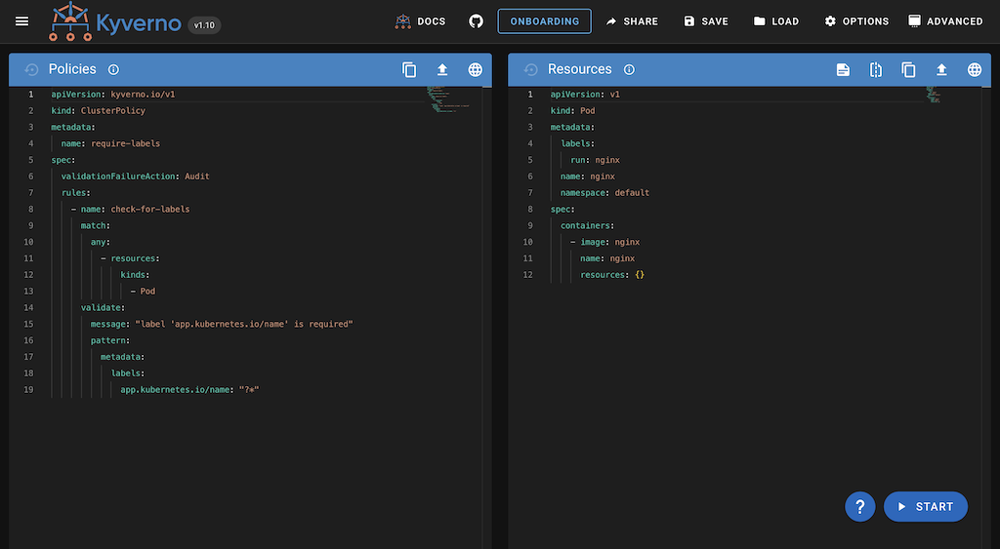
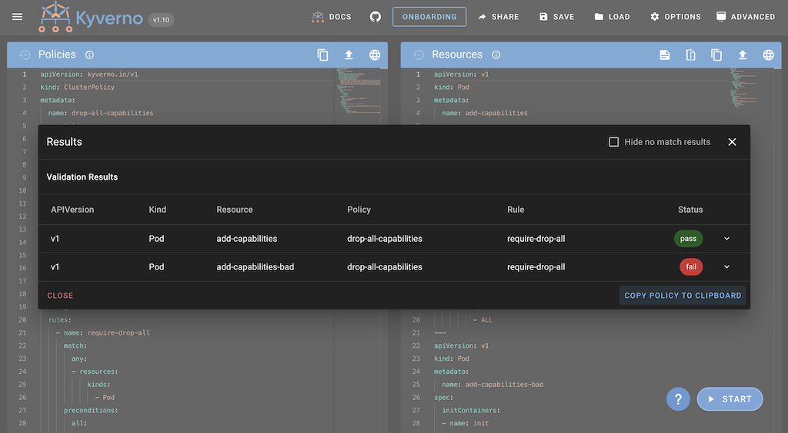
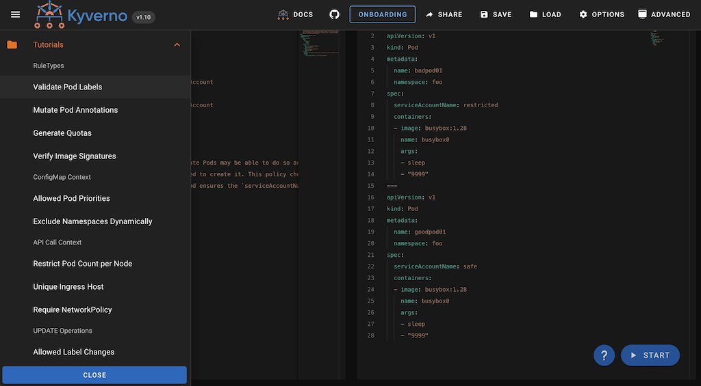
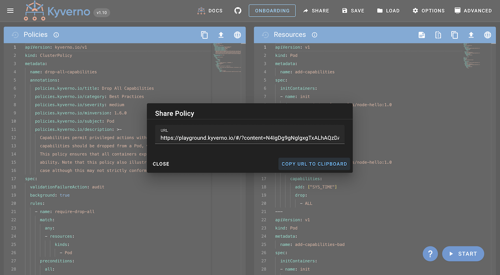
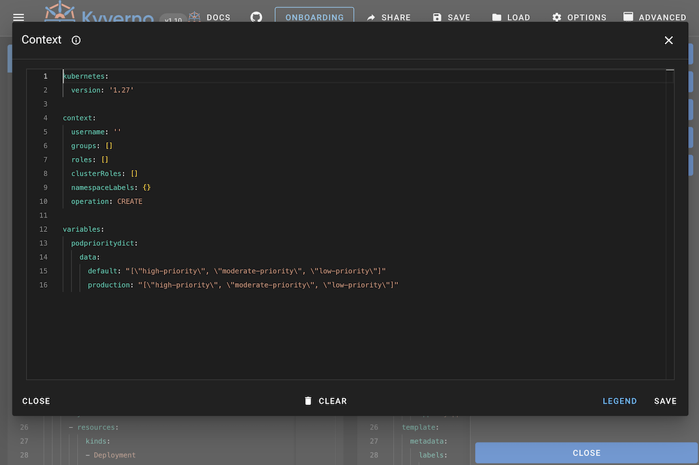

## Foreword

<i>"Kyverno is a policy engine designed specifically for Kubernetes."</i>

While this approach makes it very easy to use Kyverno in its intended environment, it is sometimes difficult to explain and present the capabilities when that environment is not available.

To help potential users get started and reduce the effort required to test Kyverno and/or develop new policies, the [Kyverno Playground](https://playground.kyverno.io) has been developed. This has now been available for 3 weeks, currently in version 0.3.1.

This article explains:
* What is the Kyverno Playground?
* How was the Kyverno Playground created?
* How does the Kyverno Playground work?
* What additional features provides the Kyverno Playground?

## Introduction

Having a booth at a conference and having direct contact with current and potential new users provides many opportunities. You can talk about how it works, existing and new features, use cases, and user challenges. However, many conversations often only scratch the surface because there has been no way to quickly and easily present a concrete feature or write a simple policy and demonstrate it right away.

In these situations, the desire for a playground as a simple, independent test environment to reduce these problems arose again. After KubeCon EU 2023, we expanded this idea and started developing a first prototype.

## What is the Kyverno Playground?

Kyverno Playground is a web-based and isolated test environment for Kyverno. It is a standalone binary and does not require connection to a real Kubernetes cluster, but is optionally supported.

All the information to simulate a policy execution can be provided as YAML content in the respective panels. For a minimal setup, you only need to specify a resource and the policy you want to apply to it. All other information is optional or provides similar default settings as a real Kyverno installation.

## How was the Kyverno Playground created?

Originally, we were going to use the Kyverno CLI under the hood, but then decided to use the Kyverno engine directly and develop everything around it from scratch. This allows us to close some gaps between the CLI and an actual installation, as well as provide more options in configuration and simulation.

We also wanted to decouple the frontend and backend so we could work on features independently and later bring everything together using a simple REST API. This gave us the most flexibility possible in developing and choosing the tools we needed in these two areas.

The frontend is based on [Vue3](https://vuejs.org/) and uses [Vuetify](https://vuetifyjs.com/en/) as a Vue component framework that simplifies the creation of a user-friendly and interactive interface. We also use [monaco editor](https://microsoft.github.io/monaco-editor/), which is also used in Visual Studio Code, to provide the best possible user experience for entering and working with YAML content.

For the backend, we use Go to integrate the Kyverno engine as smoothly as possible. The [Gin Framework](https://github.com/gin-gonic/gin) helps us to provide our API and UI via a file server.

## How does the Kyverno Playground work?

Once the backend and frontend were set up, we were able to simulate the first policies on the new playground. To do this, each simulation sends all available information to a single REST API endpoint.

As we simulate the policy, resource, context, and engine configuration, we create a separate engine for each request. This ensures that all requests are independent of each other and that the provided configuration can be applied without having to reconfigure a single engine each time.

Before running the actual engine, the received YAML content must be parsed. To ensure that the provided content is not only valid YAML, but also valid Kubernetes resources, we use tools like [kubectl-validate](https://github.com/kubernetes-sigs/kubectl-validate) and OpenAPI schemas. This way, we can provide early feedback to the user and avoid misleading error messages.

After parsing and validation, we perform the actual engine operations in the same order as in a real cluster. This means that mutation and image verification are performed before validation of the resource. This behavior ensures that there are no errors due to dependencies of operations within a policy.

At the end, the engine returns a response with all executed rules that can be displayed in the frontend.

## What additional features provides the Kyverno Playground?

Besides the basic idea of providing a simple testing environment, the Playground offers several features to further enhance the user experience and exploration of Kyverno.

Let's take a look at a small selection of these available additional features.

### Example Library
In order to give new users an interactive overview of what Kyverno can do and how different use cases can be achieved within the Playground, we decided to include a small sample library based on the extensive [Kyverno Policy Repository](https://github.com/kyverno/policies). The examples provide a set of predefined policies and related resources and configurations for common use cases such as the [Pod Security Standards](https://github.com/kyverno/policies/tree/main/pod-security) and [Best Practices](https://github.com/kyverno/policies/tree/main/best-practices).

The tutorials focus on features and how they can be simulated in the Playground, providing various examples such as upgrade operations, image verification, resource cloning, and more.

### Share Functionality

In our daily work in the community, we often have situations where users need help with their policies. The process to get help has often been cumbersome because you need the ability to test the policy yourself. You have to figure out where the problem is and maybe try different things to get it to work. In the end, the user again has to test whether the policy works with their resources.

With the <b>Share</b> functionality, we have created an easy way to share a complete policy setup via the Playground. This includes the policy, an example of a validated resource, context information, and the engine configuration. Since all information is part of the created URL, this functionality is stateless, immutable, and does not expire. This makes it suitable for both short conversations and longer-lasting GitHub discussions and issues.

You want to open the exact same setup as shown in the Screenshot? No problem, we'll [share](https://playground.kyverno.io/#/?content=N4IgDg9gNglgxgTxALhAQzDAagUwE4DOMEAdsgAQDWCAbviRAHTED0NAjADomUwkAmFAMJQArgQAu%2BAArR4CbgFscEtPzSrk3cuRJplFfnghgAtGihRTcDGgBGMWBJg4C28mhINVz0gS0kOjqQsHAuBIzUdHgMzBAszhJQOBQAIsZg5ACCluRCtg5O4e7BcmGukbT0TKw2UgDmEHgIFABCrhLk0nhocM5wriXkIfDhldGxrAQ40TASLeTK/DCiikMj5RFR1XEsinzRRKQU7IwAbIwADOtlY9sxNfEEonYAVjh9FLL8N6F3VQ9dvxXHA8DAwL4yOQAHymIY6fJgeyOObhYb4fadMBgmiOHD1HD8Dx9YgkAjkADucwAFhBRJ16jBcSR6uQAGaiXLGCCdXoDAgRbKWeHkGxIwqo1zkAi0zlEuw4chGExgQns4yKDxdCD8AA0lJp5FIUAQ5AktOm5DwOAAjqIYNaiWpgfLepRGCKACrUmDkjamnBk0TW8nmjQeXJwUiqPj4ck4AAeYD%2BSVNBFVYTZpvNioABsqwBQANqcEBZAAy5dLAF1cyLkU4EIxyAA5HmKsOdc2%2B4ZlU0WAgQciOMSSHpScm0ilmodR6JKjLkQMSMFSvgeEgKQJBHQ2S0Wc10%2BrUs0%2B8mKNCm7zSlfwVOi0hspqaiRDnPaokAZQ%2Bwbmps/qgCGgeD8BE3Dph8AQ6DQFgwOokIAGJoI4wY4FkJLHB4ojLBI7h2G69TGKIAgUCuog4O4eCcq4UFBKYuj6CkVq2va1qmAW5jCtuO4XhIcDUrRO46J4LQijo9EhnSeD8oJQk7rwAj%2BGJcnkPR3witiHykDhpJKdxQkWFAsk7vRlA4AspbAMAzF2h0jAmPgGikuQAA%2BLnkAA5K0WRCAA0gA4gASgA8gAqi2qQeeQAC%2B0WlspOgOeOTQUG2EgAKJ2gOCXkDBYhMak6XlulnrpSKeVwRoKTKcoApoASFCwjlQjRshJBxos4idAW5C5hW5a5qKBQos4FTKU%2B1q9AJOX0bAkgUNatmSPZbwfBIjAQXAjBFjgYDUjgyg9FALUkDG7WEPqfBzCdZ1xvqUanW1cbVkW1Y5TowKbsZKm7tpqJ%2BN9P3CZYgNA6Z5kUP170qUlGgpdkm5pQAkiQ0NyXl5EUJZ1k4MkyinRtP5gvMN2JutYoNpKEQFq9jCvgA%2BqIYCqngAAUAACACUrnubmr2DbFpYgLqICScGAwoOgmC4IQpIUBw3AKYIH5KCoagaGgtF6AYHj8Pw1jDUUgxkhmtFXRIN1PYQtH0drTHm0MMAXg15D1KCuyNBA9TJKYBD6MmrgsAwwKmPtlgQMgpzXPp0xwL%2BJPRmT30UxKo16T9Bag%2BJ2SVu4D23db7i24xFDOgb4ojcU%2BlO/VTFu3gHsQF7Pt%2B4oAcEEHOo4KHuNQBHUdDLH8cIKTCYSMnhtU6DzrFqWn4AJqfvTnpIwAsmVIBvfpO6ZzNOdViQphH9wGDYHGcu5VwPB8Mr6kkMoqjwZr7h26Xevl5TaemPhPwm5B7jm0trGQu25i46wdtXZ2dd3asE9t7burd26dxDmHPukcrh51asA9OqkGI6zLinSuxsdw1xdvXRuzcEH%2B2SB3YO3dUH9wwTHImf5R7jxFIQo2OC5Iz3ICWEAC8l4r3XjWZSu9t5CXolDEgwsQD5zJpLSgLx6AqBou4Q4F8PKnAAEwAHYPLcG4PIsetFxD0BLp5Ax25CJ0jAP4PhW8dDGBocWRxopRxSDwIFaANEHEv0YumXoOByz2FxvY4AcVtyw0hMIQK6UsilUMSQGCYJ7AuPIBE2RD02QwHqJLU%2BMsjhQgVtfEieRHy5NXhgVWj8NZawsfcBg/japIgGBQRpEBuBP1osCNkaBOQSECviX0K4Fj8AgHAMyDdiCUVcFJAYCFHCePsS5IYRYABUuoOm6nWW4nQRZ0p0FOjsnZey%2BGbKUQqX2CBJAHVOWsi5yjTBgBeKEe5%2BkNlbKeXQ0wyQ0DTHeTuIsbZgQnN2WsrI0gkbfjwLiAYYKzlFk9BAMyJAhm4hwBSBFazPwvHeH0dC/ICDopcFizZ4KPnfigGyXFq0CVwCJSSzF2KPmtBvnweoLKgVDOTPANA34JBcqCEWLI/B9gClJDypogryWIpEF1fAorxVFKlXgGVgLhWtAIkRAQn4bBot2tKoV%2Bz5W3LwFqyZNjiL8D1Z4VV6qKVAtNZ47xyQTkdOQI64Vzr8CupwGygQHL3UAgYJ6xFMK4VoQZXSY52yOlyoqfUKpYAtkhogKmiYEAE0kByUmjAGbqgFoeKYB%2BYI4AEERakXafcED40FXGtNiKABSEA7BFoYO2iAocm6UGeWxYEyQpCIpbCoCkTRKCyFCAgTtnbEXfFSL6KiEJSStGwgSetabZ1rL9TOj1Xr9l%2BoDcsFku601hpxR8a0G7M2dt9jQLaHSNr3sYPuvhEb4A4FPZmu9cBw34EjV%2B6oP6S0qDLRWi9sKP2r1IHMJogHi0EHvb7f9H6S0wdfHgOdOp4MMFMBOCQ1YsldQgIoIZg5xY4CrTkkg/0ySSyyR431cyKMEHydLc%2BmESlKwoN%2BUEKganq00M0pi1p66EmE4EtpSocB9IGdweYqoKDBSRLZLpdT3BIgFGOkCFBV4AHV54IAAFqpAQlAVeihQraJbNowKihZGJgGMuvw9HopAA=) it with you!

### Context (Variables)

Kyverno can run on various operations and uses request information such as usernames, groups, roles, and additional context from provided ConfigMaps, Secrets, and more. How could we provide this information within the Playground? We don't have a true cluster request or other resources to pull the information from. We decided to take a simple approach and provide the ability to simulate what you need to provision for your policy.

In the advanced section of the Playground, you can change the context of your request and simulate variables that you would normally get from other resources or API calls.

Want to try out an example? Check out the [Allowed Pod Priorities](https://playground.kyverno.io/#/?content=N4IgDg9gNglgxgTxALhAQzDAagUwE4DOMEAdsgAQDWCAbviRAHTED0NAjADomUwkAmFAMJQArgQAu%2BAArR4CbgFscEtPzSrk3cuRJplFNFCgQA7jn4BaSPzB5i9iTBwFt5NCQaqnpAlpI6OpCwcM4EjNR0eAzMECxOElA4FACCxmYW5LL8WfYQjmFuQXKhLhG09Eys/C5w9mA%2BZOQAfJZFgSlZEDnSeY4IImgEBOQwI%2BKZEhDkdhA0MDXu5ADmomh4HlI45KTkEgAW2wRwh/yisCTLOwBmS9nkeDhQGjB0e9MQB/jh7ToAkgE4PhVHxyHAhi5yKZDo9dJ93MZyBNCKMAmgwWJJPh3LCJHhxFJ%2BAAaJaKIzwYjiJEEbFwCDnHJ1HAabbZVwBQI6DR7Q7kfYwZaHSQzCDDGAAIySMz6MCcLhJ4PEfCunxhXX4Iym5HF2xw8zghJYXhWKnIx1O5wsjHIABV%2BSNgvJfmDDnBKJreTVrnxMgADOwOWUDZ7DABy%2BhwvtRd26ZrAODg7yW/HgjXWCBuCJMpjQkpwzt6gYkwaGNJG13yPO2y1eOAC4eUBDAaCBZqmjxyoPRQlI3uWAFkMNa/rcvuR/TLi4MwxGo2M4RJnfpSFcvooSWP7vPJRA3VbuE2E/4dDRyepGgAxNAwMSPFIG4hNNCiFOLjniluUZZ4ekCCh40R8w5fEkj8NxLF0CMKFPWBzxwaxumsScFA5HQ6RIKQAA8JGPTlyAgvQDBFWxkJTA1nTQ3sBUHMBcLwwJCOSLMMisGwkKLQpUPoyDG2bIEKC9Z8oDfTkyQkE46MCDwEEknQIMeAh6TwIEwK4%2BjeAEVTuMCCCABEcDAEwEGUDCKJ08hdLQHBFFIABlFQzLk8hbO8HBrnOeyRO0/DyAAKQgcV2hghYWVk8hGwINBliY1ozLtVlY0LfIg2nEZgGAB4cAAR0AyRGACgArBMJEYQ84EYKRFEMllSvjcqA2SqcQwIBttgAXza0YRmNUEx1gSQzIgUdeQrdJTGVXIixLYZISMbNMl6%2B1yFapsWyY9LiIa/oyJK880EYdLHhylwSsY1agQ68gOsYZ0ahIGSzPQ19Hy07zpLCzkIMoHAZPITgQA2o7cpKwritqhMKus6qpHB%2BrkNS1qrra/7HMCCB4w2dtUnu0NPgBVGTyMQCKD%2BgGMpsLagx2xg9oO4AgZOxgzr4nBLo6lGOQIqDyGCuCENY5D%2BfZTl0KwnDnS5oiKdI1NHqogcMA%2Bhjubmlj%2BfYxrOO8niXBZgS3KErydDEiSl3usL5JcJSVKVnQNI1W2fOyIKz1C50IqimK2jUwJ4vVSbGumtKMoZvLQYNWHGEpprS0Ry75x6gI%2BrGI28KGqtyFG7MJqS/pUtmsaFqTpaVr18gNulqbqdpw7suBpmI3O1nOuu266wen3KIEWUXsd97Ua%2Bn6KH%2BwG68Z8OSrKqP4eauPkZAAmdgxjR8mxhBcYkfHO7wmDiZ0Efye6aOEGrjR9tr468uZta2fn8Cdeg12pHV4/LDqUgCoC9pRZwbCLYfzaMtyLb3Qn2GijtGKGELqxRC0ctbeWvvxcgglzipxNvsMK/cfaW0UqIZSLhHb21etpCCQgfwkH8oFLivM3Y%2Bw9tFCgsVt5%2B3uLnFKzVy4hzHmHcURUI5T0/uKG0UNngwynpVaGOBI7HwRhGJGXUFzRmTgNbe6cxxZzMDnGepYC7zU7MXecpc1oUArkfIBu0z501DqdRuLNb43R9ndDu2kno918H3c2A8qBD1JqPS%2BINeFgwEQFYRVVRFSPESImqU8ZGzzkezBe29OTo3wCvPAa8N5b21oTMQTFfGHxIlXVMNNLEX3rog5uSN/ogCJCABS1scAoHQJgXAhBHzQS4DwPggh1RKBUGoM%2BuFIHhQQBgMA/M3AVP1tcQ2bhng6igMQ8gdYaD/hOgeOquFRbXhIN8XCksmKXD4JhdoMAyQMN0DWEgJyuJnM9tIc4UBZAhF%2BiODevQXB1i8rE2O3N%2BSCg1v0bg3BLCgu4BgbA3x2nuDAGAAgbBOn2woPpQyEBjJfL6aoPaQzuaKBPgZIykzbHGOQQbVBGyjxuEeIZeAQwKCdJ0DSJIBpV7tHQQAGVzE8JZXJYUUDxWMtwEjwmSWUFiwZzp5ncqVmM/lozYXtDKmFbZPpCD/zuRco51zkDhJUdpYZWqbn0R%2BTOIidQe7gigICoMwKSCgu9hC1pRBSAUA/OJfYCLuBIvIGQ0glDMUDM0ESoihx0jBt1iS2YZwHykApXAXC5oLCWmHiAAAVCwdg5BU1ZpzamjmOhBGhMkZJJVzphW0O0qWpJYJSAgl2WqrxwzQ0mEXhqpi4pxAIHFBAI12S20POMM8%2BQFA3mfA%2BTSUy1aFKqDwBIIdiAKAAHkSBXhvHgoC2sTUtW5tma1xYakgB/thJplBRA6miCoAhbgojOqaAAcnYIwAATAAdjvbao94sOTImGXe99HJvz0jhRQAA2gAXSpdAAh5BwNuDgJiKQeAABKUG/AwYgxyCpnKFloeAMjDkKTMbQqEEhgAoikG0pHbWnnsLmUCuFK6Bx2pJbFbcZmoJTSBzg3GQD/P2HuhQPGSTcf%2BjZGomN4LHxEzUv6PHd1SZ4xBxJxqfzRsaJx6TfGBPSeEzxsTqTn4Kf%2Brp/68nkLSaUwe0BAommOqhS6nmiLunCHljRANrHMPc0iJUcNTcKDeeiBAbgHmdAoOEkhnANZJB4F%2BvwXc308CxCpVbPBQILw3kQ2hgAPu0EDqaiQBYYESVNGHOQgdI3QDCxXiulcCHlgrZ74IEAQFidcJXcv5dPTqawZ6Qg1Y6w17rDAaiWCSBCfrXEQO4xqNV9rk2UjSD%2BPZPA%2BocCzdqzoEDNoIDfRIBF%2BYOBTDrdy7ZM9fCJD3hUgQfbzgjv5bm2V%2ByUBrincCQaS7Lhrt6lu8dybAAhbpypftlYizS8Enlgd1ZSPwRQYxb2g/yBISHm2RAEnwND2HYpSAI9ncjmDf3PyAdEAIWy4I9sGUR3jkDqOsR4AJ26InJOyc46R/djbMGaeIZQ0karhWIDIAe3Vzn%2BBuc4AB93S4vOKiBYF%2BzkDy3VuXd/EjvnBXpcMDlz2EgYCMBq6iEVvnmvXO69V3zywYr7BwAIHLlFRkTIq/VxAPXlQ5eUOd4F93DBLD7AgDtpC8EahJCkHL0MKhTD5EoPOhAnuneG9y9kXSYx8QNEfH9l80UHf69j47uXouY8x9l7l0X4uUyS9N47wvk37JMkz5UGPlgCA0HKnz0qTfGCC82wr%2BAa3y9Z4b03uXXegT57N43uA5uVCW%2Btyd/Aq3%2BykFlPkEfjv%2B/j5pCt7v5uF/tjl9kZffepCSDA1ZgkEBFARdwfg/S3oSBuJIAQJpVmEMi5S/gh/qA7NtIcxwL1znnIJkeDfDFUDTQBxSIkeGWCZH4F8zLjCzfGLHjCXWbGOmCwlQ5GbGGHDzwB6X7AAHUABNBAAALV0gvCgH7EUAAFUn1Qwn0kNFAD1f4gQU9fBH82ogA==) or [Check ServiceAccount](https://playground.kyverno.io/#/?content=N4IgDg9gNglgxgTxALhAQzDAagUwE4DOMEAdsgAQDWCAbviRAHTED0NAjADomUwkAmFAMJQArgQAu%2BAArR4CbgFscEtPzSrk3cuRJplFOAAsccSgFoCabeTQkGqicRIEtJHTsiw4MHAUbUdHgMzBAsThJQOMImZuQAyvg08DgAgnBwEKIkEjaecj5%2BAbT0TKxwGjgA5hB4CBTx%2BmBReeRe8L7%2BgaWhLASiAEYAVqYSFLL8ADSJeMlwaRlZOa3dwWVhqwzmQUSkFOyMAGyMAAyt7YVdJWu9inw7zvtHpyvXIayUg/Qqftv4u2RyJwQAcAExcEDnAqdYpBd5hfh%2BOB4GBgJx7cgAPnMrR0MzmC0y2QkBHIAHcYBIjG0UckolU/OQJBByMicJVyBNSYo0AhyAMcLYBlEmSz%2BCyCCy7PxdPocLjbAkkil0kScuQIFT8EyjHYdYLSILxDgZczWXh2VJyJTGOQACpGGCki584ymSikrUKiaTa0AM3NlpN/L5aCVsxVi2Jvul5BwLlEFs9JnIAAMCMr5qqlhIAHJy1PkP2%2BKD8BU8iRu5OCtBwCSiNBQcME7PExjcAhgUxuHQ0RswdTokgAMTQMDEFvSQ4oaFE/EpNgGtcoVTwS0ERcbGZseFEUVcrXMsoMrNiFis5Y0xh7HlvdnqCp0R6TWTw8wP7lvX50vAEH%2B/35HhMCpgBamQCJSzj/gBjZQDegFUDg9RAiAwDABmEZZlGOT5soAC%2BeHAo%2BHgQF2eAaLUFAAKIAI4NlABDEb2jaiNEKEAFQAPxEZ%2BCGUEhFDAmhFp0X4EiMKR%2BAaM4BE8QBJFkRReDUXRW5MeQfZiGxQgAEpUakdpUQqmkDpU8FfsoBBWAygkgA6gr4pGaoSOQxqmiybIclSTqchAMo%2BeBxYkMGZriHwVT6uQVjKLY2EuWSJjuLu9jhZFEztpCvFfmAGhSME5nfp23bqToGEtnFuFsUJ6GZoSOaVbJmUgJMIAvom8woCA5jddwGDYP8jwaVwPB8BuwEkMoqiDmgN56CeS78JA/AnMNOhzX4OXzBQfoQBAHZdnAN5lU59VyhQSYSCidYmjY4GqHw/w3keMA8jZ/LiAgAwQAAHsgYIABytOtFADB9X3fWcWVoHgVTQU%2BUVRDgYCHihACc6Oozx3U4nomC4IQg0cNwv5jX5SgqGoGgzTYwPkDUflLStNNyp2tZsTte0uAdR21a2OFnVFaB%2BvKn53WOwWEE91qvWxoMEJ9P1/YwoKA1ltNywrEOtNDsPmUeBCI8jWVHsCGOYyAzUgHdODfRInWfAKwQ/NBDwYgA5GCADsbvcNw1u2zexrBALbvy5IOCKMgx3zLWznIBzUdCzgPufquWRgK45AANoALo7tAfgULnt1iOHeA6QXmfF5%2B62s/MAAyaACgxFDAIRn6SeR07kLp%2BmGb7JB9iiTf7q3eGW4FMBVJ1fX4wCFBEyNAjCKQxZVAAshg5NTVTs0C5snNrSzm1sQf3DTTeiJ%2BrOUASDp1ROpdyHimY%2BChDufivvMw7jnlmcAD6tCzuxSYB9JjsTzllLOVE6A5HAeAyBt5gGgK%2BJYBA4dFAIKASAh2OBzBgEGN4LBUCcGoIYIicwUQ0AZmIUg3MfkcDwIgUA1I0gACSjl5hMMQR4LOdoID8RIPfZIOAyTcKAfEQYIw6yqj8AQYRvgxEgOYVAxIUA/SSOGKMWRVkFGiPEVAgAQqNcKBikH32aPANAiQJBmN4akfgdwrLOAsbUWxyieE6CziIcQeUHFOIBK4vA7jaG8MMcuNO2R%2BDxAqEIpGbi7FeJ8WXcJZhIkCBiXYIJISVFIOSXlCuUR4EH2QLk3h%2BT8CFJwMYiCJAqjFLeBAUpnjs6cLqtGMBB8WneNXlPTeYBQGNMGXCCA3ShC9I3hgYZpRplrHMJNK6BBukABEkZQAgAgZQcDOmNO6QAKQgAMWZDBjkQHMEYXaFhQJ4MRFEKQ3TcwqDJLUSgshvAIFOac7pExllOl3GiZwhi5wMlsTskZ3SqmfJKWUrxVSanzjqVCxpzSJGmAtKCoZB9LA0DgLCHoBAcWMBha02qSKRnYrgN0tpZLSgUvmSoRZVLarr1IJSWoNK5kErgJYWq8zWXMjwN8vyHKthSEkDnCeviICKHvpKdqOBVlBUgqQAgnUJ6lwKZ/eVqrUCzwGhiReJMGhopUNvSmmhmYngtFUNkZYa7HzZhQK%2BN9cg5AQF2CgAB5HKolz67xsDlKyzy8AbnXgAdQAJoIAAFrLOHFAdeigACqoJcygh0ooS2Nt5gApVWqvCQA==) Example.

## Conclusion

This article explained the story behind the Kyverno Playground, how it started, and where we are just three weeks later. We are really impressed with the initial feedback from our users and what we can already offer without having thought about it at first. We're excited to see how these tools evolve and offer in function. We hope to get more feedback to improve and develop it further.