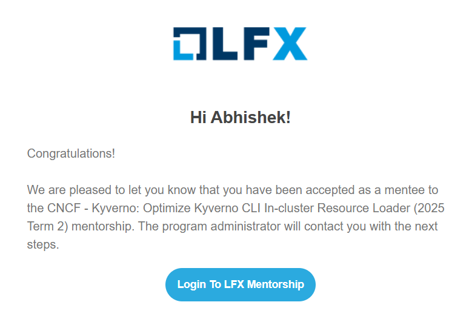
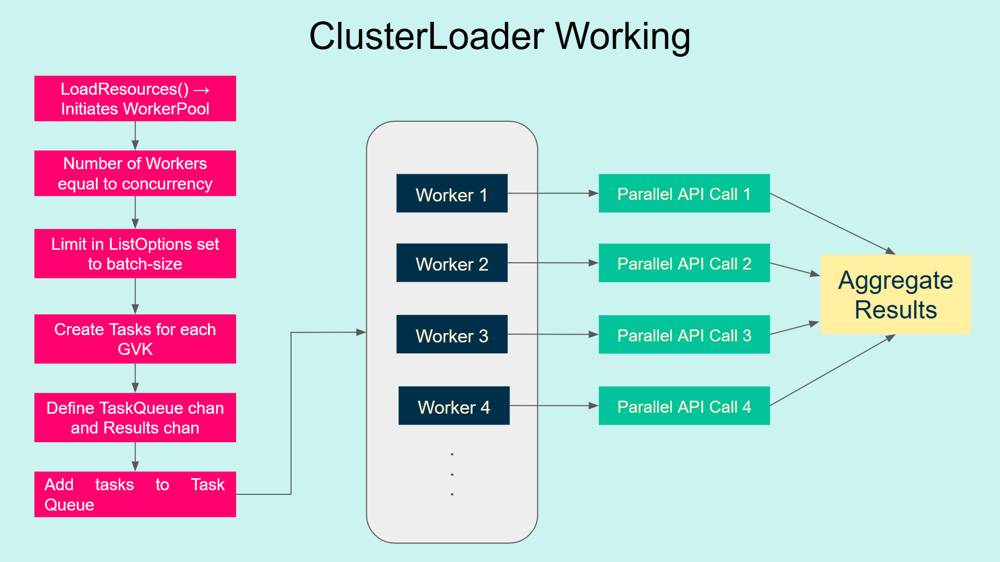
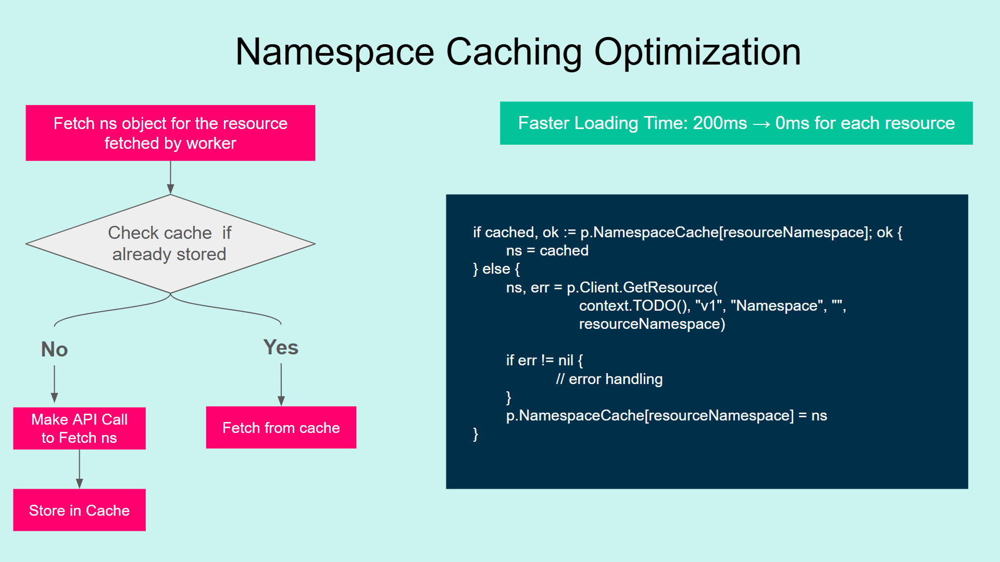
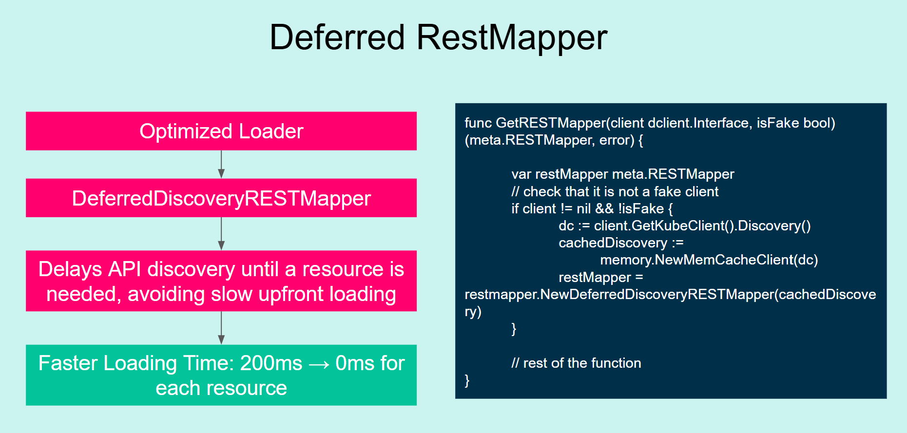
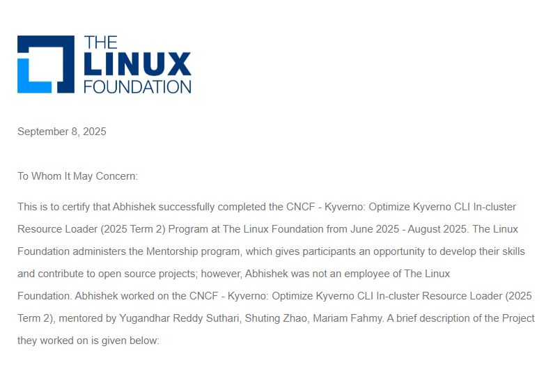

## Why Open Source?

As a recent Master's graduate, I began my work in March 2025. While searching through CNCF Projects, I stumbled upon Kyverno and the welcoming and supportive community really impressed me. The assistance provided by the mentors and community members inspired me to become a part of LFX Mentorship and motivated me to help new people start their open source journey. With this drive of mine, let me walk you through my journey of breaking into the open source world to LFX Mentorship graduation.

## Introduction to LFX Mentorship

The LFX mentorship is a 12-week long program which provides mentees with necessary guidance and support required to get involved in open-source projects. Under the mentorship of experienced open-source project maintainers, LFX provides students with the opportunity to learn more while gaining real-world experience by contributing to community-driven projects. The program runs thrice a year during Spring, Summer and Fall. Organizations like CNCF under The Linux Foundation offer mentorship opportunities through their program.

## What is Kyverno?

Kyverno is a cloud-native policy that runs in a Kubernetes cluster, and can also run outside the cluster as a unified policy language. It enforces best practices for security, compliance, for platforms and applications through policies as code. Basically, Kyverno operates as a dynamic admission controller in your cluster that processes admission webhook callbacks from the Kubernetes API server for mutation, validation, and generation. Kyverno applies policies to resources using matching parameters such as resource kind, name, labels, and other selectors. According to policy rules, Kyverno can automatically mutate, validate, or generate resources. For further information, visit [Kyverno documentation](https://kyverno.io/docs/).

## Getting Started with Kyverno

When I first learnt about open source in March 2025, I discovered CNCF and its enormous ecosystem of open source projects. I was excited to discover Kyverno, which is a Kubernetes policy engine. I started to browse its codebase, fixed some beginner friendly issues and joined its Slack communication channel. I learned about its weekly community meetings, where it was easy to talk about my work and contributions within the community, engage with maintainers and ask for their advice for contributions. In one of these community meetings, I learned about the LFX Mentorship program and started reading more about it.

## Selection Process and Onboarding

Once I learnt about the LFX mentorship, I felt really motivated to apply. After going through the official documentation for guidelines and step-by-step application process, I figured that a person can apply to at most three mentorship programs under a single term. After a few weeks of contributing, I got familiar with Kyverno’s codebase, community, and maintainers, and realised that applying to Kyverno’s Project was best fit for me.

The application process started as I created a mentee profile and answered some basic questions about my background, my motivation to apply, and how I would approach he project’s problem statement. I also submitted a cover letter to further highlight my motivation, explain how I could contribute to the community, and share my problem-solving approaches. I already had some past contributions to Kyverno so I included references and links to them.

This program not only encourages beginners to start their open-source journey, but also provides a platform to people with little to no prior experience.

## My Mentorship Work

Once I was selected for the Kyverno’s Project in the mentorship program, my work started with kickoff calls with my mentors [Shuting Zhao](https://mentorship.lfx.linuxfoundation.org/mentor/6c6848ba-76ae-49b6-a3b0-3754deb849f7), [Mariam Fahmy](https://mentorship.lfx.linuxfoundation.org/mentor/f9b67ae7-aea2-49ca-97de-5b83c53194cf), and [Yugandhar Reddy Suthari](https://mentorship.lfx.linuxfoundation.org/mentor/bede4d74-a783-42a5-9a94-d043c78fa207). We had weekly calls to track the progress of my work, make next plans and provide constructive feedback on my work.

In the first two weeks, we were strongly focused on the onboarding process, understanding the problem statement, researching the affected codebase, and devising a Kyverno Design Proposal, a solution approach for my project's problem statement. Once we finalized the plan, I started with the implementation.

## Problem Statement 

Kyverno offers a Command Line Interface (CLI) which is designed to validate and test policies against resources before applying them in a cluster using the apply and test commands. One can provide resources to be tested or validated against the policies via various methods, such as file manifests, stdin (standard input), or loading resources present in an active cluster via the –cluster flag.

When implementing the policy on the resources present in the cluster using `kubectl apply policy.yaml --cluster`, the results were generated right away within 1-2 seconds. However, when the number of resources increased to something around 3000+ resources validated against the policy, the execution time of the apply command took around 10-15 minutes, which was quite unusual.

## Analysis and Solution

I happened to identify three major bottlenecks –

1. Sequential Resource Loading: While loading the resources from cluster in Kyverno CLI, a gvkMap is created which contains GVK of all the resources that must be loaded from the cluster. Iterating over gvkMap to load resources from the cluster for each GVK using dynamic client sequentially results in higher execution time for a large number of resources.
2. Redundant Namespace Fetching: For every resource being fetched from the cluster, the policy application logic was redundantly fetching namespace resources with  dynamic clients from the cluster, which was causing approximately 200+ ms overhead time for every API call.
3. Eager Discovery Restmapper: In policy processing logic for each resource, we were building a RestMapper which utilized GetAPIGroupResource method that discovered all the API resources in the cluster in advance each time, resulting in 200+ ms overhead time for each discovery process.

All these bottlenecks, when happening for each resource fetch for 3000+ resources, result in 300*3000 ms ~ 15 mins.

Identifying bottlenecks made implementing solutions to optimize a lot easier. For each of the bottlenecks identified, I designed the following solutions –

1. For Sequential Resource Loader, I designed a concurrent resource loader strategy that initiates a worker pool with some number of workers/go-routines that take each GVK from gvkMap and load resources in parallel using the Kubernetes dynamic client and return the results. The number of workers and number of resources to fetch in a single API call for the large clusters can be controlled by the users using --concurrent and --batch-size flags. Apart from this, I also introduced a –show-benchmark flag through which the user can observe the performance metrics of the resource fetching mechanism.

2. For redundant Namespace resource fetching, I added a namespace cache to store namespace resources to avoid redundant API calls for enforcing the policy on each retrieved resource

3. For the Upfront RestMapper Discovery Issue, I added a deferred RestMapper that uses a lazy-loading approach for discovering resources in the cluster only when necessary.

## Results and Impact

With the help of the implementation of the three strategies that I did, the concurrent resource loader, namespace cache and deferred RestMapper - 

- **Execution time reduction**: I was able to cut down the 15 minutes of time taken by Kyverno apply command in applying policy on 3000+ resources to just 1-2 seconds. 
- **Overall performance improvement**: I was able to improve the Kyverno apply command execution time for large clusters by 99%. 
- **Concurrent Resource Loader efficiency**: The concurrent resource loader was able to load resources from cluster up to 80% more efficiently than sequential resource loader for 3000+ resources.
- **Enhanced user experience**: These enhancements allow users to perform policy validation on resources in a cluster at a much larger scale with much faster and smoother experiences, which makes Kyverno CLI a viable tool for production clusters in the real world. 
- **Configurable performance tuning**: The --show-performance flag support allows users to set up workers and batch size for resources to fine-tune the performance of policy validation for production-grade clusters.

## Reflections and Key Learnings

This mentorship experience changed my entire perspective about open source and contribution. The friendly Kyverno community members and the weekly calls with such positive feedback from mentors made it a warm learning experience for me. I am glad to say that there is no looking back for me now. This experience helped me understand that open source is not merely about commits and PRs but about open mindset, making your ideas and thoughts public and mentoring others in their open source journey. With everything that I learned from my LFX mentorship experience, I graduated from the Mentorship in September and am still contributing to the Kyverno community.

## References

- **Kyverno CLI Documentation**: Explore detailed documentation on Kyverno CLI, its use-cases - [Kyverno CLI](https://kyverno.io/docs/kyverno-cli/). 
- **Kyverno Slack and Community Meetings**: You can also join the Kyverno at Kyverno Slack community and weekly community calls to share your story and contributions. - [Kyverno Slack](https://slack.k8s.io/#kyverno), [Community Meetings](https://kyverno.io/community/#community-meeting)
- **CNCF Slack**: If you are interested in contributing to CNCF projects or joining community, you can join at CNCF Slack - [CNCF Slack](https://slack.cncf.io/?ajs_aid=1a8fc09c-f9b7-4e64-b1e8-d449629de96f)
- **Mentorship Projects**: Learn about mentorship projects at Kyverno and other open source projects - [Mentorships](https://mentorship.lfx.linuxfoundation.org/#projects_all)
**My PRs**: Know more about my contributions during the mentorship - [PR1](https://github.com/kyverno/kyverno/pull/13560), [PR2](https://github.com/kyverno/kyverno/pull/13550)
 
