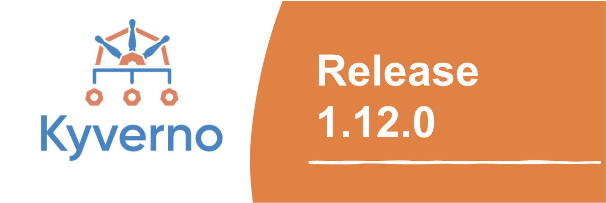
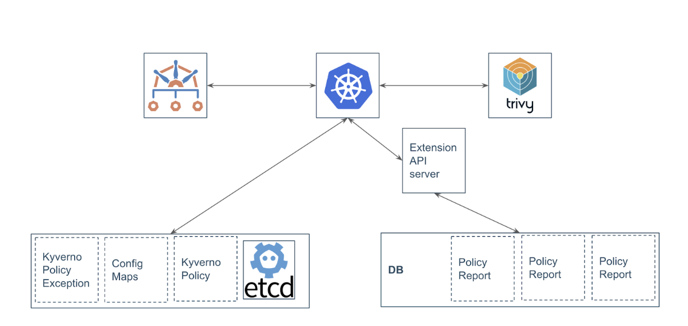
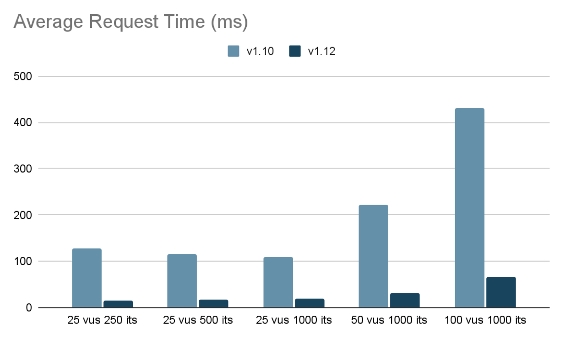

The Kyverno team is thrilled to announce the launch of version 1.12 hot on the heels of KubeCon EU 2024. Our interactions with Kyverno users during the conference have been incredibly insightful, with many expressing eager anticipation for the features introduced in this latest release. With over 330 pull requests merged, and 32 new contributors onboarded, we extend our heartfelt thanks to the Kyverno community for its invaluable contributions. Join us as we delve into the exciting new features of the 1.12 release.

## Key New Features in Kyverno 1.12

This release introduces support for alternative storage for policy reports, brings Kyverno JSON to the CLI and includes various other enhancements in policy exception handling, ValidatingAdmissionPolicy and pod security sub-rule. Significant performance improvements have been made, ensuring resilience for large-scale systems.

### Reports Server - Alternative Reports Storage

Policy reports are vital for tools like Kyverno, yet in large clusters, etcd's storage limitations can hinder efficient policy management. Reports Server is designed to tackle these challenges head-on and streamline policy reporting within Kubernetes environments. Reports server provides a scalable solution for storing policy reports and cluster policy reports. It moves reports out of etcd and stores them in a PostgreSQL database instance.

Reports Server offers a straightforward solution. It leverages the Extension API server with a database to seamlessly integrate with Kubernetes, providing a dedicated space for storing and retrieving policy reports.



Advantages of Reports Server:

* Scalability: Overcomes etcd's storage constraints, allowing for seamless scalability within Kubernetes clusters.
* Performance: By storing policy reports in a dedicated database, Reports Server improves cluster performance, particularly during heavy operations.
* Simplified Querying: Offers enhanced querying capabilities compared to etcd, simplifying access to policy reports.

Explore Reports Server and contribute to its development on GitHub: https://github.com/kyverno/reports-server.

### Global Context Entry

Kyverno's Global Context feature enhances policy enforcement within Kubernetes environments by enabling the caching of resources or external API calls for efficient reference across policies. Let's delve into how this functionality enhances flexibility and performance in policy management.

The cornerstone of Global Context is the Global Context Entry, a custom resource type introduced by Kyverno. With Global Context Entry, users can declare resource or API call data globally, independent of any specific policies. These entries can then be effortlessly referenced within policies as needed.

#### Types of Global Context Entries

##### Kubernetes Resource

Users can reference any Kubernetes resource, optionally within a specific namespace, to populate the cache with its latest state. This is particularly useful for scenarios where the latest state of resources needs to be accessed across multiple policies.

Example:

```yaml
apiVersion: kyverno.io/v2alpha1
kind: GlobalContextEntry
metadata:
  name: deployments
spec:
  kubernetesResource:
    group: apps
    version: v1
    resource: deployments
    namespace: test-globalcontext
```

_Notes_: When dealing with cluster-scoped resources, leave the namespace field empty.

##### API Call

Users can define an external API call, specifying the URL, CA bundle for certificate verification, and refresh interval to ensure the cached data remains up-to-date. This empowers policies to dynamically fetch data from external sources and utilize it for enforcement.

Example:

```yaml
apiVersion: kyverno.io/v2alpha1
kind: GlobalContextEntry
metadata:
  name: deployments
spec:
  apiCall:
    urlPath: "/apis/apps/v1/namespaces/test-globalcontext/deployments"
    refreshInterval: 10s
```

_Notes_: It's important to be mindful of potential data staleness with API calls, as the cache is updated periodically based on the defined refresh interval.

#### Integration with Policies

Global Context Entries seamlessly integrate into policies, allowing users to harness the cached data within their enforcement logic. By referencing Global Context Entries within policy contexts, users can leverage pre-fetched data without redundancy.

Example:

```yaml
context:
  - name: deploymentCount
     globalReference:
       name: deployments
```

_Note_: Depending on whether the data is sourced from Kubernetes resources or API calls, the JMESPath expression used to manipulate the data may vary. For Kubernetes resources, utilize `length(@)` to obtain the length of the array, while for API calls returning a list, use `items | length(@)`.

In conclusion, Global Context in Kyverno empowers users to streamline policy management by centralizing and reusing data across policies, thereby enhancing efficiency and maintainability in Kubernetes environments.

### Kyverno JSON In CLI

Kyverno JSON was introduced around the same time as Kyverno 1.11.0, expanding Kyverno's capabilities beyond Kubernetes. With the latest 1.12 release, Kyverno JSON is now supported by the Kyverno CLI for validating any JSON payload.

The following illustrates how to use the new `checks` stanza in a Kyverno CLI test:

```yaml
# ...
checks:
- match:
    resource:
      kind: Namespace
      metadata:
        name: hello-world-namespace
    policy:
      kind: ClusterPolicy
      metadata:
        name: sync-secret
    rule:
      name: sync-my-secret
  assert:
    status: pass
```

### Policy Exception Enhancements

PolicyExceptions now support a `conditions{}` block (optional) that uses common expressions similar to those found in `preconditions` and `deny` rules to query the contents of the selected resources in order to refine the selection process.

The following is a PolicyException that checks if the Pod/Deployment has a specific label:

```yaml
apiVersion: kyverno.io/v2beta1
kind: PolicyException
metadata:
  name: container-exception
spec:
  exceptions:
  - policyName: max-containers
     ruleNames:
     - max-two-containers
     - autogen-max-two-containers
  match:
    any:
    - resources:
        kinds:
        - Pod
        - Deployment
  conditions:
    any:
    - key: "{{ request.object.metadata.labels.color || '' }}"
       operator: Equals
       value: blue
```

In addition, PolicyException can be used to define an exemption for the Pod through the `podSecurity{}` block. It can be used to define controls that are exempted from the policy.

The following PolicyException exempts the containers running either the `nginx` or `redis` image from following the `Capabilities` control.

```yaml
apiVersion: kyverno.io/v2beta1
kind: PolicyException
metadata:
  name: pod-security-exception
  namespace: policy-exception-ns
spec:
  exceptions:
  - policyName: psa
    ruleNames:
    - restricted
  match:
    any:
    - resources:
        namespaces:
        - delta
  podSecurity:
    - controlName: Capabilities
      images:
          - nginx*
          - redis*
```

Furthermore, Kyverno CLI supports applying PolicyExceptions alongside policies to resources by using the `-e` or `--exceptions` flag to pass the Policy Exception manifest.

```bash
kyverno apply /path/to/policy.yaml --resource /path/to/resource.yaml --exception /path/to/exception.yaml
```

Resources that match the given exception will get a `skip` as a result. 


### ValidatingAdmissionPolicy in CLI and Reports

In 1.12, Kyverno CLI now supports applying the ValidatingAdmissionPolicyBinding along with the policy definition to the resources. Furthermore, the reports controller generates reports as a result of applying the ValidatingAdmissionPolicy along with its binding to resources.

Here is a report snippet that is generated for ValidatingAdmissionPolicy with its binding:

```yaml
 apiVersion: wgpolicyk8s.io/v1alpha2
  kind: PolicyReport
  metadata:
    labels:
      app.kubernetes.io/managed-by: kyverno
    namespace: staging-ns
    ownerReferences:
    - apiVersion: apps/v1
      kind: Deployment
      name: deployment-3
  results:
  - message: 'failed expression: object.spec.replicas <= 5'
    policy: check-deployment-replicas
    properties:
      binding: check-deployment-replicas-binding
    result: fail
    source: ValidatingAdmissionPolicy
  scope:
    apiVersion: apps/v1
    kind: Deployment
    name: deployment-3
    namespace: staging-ns
  summary:
    error: 0
    fail: 1
    pass: 0
    skip: 0
    warn: 0
```

### Fine-grained PodSecurity Validations

The `validate.podSecurity` sub-rule now has the ability to further classify exclusions by excluding specific fields as well as their values. This allows you to both use the easy style of policy language but get down to the lowest level of the funnel. For example, this is how you’ll be able to enforce the entire baseline profile of the Pod Security Standards but only exclude Istio’s and Linkerd’s images from specifically the `initContainers` list.

```yaml
apiVersion: kyverno.io/v1
kind: ClusterPolicy
metadata:
  name: pod-security-standards
spec:
  background: true
  validationFailureAction: Enforce
  rules:
    - name: baseline-service-mesh
      match:
        any:
          - resources:
              kinds:
                - Pod
      validate:
        podSecurity:
          level: baseline
          version: latest
          exclude:
            - controlName: Capabilities
              images:
                - "*/istio/proxyv2*"
                - "*/linkerd/proxy-init*"
              restrictedField: spec.initContainers[*].securityContext.capabilities.add
              values:
                - NET_ADMIN
                - NET_RAW
```

### Increased Performance

Kyverno 1.12 has undergone significant performance enhancements, making it even more suitable for large-scale deployments. Let’s dive into the challenges faced, the optimization journey, and the impressive results achieved.

#### Facing the Performance Bottlenecks

While Kyverno functioned well under normal conditions, its performance degraded under high loads, impacting large clusters. To address this, the Kyverno team, in collaboration with customers and the community, embarked on a mission to optimize performance.

#### Unveiling the Culprits

Load testing with K6 and profiling with Golang's pprof tool revealed the primary culprits: inefficient context storage, repetitive JSON operations, and excessive goroutine creation during event processing.

#### Strategic Optimizations

Armed with these insights, the team implemented targeted optimizations:

* Context Storage: Replacing JSON structures with in-memory Golang maps significantly reduced overhead.
* JSON Handling: Switching to the lightweight jsoniter library boosted JSON processing efficiency.
* Event Processing: A custom Watcher function optimized event generation and minimized goroutine overhead.
* Policy Matching: Restructuring the matching logic prioritized simpler comparisons, leading to faster processing.
* Webhook Configuration: Fine-grained configuration minimized unnecessary Kyverno invocations.

#### The Performance Leap

These optimizations yielded remarkable results:
* 8x improvement in average and p95 latency.
* Stable performance even with high iteration counts.



#### Continuous Improvement through Automation

To ensure the longevity of these improvements, automated K6 load testing is now integrated into the CI/CD pipeline. This allows for early detection of potential regressions and facilitates continuous performance optimization.

#### Kyverno: Ready for Large-Scale Deployments

These advancements solidify Kyverno's position as a robust and scalable policy engine for Kubernetes, capable of handling demanding workloads with ease. The collaborative effort behind these improvements exemplifies the project's commitment to delivering a secure and efficient policy management solution for the Kubernetes community.

## Policy Reporter UI V2

Policy Reporter UI v2 started its alpha phase with an updated techstack and complete restructuring of dashboards, details pages and the plugin system.

#### Content Restructuring

Policy Reporter UI v2 offers two types of views, resource-based and policy-based. The resource-based dashboards replace the old report views in Policy Reporter UI v1. The new focus of resource-based dashboards makes them much more scalable in larger environments and improves overall performance. Policy-based dashboards were a Kyverno-only feature in the old UI and only available with an additional Kyverno plugin. The revised views are available without additional requirements and are available for all provided sources.

#### New Plugin System

The plugin system was introduced to provide additional engine-specific functionality, but the old implementation required direct changes to the UI code, which made adding custom plugins very difficult.

The new plugin system requires an external service with a predefined (sub)set of REST APIs, where each plugin points to a source and provides additional information about this source. This additional information is automatically embedded in the existing views. These workflows make it possible to develop and use custom plugins without having to work on the actual user interface.

#### Custom Boards

One disadvantage of predefined views is the lack of customization options. Although they provide an overview of the entire cluster, it is often the case that teams within a company are only interested in a subset of namespaces and engine reports.

Custom Boards are a way of extending the UI with customized, application-specific views that provide only the required subset of information. The various configuration options enable the selection of namespaces based on a list or selector, the selection of displayed sources and the activation or deactivation of cluster-specific resource results.

#### Additional Features

* OpenIDConnect and OAuth2 authentication support
* Updated frontend tech stack: Bun, Vue 3.x, Nuxt 3.x, Vuetify 3.x, Vite 5.x
* Color Blind Themes
* General performance improvements

### Kyverno Playground

The Kyverno playground with the support of ValidatingAdmissionPolicyBinding is now available for the new 1.12 release. You can check it out today via https://playground.kyverno.io/next/#/.

## Closing
We have achieved another significant milestone, thanks to the support and contributions from our incredible community. Alongside the highlighted new features, this release includes critical fixes and other important changes. For a comprehensive overview, please refer to the full [release notes](https://github.com/kyverno/kyverno/releases/tag/v1.12.0) on GitHub.

You can find us in the Kyverno channel on [Kubernetes Slack](https://kyverno.io/community/#slack-channel), come and join one of our [community meetings](https://kyverno.io/community/#community-meetings) to discuss your contribution issues, or just catch us on [Twitter](https://twitter.com/kyverno). And if you’re already a Kyverno adopter, sign up to be an official adopter by updating the Adopters form [here](https://github.com/kyverno/kyverno/blob/main/ADOPTERS.md).

