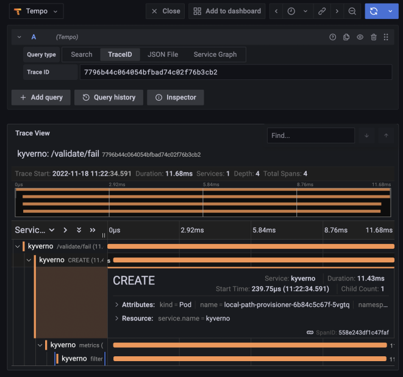

With the ringing in of the new year the Kyverno team is proud to announce the release of Kyverno 1.9.0, a release that we've been working hard on over the past several months and which is full of massive new features include TWO brand new rule types, several community-requested enhancements, and loads of fixes and improvements. Without any further ado, let's dive right in and show you what's in the bag.

## Key New Features of Kyverno 1.9

### Policy Exceptions

Something we've heard for a while now from the community was that they love the ease with which Kyverno can [select resources](/docs/writing-policies/match-exclude/) (and, really, just ease of use in general) for action by policies but that this was limiting in certain ways. It may not be scalable to modify every policy with the same exclusions, and, secondarily, in real-world ops scenarios everyone has special exceptions that need careful handling. So we're excited to show off our new PolicyExceptions in 1.9!

A [PolicyException](/docs/writing-policies/exceptions/) is a new type of policy and Custom Resource in Kyverno 1.9 which allows you to create an exception to any existing Kyverno policy in a way which is decoupled from the policy itself and so doesn't involve modifying the policy.

Here's what it would look like to allow a special exception to one of the [Pod Security Standard](/policies/pod-security/) [policies](/policies/?policytypes=Pod%2520Security%2520Standards%2520(Baseline)%2BPod%2520Security%2520Standards%2520(Restricted)) but only for a very specific resource named `important-tool`.

```yaml
apiVersion: kyverno.io/v2alpha1
kind: PolicyException
metadata:
  name: delta-exception
  namespace: delta
spec:
  exceptions:
  - policyName: disallow-host-namespaces
    ruleNames:
    - host-namespaces
    - autogen-host-namespaces
  match:
    any:
    - resources:
        kinds:
        - Pod
        - Deployment
        namespaces:
        - delta
        names:
        - important-tool*
```

Once a PolicyException is created, a resource which is selected by the exception and also applies to the policy and rule combo named in the exception will be allowed to circumvent the policy. As shown, it'll be quite useful, we think, for users who want those one-time exceptions to validate rules which are in `Enforce` mode although it works for other situations and rules as well. Access to creating PolicyExceptions can be controlled through a combination of Kubernetes RBAC, your own GitOps review processes, [YAML signing](/docs/writing-policies/validate/#manifest-validation) for integrity and tamper-prevention checks, and even Kyverno validate policies.

### Cleanup Policies

With Kyverno's unique [generation rule](/docs/writing-policies/generate/), which remains one of its most popular abilities and is beloved by ops teams everywhere, it has proven that Kyverno is far more capable than a simple admission controller which can only deliver "yes" or "no" responses. Generation, especially when combined with validation and mutation, unlocks tremendous power and turns Kyverno into a true tool of automation. That was a great first step, but we knew we could do more. We heard there was a piece missing from the story and that piece was the ability to delete as well as create. Well, we're really happy to say that as of Kyverno 1.9, our second new policy type will allow you to do just that: cleanup resources on a scheduled basis.

A Kyverno [CleanupPolicy](/docs/writing-policies/cleanup/) brings the all-familiar `match` and `exclude` capabilities with the powerful expressions and [JMESPath](/docs/writing-policies/jmespath/) filtering system together with a scheduler which allows you to very granularly select and filter resources you want removed in your cluster based on a recurring schedule. Just take a look at the below sample.

```yaml
apiVersion: kyverno.io/v2alpha1
kind: ClusterCleanupPolicy
metadata:
  name: clean-nekkid-pods
  annotations:
    pod-policies.kyverno.io/autogen-controllers: none
spec:
  match:
    any:
    - resources:
        kinds:
          - Pod
  conditions:
    all:
    - key: "{{ target.metadata.ownerReferences[] || `[]` }}"
      operator: Equals
      value: []
  schedule: "0 0 * * *"
```

Here is a ClusterCleanupPolicy which, as you might have guessed, applies cluster-wide, and which will find and remove Pods with no ownerReferences every day at midnight. Cleanup policies like these can be super helpful to keep clutter to a minimum and fit nicely into existing automation workflows.

A policy-based approach is only the first step, and in the second phase we intend on implementing automated cleanup based on a reserved label or annotation assigned to resources.

### Distributed Tracing

In the 1.8 release, we added OpenTelemetry support, but in this release we wanted to one-up ourselves and add in more observability to provide insights on _exactly_ what Kyverno is doing to your resources. So in 1.9, we've added full support for distributed tracing. With distributed tracing instrumented in Kyverno, you can see every rule and even every external call (in the case of OCI registry lookups) Kyverno is making and how long each span took. This is super helpful not just from a visibility but also a troubleshooting and even auditability standpoint. With traces in hand sent to your collector, you can see the rules which matched the resource and were processed so you know everything is working properly.



### Extended Support for Subresources

Kyverno has had support for some subresources for a few releases now (ephemeral containers have been supported since 1.7), but there were still gaps. Specifically, Kyverno had problems with the Scale subresource, which can be tricky to deal with, as well as mutations to the Status subresource. This meant that a couple real-world use cases that have come up simply weren't possible to implement in Kyverno policies. With Kyverno 1.9, that should be a thing of the past and most, if not all, subresources can be handled quite well.

With this enhanced support, you can now easily match on the precise subresource you want (even using wildcards) and Kyverno will figure it out. For example, advertising [extended resources](https://kubernetes.io/docs/tasks/administer-cluster/extended-resource-node/) to Kubernetes nodes is important for use cases like GPUs and FPGAs, and with a Kyverno [mutate](/docs/writing-policies/mutate/) rule targeted at Node/status, it's now incredibly simple and doesn't require any custom webhooks. The below policy will add the `example.com/dongle` resource to new Nodes brought up in the cluster.

```yaml
apiVersion: kyverno.io/v1
kind: ClusterPolicy
metadata:
  name: advertise-resource
spec:
  background: false
  rules:
    - name: advertise-dongle
      match:
        any:
        - resources:
            kinds:
            - Node/status
      mutate:
        patchStrategicMerge:
          status:
            capacity:
              example.com/dongle: 2
```

### ConfigMap Caching

ConfigMaps are a common source of data not just to Pods but to Kyverno policies as well. Kyverno has long had support for [dynamic lookups from ConfigMaps](/docs/writing-policies/external-data-sources/#variables-from-configmaps) without requiring any pre-syncing, and in most use cases this was fine. But as more users flocked to Kyverno with ever larger clusters, these additional API calls produced some unwanted overhead. Starting in Kyverno 1.9, if you would like Kyverno to cache the ConfigMaps you need for policy decisions, simply assign the label `cache.kyverno.io/enabled: "true"` to any ConfigMap and Kyverno will automatically cache it for you. Nothing else you need to do.

## Other Additions and Enhancements

Some other cool features and status updates we're proud to share include new JSON logging format and the ability to dump out the full AdmissionReview contents the API server sends to Kyverno. The latter has been a common request from the community and should help in those situations where you're not quite sure how to write a certain policy. Both require setting a new container flag so check out the [docs](/docs/installation/customization/#container-flags).

Kyverno now supports [nested foreach loops](/docs/writing-policies/mutate/#nested-foreach) which are great especially for mutation use cases where you need tactical modifications or removals from complex nested objects like arrays within arrays.

There are eleven new [JMESPath filters](/docs/writing-policies/jmespath/#custom-filters) specifically for working with time. These filters include things like getting current time, converting it from different formats, and even translating the time to a Cron expression. These are sure to come in handy when writing policies which account for time in various ways.

Pod controller [rule auto-generation](/docs/writing-policies/autogen/), another of Kyverno's hallmark capabilities which if you're not familiar allows Kyverno to translate rules solely for Pods to all other major Pod controllers, added support for ReplicaSet and ReplicationController. There's nothing policy authors need to do and Kyverno will now add these two resources into the auto-gen rules for you.

The Kyverno CLI now has experimental support for uploading and downloading Kyverno policies as OCI artifacts. This is great for storing policies alongside container images using the same, common semantics. In the future, we're planning on doing more with this support so keep a lookout.

We're preparing for the movement away from v1 of our policy schema which has served us well for a while now. As we go towards v2beta1, which is available in 1.9, we get rid of deprecated and obsoleted fields to make a nice and tidy policy. We ask you to start moving in the direction of v2beta1 now to make the removal process much smoother.

Kyverno 1.9 brings support for Kubernetes 1.26. Kyverno follows an [N-2 support policy](/docs/installation/#compatibility-matrix), and so to ensure we're staying current, we're now building and testing up to 1.26.

We have long been a champion of software supply chain security and insist on enacting these practices ourselves. With the 1.9 release, Kyverno now generates and attests to [SLSA provenance](https://slsa.dev/spec/v0.1/index) which anyone on their end can publicly [verify](/docs/security/#verifying-provenance). We believe this and other policies by which we abide makes us adherent to SLSA [Level 3](https://slsa.dev/spec/v0.1/levels) and will be working with the [Open Source Security Foundation](https://openssf.org/) to ensure this is the case.

And last but not least, the [Kyverno policy library](/policies/), the largest community-driven library of any policy engine for Kubernetes, has received another large bump putting it well over the 250 mark. Included in this library update is a new [table](/policies/gatekeeper/) which maps Gatekeeper policies to Kyverno policies, helpful for users of both tools to see how to accomplish some common use cases in these engines.

## Potentially Breaking Changes

One change we do want to make you aware of, which actually came in 1.8.3, which could be breaking is a schema modification for verifying a container image attestation. Due to some upstream changes in Sigstore's [cosign](https://github.com/sigstore/cosign), we had to move the attestors under the attestation being verified. This necessitated a schema change which you can find in the [documentation](/docs/writing-policies/verify-images/#verifying-image-attestations). So if you have Kyverno policies which verified image attestations, please update them to the new schema so they continue to work in 1.9.

## Closing

With so many new features, enhancements, and well over 200 fixes, there's so much to get excited about in this release. Hopefully what you've seen makes you excited to try out the 1.9 release and provide your feedback. Come engage with us in the Kyverno channel on [Kubernetes Slack](/community/#slack-channel), attend one of our [community meetings](/community/#community-meetings), or just catch us on [Twitter](https://twitter.com/kyverno).
