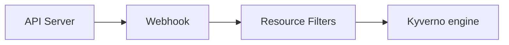

Kyverno provides multiple methods for installation: Helm and YAML manifest. When installing in a production environment, Helm is the recommended and most flexible method as it offers convenient configuration options to satisfy a wide range of customizations. Regardless of the method, Kyverno must always be installed in a dedicated Namespace; it must not be co-located with other applications in existing Namespaces including system Namespaces such as `kube-system`. The Kyverno Namespace should also not be used for deployment of other, unrelated applications and services.

The diagram below shows a typical Kyverno installation featuring all available controllers.


<br/><br/>

A standard Kyverno installation consists of a number of different components, some of which are optional.

* **Deployments**
  * Admission controller (required): The main component of Kyverno which handles webhook callbacks from the API server for verification, mutation, [Policy Exceptions](/docs/writing-policies/exceptions/), and the processing engine.
  * Background controller (optional): The component responsible for processing of generate and mutate-existing rules.
  * Reports controller (optional): The component responsible for handling of [Policy Reports](/docs/policy-reports/).
  * Cleanup controller (optional): The component responsible for processing of [Cleanup Policies](/docs/writing-policies/cleanup/).
* **Services**
  * Services needed to receive webhook requests.
  * Services needed for monitoring of metrics.
* **ServiceAccounts**
  * One ServiceAccount per controller to segregate and confine the permissions needed for each controller to operate on the resources for which it is responsible.
* **ConfigMaps**
  * ConfigMap for holding the main Kyverno configuration.
  * ConfigMap for holding the metrics configuration.
* **Secrets**
  * Secrets for webhook registration and authentication with the API server.
* **Roles and Bindings**
  * Roles and ClusterRoles, Bindings and ClusterRoleBindings authorizing the various ServiceAccounts to act on the resources in their scope.
* **Webhooks**
  * ValidatingWebhookConfigurations for receiving both policy and resource validation requests.
  * MutatingWebhookConfigurations for receiving both policy and resource mutating requests.
* **CustomResourceDefinitions**
  * CRDs which define the custom resources corresponding to policies, reports, and their intermediary resources.

## Compatibility Matrix

Kyverno follows the same support policy as the Kubernetes project which is an N-2 policy in with the three latest minor releases are maintained. Although previous versions may work, they are not tested and therefore no guarantees are made as to their full compatibility. Kyverno also follows a similar strategy for support of Kubernetes itself. The below table shows the compatibility matrix.

| Kyverno Version                | Kubernetes Min | Kubernetes Max |
|--------------------------------|----------------|----------------|
| 1.6.x                          | 1.16           | 1.23           |
| 1.7.x                          | 1.21           | 1.23           |
| 1.8.x                          | 1.23           | 1.25           |
| 1.9.x                          | 1.24           | 1.26           |
| 1.10.x                         | 1.24           | 1.26           |

\* Due to a known issue with Kubernetes 1.23.0-1.23.2, support for 1.23 begins at 1.23.3.

**NOTE:** The [Enterprise Kyverno](https://nirmata.com/kyverno-enterprise/) by Nirmata supports a wide range of Kubernetes versions for any Kyverno version. Refer to the Release Compatibility Matrix for the Enterprise Kyverno [here](https://docs.nirmata.io/n4k/nirmata-enterprise-kyverno/) or contact [Nirmata support](mailto:support@nirmata.com) for assistance.

## Install Kyverno using Helm

Kyverno can be deployed via a Helm chart--the recommended and preferred method for a production install--which is accessible either through the Kyverno repository or on [ArtifactHub](https://artifacthub.io/packages/helm/kyverno/kyverno). Both generally available and pre-releases are available with Helm.

In order to install Kyverno with Helm, first add the Kyverno Helm repository.

```sh
helm repo add kyverno https://kyverno.github.io/kyverno/
```

Scan the new repository for charts.

```sh
helm repo update
```

Optionally, show all available chart versions for Kyverno.

```sh
helm search repo kyverno -l
```

Choose one of the installation configuration options based upon your environment type and availability needs. For a production installation, see the [High Availability](#high-availability) section. For a non-production installation, see the [Standalone](#standalone) section below for additional details.

When deploying Kyverno to certain Kubernetes platforms such as EKS, AKS, or OpenShift; or when using certain GitOps tools such as ArgoCD, additional configuration options may be needed or recommended. See the [Platform-Specific Notes](#platform-specific-notes) section below for additional details.

After Kyverno is installed, you may choose to also install the Kyverno [Pod Security Standard policies](/policies/pod-security/), an optional chart containing the full set of Kyverno policies which implement the Kubernetes [Pod Security Standards](https://kubernetes.io/docs/concepts/security/pod-security-standards/).

```sh
helm install kyverno-policies kyverno/kyverno-policies -n kyverno
```

### High Availability

The Helm chart is the recommended method of installing Kyverno in a production-grade, highly-available fashion as it provides all the necessary Kubernetes resources and configuration options to meet most production needs including platform-specific controls.

Since Kyverno is comprised of different controllers where each is contained in separate Kubernetes Deployments, high availability is achieved on a per-controller basis. A default installation of Kyverno provides four separate Deployments each with a single replica. Configure high availability on the controllers where you need the additional availability. Be aware that multiple replicas do not necessarily equate to higher scale or performance across all controllers. Please see the [high availability page](/docs/high-availability/) for more complete details.

The Helm chart offers parameters to configure multiple replicas for each controller. For example, a minimally-viable, highly-available, complete deployment of Kyverno would consist of the following values.

```yaml
admissionController.replicas: 3
backgroundController.replicas: 2
cleanupController.replicas: 2
reportsController.replicas: 2
```

For all of the available values and their defaults, please see the Helm chart [README](https://github.com/kyverno/kyverno/tree/release-1.10/charts/kyverno). You should carefully inspect all available chart values and their defaults to determine what overrides, if any, are necessary to meet the particular needs of your production environment.

{}
All Kyverno installations require the admission controller be among the controllers deployed. The admission controller does not support two replicas. For a highly-available installation, the only supported count is three.
{}

By default, the Kyverno Namespace will be excluded using a namespaceSelector configured with the [immutable label](https://kubernetes.io/docs/concepts/overview/working-with-objects/_print/#automatic-labelling) `kubernetes.io/metadata.name`. Additional Namespaces may be excluded by configuring chart values. Both namespaceSelector and objectSelector may be used for exclusions.

See also the [Namespace selectors](#namespace-selectors) section below and especially the [Security vs Operability](#security-vs-operability) section.

Use Helm to create a Namespace and install Kyverno in a highly-available configuration.

```sh
helm install kyverno kyverno/kyverno -n kyverno --create-namespace \
--set admissionController.replicas=3 \
--set backgroundController.replicas=2 \
--set cleanupController.replicas=2 \
--set reportsController.replicas=2
```

### Standalone

A standalone installation of Kyverno is suitable for lab, test/dev, or small environments typically associated with non-production. It configures a single replica for each Kyverno Deployment and omits many of the production-grade components.

Use Helm to create a Namespace and install Kyverno.

```sh
helm install kyverno kyverno/kyverno -n kyverno --create-namespace
```

To install pre-releases, add the `--devel` switch to Helm.

```sh
helm install kyverno kyverno/kyverno -n kyverno --create-namespace --devel
```

## Install Kyverno using YAMLs

Kyverno can also be installed using a single installation manifest, however for production installations the Helm chart is the preferred and recommended method.

Although Kyverno uses release branches, only YAML manifests from a tagged release are supported. Pull from a tagged release to install Kyverno using the YAML manifest.

```sh
kubectl create -f https://github.com/kyverno/kyverno/releases/download/v1.10.0/install.yaml
```

### Testing unreleased code

In some cases, you may wish to trial yet unreleased Kyverno code in a quick way. Kyverno provides an experimental installation manifest for these purposes which reflects the current state of the codebase as it is known on the `main` development branch.

{}
DO NOT use this manifest for anything other than testing or experimental purposes!
{}

```sh
kubectl create -f https://github.com/kyverno/kyverno/raw/main/config/install-latest-testing.yaml
```

## Platform-Specific Notes

Depending on the application used to either install and manage Kyverno or the Kubernetes platform on which the cluster is built, there are some specific considerations of which to be aware. These notes are provided assuming the Helm chart is the installation artifact used.

### Notes for ArgoCD users

When deploying the Kyverno Helm chart with ArgoCD, you will need to enable `Replace` in the `syncOptions`. You may want to also ignore differences in aggregated ClusterRoles which Kyverno uses by default. Aggregated ClusterRoles are built by aggregating other ClusterRoles in the cluster and are dynamic by nature, therefore desired and observed states cannot match.

You can do so by following instructions in these pages of the ArgoCD documentation:

* [Enable Replace in the syncOptions](https://argo-cd.readthedocs.io/en/stable/user-guide/sync-options/#replace-resource-instead-of-applying-changes)
* [Ignore diff in aggregated cluster roles](https://argo-cd.readthedocs.io/en/stable/user-guide/diffing/#ignoring-rbac-changes-made-by-aggregateroles)

ArgoCD uses Helm only for templating but applies the results with `kubectl`. Unfortunately `kubectl` adds metadata that exceeds the limit allowed by Kubernetes. Using `Replace` overcomes this limitation. Another option is to use server-side apply, supported in ArgoCD v2.5+.

Below is an example of an ArgoCD Application manifest that should work with the Kyverno Helm chart:

```yaml
apiVersion: argoproj.io/v1alpha1
kind: Application
metadata:
  name: kyverno
  namespace: argocd
spec:
  destination:
    namespace: kyverno
    server: https://kubernetes.default.svc
  project: default
  source:
    chart: kyverno
    repoURL: https://kyverno.github.io/kyverno
    targetRevision: 2.6.0
  syncPolicy:
    automated:
      prune: true
      selfHeal: true
    syncOptions:
      - CreateNamespace=true
      - Replace=true
```

#### Ownership Clashes

ArgoCD automatically sets the `app.kubernetes.io/instance` label and uses it to determine which resources form the app. The Kyverno Helm chart also sets this label for the same purposes. In order to resolve this conflict, configure ArgoCD to use a different tracking mechanism as described in the ArgoCD [documentation](https://argo-cd.readthedocs.io/en/latest/user-guide/resource_tracking/#additional-tracking-methods-via-an-annotation).

### Notes for OpenShift Users

Red Hat OpenShift contains a feature called [Security Context Constraints](https://docs.openshift.com/container-platform/4.11/authentication/managing-security-context-constraints.html) (SCC) which enforces certain security controls in a profile-driven manner. An OpenShift cluster contains several of these out of the box with OpenShift 4.11 preferring `restricted-v2` by default. The Kyverno Helm chart defines its own values for the Pod's `securityContext` object which, although it conforms to the upstream [Pod Security Standards' restricted profile](https://kubernetes.io/docs/concepts/security/pod-security-standards/#restricted), may potentially be incompatible with your defined Security Context Constraints. Deploying the Kyverno Helm chart as-is on an OpenShift environment may result in an error similar to "unable to validate against any security context constraint". In order to get past this, deploy the Kyverno Helm chart with with the required securityContext flags/fields set to a value of `null`. OpenShift will apply the defined SCC upon deployment. If on OpenShift 4.11+, the `restricted-v2` profile is known to allow for successful deployment of the chart without modifying the Helm chart installation process.

### Notes for EKS Users

For EKS clusters built with the VPC CNI plug-in, if you wish to opt for the operability strategy as defined [below](#security-vs-operability), during the installation of Kyverno you should exclude the `kube-system` Namespace from webhooks as this is the Namespace where the plug-in runs. In situations where all the cluster Nodes are "deleted" (ex., only one node group in the cluster which is scaled to zero), which also impacts where the Kyverno replicas run, if `kube-system` is not excluded and where at least one policy in `Fail` mode matches on Pods, the VPC CNI plug-in's DaemonSet Pods may not be able to come online to finish the Node bootstrapping process. If this situation occurs, because the underlying cluster network cannot return to a healthy state, Kyverno will be unable to service webhook requests.

### Notes for AKS Users

AKS uses an Admission Enforcer control the webhooks in an AKS cluster and will remove those that may impact system Namespaces. Since Kyverno registers as a webhook, this Admission Enforcer may remove Kyverno's webhook causing the two to fight over webhook reconciliation. See [this Microsoft Azure FAQ](https://learn.microsoft.com/en-us/azure/aks/faq#can-admission-controller-webhooks-impact-kube-system-and-internal-aks-namespaces) for further information. When deploying Kyverno on an AKS cluster, set the Helm option `config.webhookAnnotations` to include the necessary annotation to disable the Admission Enforcer. Kyverno will configure its webhooks with this annotation to prevent their removal by AKS. The annotation that should be used is `"admissions.enforcer/disabled": true`. See the chart [README](https://github.com/kyverno/kyverno/blob/release-1.10/charts/kyverno/README.md) for more information.

## Security vs Operability

For a production installation, Kyverno should be installed in [high availability mode](#high-availability). Regardless of the installation method used for Kyverno, it is important to understand the risks associated with any webhook and how it may impact cluster operations and security especially in production environments. Kyverno configures its resource webhooks by default (but [configurable](/docs/writing-policies/policy-settings/)) in [fail closed mode](https://kubernetes.io/docs/reference/access-authn-authz/extensible-admission-controllers/#failure-policy). This means if the API server cannot reach Kyverno in its attempt to send an AdmissionReview request for a resource that matches a policy, the request will fail. For example, a validation policy exists which checks that all Pods must run as non-root. A new Pod creation request is submitted to the API server and the API server cannot reach Kyverno. Because the policy cannot be evaluated, the request to create the Pod will fail. Care must therefore be taken to ensure that Kyverno is always available or else configured appropriately to exclude certain key Namespaces, specifically that of Kyverno's, to ensure it can receive those API requests. There is a tradeoff between security by default and operability regardless of which option is chosen.

The following combination may result in cluster inoperability if the Kyverno Namespace is not excluded:

1. At least one Kyverno rule matching on `Pods` is configured in fail closed mode (the default setting).
2. No Namespace exclusions have been configured for at least the Kyverno Namespace, possibly other key system Namespaces (ex., `kube-system`). This is not the default as of Helm chart version 2.5.0.
3. All Kyverno Pods become unavailable due to a full cluster outage or improper scaling in of Nodes (for example, a cloud PaaS destroying too many Nodes in a node group as part of an auto-scaling operation without first cordoning and draining Pods).

If this combination of events occurs, the only way to recover is to manually delete the ValidatingWebhookConfigurations thereby allowing new Kyverno Pods to start up. Recovery steps are provided in the [troubleshooting section](/docs/troubleshooting/#api-server-is-blocked).

{}
Kubernetes will not send ValidatingWebhookConfiguration or MutatingWebhookConfiguration objects to admission controllers, so therefore it is not possible to use a Kyverno policy to validate or mutate these objects.
{}

By contrast, these operability concerns can be mitigated by making some security concessions. Specifically, by excluding the Kyverno and other system Namespaces during installation, should the aforementioned failure scenarios occur Kyverno should be able to recover by itself with no manual intervention. This is the default behavior as of the Helm chart version 2.5.0. However, configuring these exclusions means that subsequent policies will not be able to act on resources destined for those Namespaces as the API server has been told not to send AdmissionReview requests for them. Providing controls for those Namespaces, therefore, lies in the hands of the cluster administrator to implement, for example, Kubernetes RBAC to restrict who and what can take place in those excluded Namespaces.

{}
Namespaces and/or objects within Namespaces may be excluded in a variety of ways including namespaceSelectors and objectSelectors. The Helm chart provides options for both, but by default the Kyverno Namespace will be excluded.
{}

{}
When using objectSelector, it may be possible for users to spoof the same label key/value used to configure the webhooks should they discover how it is configured, thereby allowing resources to circumvent policy detection. For this reason, a namespaceSelector using the `kubernetes.io/metadata.name` immutable label is recommended.
{}

The choices and their implications are therefore:

1. Do not exclude system Namespaces, including Kyverno's, (not default) during installation resulting in a more secure-by-default posture but potentially requiring manual recovery steps in some outage scenarios.
2. Exclude system Namespaces during installation (default) resulting in easier cluster recovery but potentially requiring other methods to secure those Namespaces, for example with Kubernetes RBAC.

You should choose the best option based upon your risk aversion, needs, and operational practices.

{}
If you choose to *not* exclude Kyverno or system Namespaces/objects and intend to cover them with policies, you may need to modify the Kyverno [resourceFilters](/docs/installation/#resource-filters) entry in the [ConfigMap](/docs/installation/#configmap-flags) to remove those items.
{}

## Customizing Kyverno

Kyverno has many different functions and supports a wide range of possible customizations. This section provides more information on Kyverno's supporting resources and how they can be customized to tune certain behaviors.

### Certificate Management

The Kyverno policy engine runs as an admission webhook and requires a CA-signed certificate and key to setup secure TLS communication with the Kubernetes API server. There are two ways to configure secure communications between Kyverno and the API server.

#### Default certificates

By default, Kyverno will automatically generate self-signed Certificate Authority (CA) and a leaf certificates for use in its webhook registrations. The CA certificate expires after one year. When Kyverno manage its own certificates, it will gracefully handle regeneration upon expiry.

After installing Kyverno, use the [step CLI](https://smallstep.com/cli/) to check and verify certificate details.

Get all Secrets in Kyverno's Namespace.

```sh
$ kubectl -n kyverno get secret
NAME                                                      TYPE                 DATA   AGE
kyverno-cleanup-controller.kyverno.svc.kyverno-tls-ca     kubernetes.io/tls    2      21d
kyverno-cleanup-controller.kyverno.svc.kyverno-tls-pair   kubernetes.io/tls    2      21d
kyverno-svc.kyverno.svc.kyverno-tls-ca                    kubernetes.io/tls    2      21d
kyverno-svc.kyverno.svc.kyverno-tls-pair                  kubernetes.io/tls    2      21d
```

Get and decode the CA certificate used by the admission controller.

```sh
$ kubectl -n kyverno get secret kyverno-svc.kyverno.svc.kyverno-tls-ca -o jsonpath='{.data.tls\.crt}' | \
  step base64 -d | step certificate inspect --short
X.509v3 Root CA Certificate (RSA 2048) [Serial: 0]
  Subject:     *.kyverno.svc
  Issuer:      *.kyverno.svc
  Valid from:  2023-04-14T18:33:37Z
          to:  2024-04-13T19:33:37Z
```

Get and decode the certificate used to register the webhooks with the Kubernetes API server (assumes at least one validate policy is installed) and see the same CA root certificate is in use.

```sh
$ kubectl get validatingwebhookconfiguration kyverno-resource-validating-webhook-cfg -o jsonpath='{.webhooks[0].clientConfig.caBundle}' | \
  step base64 -d | step certificate inspect --short
X.509v3 Root CA Certificate (RSA 2048) [Serial: 0]
  Subject:     *.kyverno.svc
  Issuer:      *.kyverno.svc
  Valid from:  2023-04-14T18:33:37Z
          to:  2024-04-13T19:33:37Z
```

#### Custom certificates

You can install your own CA-signed certificate, or generate a self-signed CA and use it to sign a certificate. Once you have a CA and X.509 certificate-key pair, you can install these as Kubernetes Secrets in your cluster. If Kyverno finds these Secrets, it uses them, otherwise it will fall back on the default certificate management method. When you bring your own certificates, it is your responsibility to manage the regeneration/rotation process. Only RSA is supported for the CA and leaf certificates.

##### Generate a self-signed CA and signed certificate-key pair

{}
Using a separate self-signed root CA is difficult to manage and not recommended for production use.
{}

If you already have a CA and a signed certificate, you can directly proceed to Step 2.

Below is a process which shows how to create a self-signed root CA, and generate a signed certificate and key using [step CLI](https://smallstep.com/cli/):

1. Create a self-signed CA

```sh
step certificate create kyverno-ca rootCA.crt rootCA.key --profile root-ca --insecure --no-password
```

2. Generate a leaf certificate with a five-year expiration

```sh
step certificate create kyverno-svc tls.crt tls.key --profile leaf \
            --ca rootCA.crt --ca-key rootCA.key \
            --san kyverno-svc --san kyverno-svc.kyverno --san kyverno-svc.kyverno.svc --not-after 43200h --insecure --no-password
```

3. Verify the contents of the certificate

```sh
step certificate inspect tls.crt --short
```

The certificate must contain the SAN information in the `X509v3 extensions` section:

```sh
X509v3 extensions:
    X509v3 Subject Alternative Name:
        DNS:kyverno-svc, DNS:kyverno-svc.kyverno, DNS:kyverno-svc.kyverno.svc
```

##### Configure Secrets for the CA and TLS certificate-key pair

You can now use the following files to create Secrets:

* `rootCA.crt`
* `tls.crt`
* `tls.key`

To create the required Secrets, use the following commands (do not change the Secret names):

```sh
kubectl create ns <namespace>
kubectl create secret tls kyverno-svc.kyverno.svc.kyverno-tls-pair --cert=tls.crt --key=tls.key -n <namespace>
kubectl create secret generic kyverno-svc.kyverno.svc.kyverno-tls-ca --from-file=rootCA.crt -n <namespace>
```

Secret | Data | Content
------------ | ------------- | -------------
`kyverno-svc.kyverno.svc.kyverno-tls-pair` | tls.key & tls.crt  | key and signed certificate
`kyverno-svc.kyverno.svc.kyverno-tls-ca` | rootCA.crt | root CA used to sign the certificate

Kyverno uses Secrets created above to setup TLS communication with the Kubernetes API server and specify the CA bundle to be used to validate the webhook server's certificate in the admission webhook configurations.

This process has been automated for you with a simple script that generates a self-signed CA, a TLS certificate-key pair, and the corresponding Kubernetes secrets: [helper script](https://github.com/kyverno/kyverno/blob/main/scripts/generate-self-signed-cert-and-k8secrets.sh)

##### Install Kyverno

You can now install Kyverno by selecting one of the available methods from the [installation section above](/docs/installation/#compatibility-matrix).

### Roles and Permissions

Kyverno creates several Roles, ClusterRoles, RoleBindings, and ClusterRoleBindings some of which may need to be customized depending on additional functionality required. To view all ClusterRoles and Roles associated with Kyverno, use the command `kubectl get clusterroles,roles -A | grep kyverno`.

#### Roles

Kyverno creates the following Roles in its Namespace, one per controller type:

* `kyverno:admission-controller`
  * create, delete, get, patch, and update Leases to handle high availability configurations.
  * get, list, and watch Deployments so it can manage the Kyverno Deployment itself.
  * get, list, watch, create, and update Secrets to manage certificates used for webhook management.
  * get, list, and watch ConfigMaps for configuration changes.
* `kyverno:reports-controller`
  * get, list, and watch ConfigMaps for configuration changes.
  * create, delete, get, patch, and update Leases to handle high availability configurations.
* `kyverno:background-controller`
  * get, list, and watch ConfigMaps for configuration changes.
  * create, delete, get, patch, and update Leases to handle high availability configurations.
* `kyverno:cleanup-controller`
  * get, list, watch, create, and update Secrets to manage certificates used for webhook management.
  * get, list, and watch ConfigMaps for configuration changes.
  * create, delete, get, patch, and update Leases to handle high availability configurations.

#### ClusterRoles

Kyverno uses [aggregated ClusterRoles](https://kubernetes.io/docs/reference/access-authn-authz/rbac/#aggregated-clusterroles) to search for and combine ClusterRoles which apply to Kyverno. Each controller has its own set of ClusterRoles. Those ending in `core` are the aggregate ClusterRoles which are then aggregated by the top-level role without the `core` suffix.

The following `ClusterRoles` provide Kyverno with permissions to policies and other Kubernetes resources across all Namespaces.

* `kyverno:admission-controller:core`: aggregate ClusterRole for the admission controller
* `kyverno:admission-controller`: aggregated (top-level) ClusterRole for the admission controller
* `kyverno:reports-controller:core`: aggregate ClusterRole for the reports controller
* `kyverno:reports-controller`: aggregated (top-level) ClusterRole for the reports controller
* `kyverno:background-controller:core`: aggregate ClusterRole for the background controller
* `kyverno:background-controller`: aggregated (top-level) ClusterRole for the background controller
* `kyverno:cleanup-controller:core`: aggregate ClusterRole for the cleanup controller
* `kyverno:cleanup-controller`: aggregated (top-level) ClusterRole for the cleanup controller
* `kyverno-cleanup-jobs`: used by the helper CronJob to periodically remove excessive/stale admission reports if found
* `kyverno:rbac:admin:policies`: aggregates to admin the ability to fully manage Kyverno policies
* `kyverno:rbac:admin:policyreports`: aggregates to admin the ability to fully manage Policy Reports
* `kyverno:rbac:admin:reports`: aggregates to admin the ability to fully manage intermediary admission and background reports
* `kyverno:rbac:admin:updaterequests`: aggregates to admin the ability to fully manage UpdateRequests, intermediary resource for generate rules
* `kyverno:rbac:view:policies`: aggregates to view the ability to view Kyverno policies
* `kyverno:rbac:view:policyreports`: aggregates to view the ability to view Policy Reports
* `kyverno:rbac:view:reports`: aggregates to view the ability to view intermediary admission and background reports
* `kyverno:rbac:view:updaterequests`: aggregates to view the ability to view UpdateRequests, intermediary resource for generate rules

#### Customizing Permissions

Because the ClusterRoles used by Kyverno use the [aggregation feature](https://kubernetes.io/docs/reference/access-authn-authz/rbac/#aggregated-clusterroles), extending the permission for Kyverno's use in cases like mutate existing or generate rules is a simple matter of creating one or more new ClusterRoles which use the appropriate labels. It is not necessary to modify any existing ClusterRoles created as part of the Kyverno installation. Doing so is not recommended as changes may be wiped during an upgrade. Since there are multiple controllers each with its own ServiceAccount, granting Kyverno additional permissions involves identifying to correct controller and using the labels needed to aggregate to that ClusterRole.

For example, if a new Kyverno generate policy introduced into the cluster requires that Kyverno be able to create or modify Deployments, this is not a permission Kyverno carries by default. Generate rules are handled by the background controller and so it will be necessary to create a new ClusterRole and assign it the aggregation labels for the background in order for those permissions to take effect.

This sample ClusterRole provides the Kyverno background controller additional permissions to create Deployments:

```yaml
apiVersion: rbac.authorization.k8s.io/v1
kind: ClusterRole
metadata:
  labels:
    app.kubernetes.io/component: background-controller
    app.kubernetes.io/instance: kyverno
    app.kubernetes.io/part-of: kyverno
  name: kyverno:create-deployments
rules:
- apiGroups:
  - apps
  resources:
  - deployments
  verbs:
  - create
```

Once a supplemental ClusterRole has been created, get the top-level ClusterRole for that controller to ensure aggregation has occurred.

```sh
kubectl get clusterrole kyverno:background-controller -o yaml
```

### ConfigMap Keys

The following keys are used to control the behavior of Kyverno and must be set in the Kyverno ConfigMap. Kyverno watches for changes to this ConfigMap and will load any updates which occur.

1. `defaultRegistry`: sets the default image registry to use if one is not specified. Defaults to `docker.io`.
2. `enableDefaultRegistryMutation`: tells Kyverno whether it should update its internal context with the value of the `defaultRegistry` key when the condition is met. Defaults to `"true"`.
3. `excludeGroups`: excludes the provided groups from any processing. Supports a comma-separated list of groups. Defaults to `system:serviceaccounts:kube-system,system:nodes`.
4. `excludeUsernames`: excludes user names from any processing. Supports the `!` operator to negate an entry (ex., `!john` will include the username `john` if it was excluded via another parameter). Default is `'!system:kube-scheduler'`.
5. `excludeRoles`: list of Roles to exclude from processing. Default is undefined.
6. `excludeClusterRoles`: list of ClusterRoles to exclude from processing. Default is undefined.
7. `generateSuccessEvents`: specifies whether (true/false) to generate success events. Default is set to "false".
8. `resourceFilters`: Kubernetes resources in the format "[kind,namespace,name]" where the policy is not evaluated by the admission webhook. For example --filterKind "[Deployment, kyverno, kyverno]" --filterKind "[Deployment, kyverno, kyverno],[Events, *, *]". Note that resource filters do not apply to background scanning mode. See the [Resource Filters](#resource-filters) section for more complete information.
9. `webhooks`: specifies the Namespace or object exclusion to configure in the webhooks managed by Kyverno. Default is `'[{"namespaceSelector": {"matchExpressions": [{"key":"kubernetes.io/metadata.name","operator":"NotIn","values":["kyverno"]}]}}]'`.
10. `webhookAnnotations`: instructs Kyverno to add annotations to its webhooks for AKS support. Default is undefined. See the [AKS notes](#notes-for-aks-users) section above for details.

### Container Flags

The following flags can be used to control the advanced behavior of the various Kyverno controllers and should be set on the main container in the form of arguments. All container flags can be prefaced with one or two dashes (ex., `-admissionReports` or `--admissionReports`). Where each flag is accepted is given in parenthesis.

* A: Admission controller
* B: Background controller
* C: Cleanup controller
* R: Reports controller

1. `add_dir_header` (ABCR): adds the file directory to the header of the log messages.
2. `admissionReports` (AR): enables the AdmissionReport resource which is created from validate rules in `Audit` mode. Used to factor into a final PolicyReport. Default is `true`.
3. `allowInsecureRegistry` (ABR): allows Kyverno to work with insecure registries (i.e., bypassing certificate checks) either with [verifyImages](/docs/writing-policies/verify-images/) rules or [variables from image registries](/docs/writing-policies/external-data-sources/#variables-from-image-registries). Only for testing purposes. Not to be used in production situations.
4. `alsologtostderr` (ABCR): log to standard error as well as files (no effect when -logtostderr=true)
5. `autoUpdateWebhooks` (A): set this flag to `false` to disable auto-configuration of the webhook. With this feature disabled, Kyverno creates a default webhook configuration (which matches ALL resources), therefore, webhooks configuration via the ConfigMap will be ignored. However, the user still can modify it by patching the webhook resource manually. Default is `true`.
6. `backgroundServiceAccountName` (A): the name of the background controller's ServiceAccount name allowing the admission controller to disregard any AdmissionReview requests coming from Kyverno itself. This may need to be removed in situations where, for example, Kyverno needs to mutate a resource it just generated. Default is set to the ServiceAccount for the background controller.
7. `backgroundScan` (R): enables/disables background reporting scans. Has no effect on background reconciliation by the background controller. `true` by default.
8. `backgroundScanInterval` (R): sets the time interval when periodic background scans for reporting take place. Default is `1h`. Supports minute durations as well (e.g., `10m`).
9. `backgroundScanWorkers` (R): defines the number of internal worker threads to use when processing background scan reports. Default is `2`.
10. `clientRateLimitBurst` (ABCR): configures the maximum burst for throttling. Uses the client default if zero. Default is `300`.
11. `clientRateLimitQPS` (ABCR): configures the maximum QPS to the API server from Kyverno. Uses the client default if zero. Default is `300`.
12. `disableMetrics` (ABCR): specifies whether to enable exposing the metrics. Default is `false`.
13. `dumpPayload` (AC): toggles debug mode. When debug mode is enabled, the full AdmissionReview payload is logged. Additionally, resources of kind Secret are redacted. Default is `false`. Should only be used in policy development or troubleshooting scenarios, not left perpetually enabled.
14. `enableConfigMapCaching` (ABR): enables the ConfigMap caching feature. Defaults to `true`.
15. `enablePolicyException` (ABR): set to `true` to enable the [PolicyException capability](/docs/writing-policies/exceptions/). Default is `false`.
16. `enableTracing` (ABCR): set to enable exposing traces. Default is `false`.
17. `exceptionNamespace` (ABR): set to the name of a Namespace where [PolicyExceptions](/docs/writing-policies/exceptions/) will only be permitted. PolicyExceptions created in any other Namespace will throw a warning. If not set, PolicyExceptions from all namespaces will be considered. Implies the `enablePolicyException` flag is set to `true`.
18. `forceFailurePolicyIgnore` (A): set to force Failure Policy to `Ignore`. Default is `false`.
19. `genWorkers` (B): the number of workers for processing generate policies concurrently. Default is `10`.
20. `imagePullSecrets` (ABR): specifies secret resource names for image registry access credentials. Only a single value accepted currently.
21. `imageSignatureRepository` (AR): specifies alternate repository for image signatures. Can be overridden per rule via `verifyImages.Repository`.
22. `kubeconfig` (ABCR): specifies the Kubeconfig file to be used when overriding the API server to which Kyverno should communicate. Only used when Kyverno is running outside of the cluster in which it services admission requests.
23. `leaderElectionRetryPeriod` (ABCR): controls the leader election renewal frequency. Default is `2s`.
24. `log_backtrace_at` (ABCR): when logging hits line file:N, emit a stack trace.
25. `log_dir` (ABCR): if non-empty, write log files in this directory (no effect when -logtostderr=true).
26. `log_file` (ABCR): if non-empty, use this log file (no effect when -logtostderr=true).
27. `log_file_max_size` (ABCR): defines the maximum size a log file can grow to (no effect when -logtostderr=true). Unit is megabytes. If the value is 0, the maximum file size is unlimited. Default is `1800`.
28. `loggingFormat` (ABCR): determines the output format of logs. Logs can be outputted in JSON or text format by setting the flag to `json` or `text` respectively. Default is `text`.
29. `logtostderr` (ABCR): log to standard error instead of files. Default is `true`.
30. `maxQueuedEvents` (ABR): defines the upper limit of events that are queued internally. Default is `1000`.
31. `metricsPort` (ABCR): specifies the port to expose prometheus metrics. Default is `8000`.
32. `one_output` (ABCR): If true, only write logs to their native severity level (vs also writing to each lower severity level; no effect when -logtostderr=true).
33. `otelCollector` (ABCR): sets the OpenTelemetry collector service address. Kyverno will try to connect to this on the metrics port. Default is `opentelemetrycollector.kyverno.svc.cluster.local`.
34. `otelConfig` (ABCR): sets the preference for Prometheus or OpenTelemetry. Set to `grpc` to enable OpenTelemetry. Default is `prometheus`.
35. `profile` (ABCR): setting this flag to `true` will enable profiling. Default is `false`.
36. `profileAddress` (ABCR): Configures the address of the profiling server. Default is `""`.
37. `profilePort` (ABCR): specifies port to enable profiling. Default is `6060`.
38. `protectManagedResources` (A): protects the Kyverno resources from being altered by anyone other than the Kyverno Service Account. Defaults to `false`. Set to `true` to enable.
39. `registryCredentialHelpers` (ABR): enables cloud-registry-specific authentication helpers. Defaults to `"default,google,amazon,azure,github"`.
40. `reportsChunkSize` (R): maximum number of results in generated reports before splitting occurs if there are more results to be stored. Default is `1000`.
41. `serverIP` (AC): like the `kubeconfig` flag, used when running Kyverno outside of the cluster which it serves.
42. `servicePort` (AC): port used by the Kyverno Service resource and for webhook configurations. Default is `443`.
43. `skipResourceFilters` (R): obey the ConfigMap's resourceFilters when performing background report scans. Default is `true`.
44. `skip_headers` (ABCR): if true, avoid header prefixes in the log messages.
45. `skip_log_headers` (ABCR): if true, avoid headers when opening log files (no effect when -logtostderr=true).
46. `stderrthreshold` (ABCR): logs at or above this threshold go to stderr when writing to files and stderr (no effect when -logtostderr=true or -alsologtostderr=false). Default is `2`.
47. `tracingAddress` (ABCR): tracing receiver address, defaults to `''`.
48. `tracingCreds` (ABCR): set to the CA secret containing the certificate which is used by the Opentelemetry Tracing Client. If empty string is set, an insecure connection will be used.
49. `tracingPort` (ABCR): tracing receiver port. Default is `"4317"`.
50. `transportCreds` (ABCR): set to the CA secret containing the certificate used by the OpenTelemetry metrics client. Empty string means an insecure connection will be used. Default is `""`.
51. `v` (ABCR): sets the verbosity level of Kyverno log output. Takes an integer from 1 to 6 with 6 being the most verbose. Level 4 shows variable substitution messages. Default is `2`.
52. `vmodule` (ABCR): comma-separated list of pattern=N settings for file-filtered logging.
53. `webhookRegistrationTimeout` (A): specifies the length of time Kyverno will try to register webhooks with the API server. Defaults to `120s`.
54. `webhookTimeout` (A): specifies the timeout for webhooks. After the timeout passes, the webhook call will be ignored or the API call will fail based on the failure policy. The timeout value must be between 1 and 30 seconds. Defaults is `10s`.

### Policy Report access

During a Kyverno installation, a ClusterRole named `kyverno:rbac:admin:policyreports` is created which has permissions to perform all operations on resources the two main Policy Report custom resources, `policyreport` and `clusterpolicyreport`. To grant access to a Namespace admin, configure the following YAML file according to your needs then apply to the cluster.

* Replace `metadata.namespace` with Namespace where this should be bound.
* Configure the appropriate `subjects` fields to bind the ClusterRole to the admin's ID. 

```yaml
apiVersion: rbac.authorization.k8s.io/v1
kind: RoleBinding
metadata:
  name: admin-policyreports
  namespace: default
roleRef:
  apiGroup: rbac.authorization.k8s.io
  kind: ClusterRole
  name: kyverno:rbac:admin:policyreports
subjects:
- apiGroup: rbac.authorization.k8s.io
  kind: User
  name: mynsuser
- apiGroup: rbac.authorization.k8s.io
  kind: Group
  name: mynsgroup
# - kind: ServiceAccount
#   name: default
#   namespace: default
```

### Webhooks

Kyverno requires a few different webhooks to function. The main resource validating and mutating webhooks, those responsible for directing the Kubernetes API server to send the resources which are the subject of policies, are registered and managed dynamically by Kyverno based on the configured policies. With Kyverno-managed webhooks, Kyverno only receives admission requests for the matching resources defined in the policies, thereby preventing unnecessary admission requests being forwarded to Kyverno. For example, after an installation of Kyverno and before installing any policies, the ValidatingWebhookConfiguration named `kyverno-resource-validating-webhook-cfg` will be effectively empty. Creation of the first policy which matches on `Pod` will result in Kyverno configuring its webhook with one rule which instructs the API server to send all Pods to Kyverno.

The dynamic management of resource webhooks is enabled by default but can be turned off by the flag `--autoUpdateWebhooks=false`. If disabled, Kyverno creates the default webhook configurations that forward admission requests for all resources and with `FailurePolicy` set to `Ignore`. In the majority of cases, these dynamically-managed webhooks should not be disabled. Understand that using statically-configured webhooks instead means that you, the operator, are now responsible for their configuration and, if left at their default, will result in the Kubernetes API server sending *every* type of resource (including subresources like `/status`) creates, updates, deletes, and connect operations. This will dramatically increase the processing required by Kyverno, even if few policies exist.

The failure policy of a webhook controls what happens when a request either takes too long to complete or encounters a failure. The default of `Fail` indicates the request will fail. A value of `Ignore` means the request will be allowed regardless of its status. Kyverno by default configures its webhooks in a mode of `Fail` to be more secure by default. This can be changed with a global flag `--forceFailurePolicyIgnore` which forces `Ignore` mode. Additionally, the `failurePolicy` and `webhookTimeoutSeconds` [policy configuration options](/docs/writing-policies/policy-settings/) allow granular control of webhook settings on a per-policy basis.

### Resource Filters

Resource filters are a way to instruct the Kyverno engine which AdmissionReview requests sent by the API server to disregard. It is a much more precise way of filtering through unnecessary requests so Kyverno processes only what it needs and can be thought of as a "last line of defense". Resource filters are not the same as webhooks. A logical flow of a request from the API server to the Kyverno engine is shown below. In order for a given request to be fully processed by the Kyverno engine, it must pass webhooks and then all the resource filters.



Resource filters, unlike webhooks, may effect more than just admission requests--they have the ability to effect policy reports in background scans as well. By default, however, the configured resource filters are taken into account during background reporting scans. Filters listed will prevent policy report results from being created. Also note that resource filters do not effect mutations for existing resources.

The Kubernetes kinds that should be ignored by policies can be filtered out by modifying the value of `data.resourceFilters` in Kyverno's ConfigMap stored in its Namespace. The default name of this ConfigMap is `kyverno` but can be changed by modifying the value of the environment variable `INIT_CONFIG` in the Kyverno deployment spec. `data.resourceFilters` must be a sequence of one or more `[<Kind>,<Namespace>,<Name>]` entries with `*` as a wildcard. Thus, an item `[Secret,*,*]` means that admissions of kind `Secret` in any Namespace and with any name will be ignored. Wildcards are also supported in each of these sequences. For example, this sequence filters out kind `Pod` in Namespace `foo-system` having names beginning with `redis`.

```yaml
[Pod,foo-system,redis*]
```

By default, a number of kinds are skipped in the default configuration including Nodes, Events, APIService, SubjectAccessReview, and more. Filters may be added and removed according to your needs.

```yaml
apiVersion: v1
kind: ConfigMap
metadata:
  name: kyverno
  namespace: kyverno
data:
  # resource types to be skipped by Kyverno
  resourceFilters: '[*/*,kyverno,*] [Event,*,*] [*/*,kube-system,*] [*/*,kube-public,*]
    [*/*,kube-node-lease,*] [Node,*,*] [Node/*,*,*] <snip>'
```

Changes to the ConfigMap are read dynamically during runtime. Resource filters may also be configured at installation time via a Helm value.

### Namespace Selectors

Instead of (or in addition to) directly ignoring the resources Kyverno processes, it is possible to instruct the API server to not send AdmissionReview requests at all for certain Namespaces based on labels. Kyverno can filter on these Namespaces using a `namespaceSelector` object in the `webhooks` key of the ConfigMap. For example, in the below snippet, a new object has been added with a `namespaceSelector` object which will filter on Namespaces with the label `kubernetes.io/metadata.name=kyverno`. The effect this will produce is the Kubernetes API server will only send AdmissionReview requests for resources in Namespaces _except_ those labeled with `kubernetes.io/metadata.name` equals `kyverno`. The `webhooks` key only accepts as its value a JSON-formatted `namespaceSelector` object. Note that when installing Kyverno via the Helm chart and setting Namespace exclusions, it will cause the `webhooks` object to be automatically created in the Kyverno ConfigMap. The Kyverno Namespace is excluded by default.

```yaml
apiVersion: v1
data:
  webhooks: '[{"namespaceSelector":{"matchExpressions":[{"key":"kubernetes.io/metadata.name","operator":"NotIn","values":["kyverno"]}]}}]'
kind: ConfigMap
metadata:
  name: kyverno
  namespace: kyverno
```

### Resource Requests and Limits

Because Kyverno is an admission controller with many capabilities and due to the variability with respect to environment type, size, and composition of Kubernetes clusters, the amount of processing performed by Kyverno can vary greatly. Sizing a Kyverno installation based solely upon Node or Pod count is often not appropriate to accurately predict the amount of resources it will require. For example, a large production cluster hosting 60,000 Pods yet with no Kyverno policies installed which match on `Pod` has no bearing on the resources required by Kyverno. Because webhooks are dynamically managed by Kyverno according to the policies installed in the cluster, no policies which match on `Pod` results in no information about Pods being sent by the API server to Kyverno and, therefore, reduced processing load.

We recommend conducting tests in your own environment to determine real-world utilization in order to best set resource requests and limits, but as a best practice we also recommend not setting CPU limits.

### Proxy

Kyverno supports using of a proxy by setting the standard environment variables, `HTTP_PROXY`, `HTTPS_PROXY`, and `NO_PROXY`. These variables must be defined for the main container of a given Kyverno Deployment.

## Upgrading Kyverno

Upgrading Kyverno is as simple as applying the new YAML manifest, or using Helm depending on how it was installed. You cannot upgrade Kyverno by bumping the image tag on the Deployment as this will not affect the CRDs and other resources necessary for Kyverno's operation.

### Upgrade Kyverno with YAML manifest

Apply the new manifest over the existing installation.

```sh
kubectl apply -f https://github.com/kyverno/kyverno/releases/download/v1.8.5/install.yaml
```

### Upgrade Kyverno with Helm

Kyverno can be upgraded like any other Helm chart.

Scan your Helm repositories for updated charts.

```sh
helm repo update
```

Show the versions of the Kyverno chart which are available. To see pre-release charts, add the `--devel` flag to the `helm` command.

```sh
helm search repo kyverno
```

Run the upgrade command picking the target version.

```sh
helm upgrade kyverno kyverno/kyverno -n kyverno --version <version_number>
```

## Uninstalling Kyverno

To uninstall Kyverno, use either the raw YAML manifest or Helm. The Kyverno deployment, RBAC resources, and all CRDs will be removed, including any reports.

### Option 1 - Uninstall Kyverno with YAML manifest

```sh
kubectl delete -f https://github.com/kyverno/kyverno/releases/download/v1.8.5/install.yaml
```

### Option 2 - Uninstall Kyverno with Helm

```sh
helm uninstall kyverno kyverno/kyverno -n kyverno
```

### Clean up Webhook Configurations

Kyverno by default will try to clean up all its webhook configurations when terminated. But in cases where its RBAC resources are removed first, it will lose the permission to do so properly.

If manual webhook removal is necessary, use the below commands.

```sh
kubectl delete mutatingwebhookconfigurations kyverno-policy-mutating-webhook-cfg kyverno-resource-mutating-webhook-cfg kyverno-verify-mutating-webhook-cfg

kubectl delete validatingwebhookconfigurations kyverno-policy-validating-webhook-cfg kyverno-resource-validating-webhook-cfg kyverno-cleanup-validating-webhook-cfg
```
