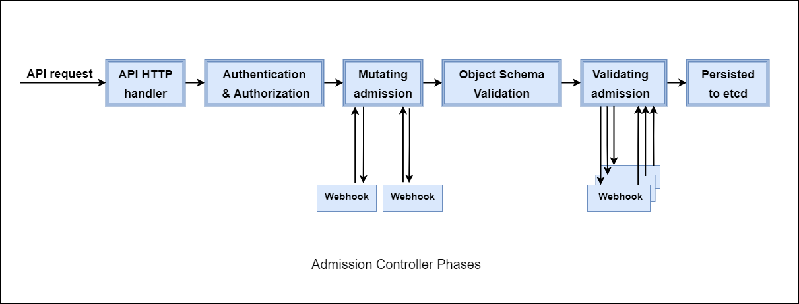

## What are Admission Controllers?

In Kubernetes, Admission Controllers are responsible for intercepting requests coming to the API server after authenticating (e.g. using token or certificate), authorizing (e.g. using RBAC) the request and before persisting (saving) the request in the backend. They basically govern and enforce how the cluster is used.

For Example, whenever we create a new Pod, a request is sent to the Kubernetes API server and an Admission controller intercepts the request and it may validate, mutate or do both with the request.

