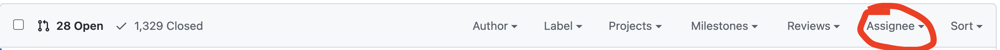

## Release Management Guide

This document approximates timelines and how to maintain release branches.

### The overall scope of the project

Kyverno simplifies Kubernetes configuration management using policies for security and automation. Kyverno makes it easy for Kubernetes administrators to write and manage Kubernetes policies, and for Kubernetes users (ex., developers) to consume policy results and address issues.

### Release Timelines

Kyverno uses the [Semantic Versioning](https://semver.org/) scheme. Kyverno v1.0.0 was released in Dec 2019. This project follows a given version number MAJOR.MINOR.PATCH.

#### MAJOR release

This is the version when you make incompatible API changes.

- Low frequency and required e.g. once a year

#### MINOR release

This is the version when you add functionality in a backwards-compatible manner. Since Kyverno is a fast growing project, having a major release approximately every three months helps to manage project progress.

- Roughly every 3 months

#### PATCH release

This is the version when you make backwards-compatible bug fixes. The patch release contains the critical fixes.

- When critical fixes are required, or roughly each month

### Versioning

Kyverno uses GitHub tags to manage versions. New releases and release candidates are published using the wildcard tag `v<major>.<minor>.<patch>*`.

The dev images are pushed with tag `<major>.<minor>.dev-N-<git hash>`. You can find published dev images for a specific commit via the GitHub workflow named [image](https://github.com/kyverno/kyverno/actions/workflows/image.yaml). For example, this [job](https://github.com/kyverno/kyverno/runs/4579160206?check_suite_focus=true) pushed images with tag `1.6-dev-7-gff99d92f` for PR [#2856](https://github.com/kyverno/kyverno/pull/2856).

To test with the latest images for different release branches, the images are pushed with `<major>.<minor>-dev-latest`.

### Notes

- Branches for new releases follow the naming SemVer naming convention, for example release v1.5.2.
- Close to any release, all PRs for that release will be cherry picked to the branch specific to the release.
- Issues are always added to milestones for releases.
- PRs are labeled with milestone labels, for maintainers to cherry-pick to patch branches.
- For any critical fixes that need to be included in a patch release, the PR should always merge to main and then cherry-pick to release branch. The milestone label is important here for tracking.
- During PR review, the Assignee filter is used to indicate the reviewer.
  image

