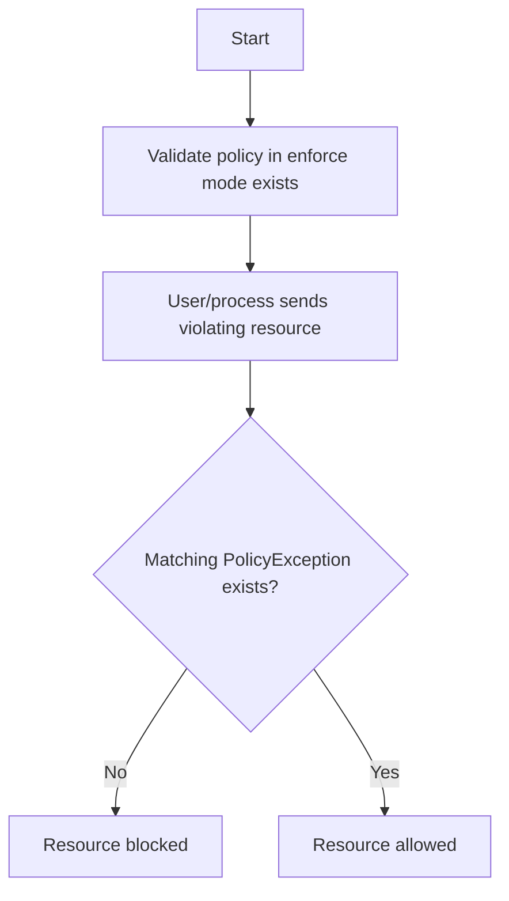

{}
Policy exceptions are an **alpha** feature and requires setting certain [container flags](/docs/installation/customization/#container-flags) to enable. It is not ready for production usage and there may be breaking changes. Normal semantic versioning and compatibility rules will not apply.
{}

Although Kyverno policies contain multiple methods to provide fine-grained control as to which resources they act upon in the form of [`match`/`exclude` blocks](/docs/writing-policies/match-exclude/#match-statements), [preconditions](/docs/writing-policies/preconditions/) at multiple hierarchies, [anchors](/docs/writing-policies/validate/#anchors), and more, all these mechanisms have in common that the resources which they are intended to exclude must occur in the same rule definition. This may be limiting in situations where policies may not be directly editable, or doing so imposes an operational burden.

For example, in organizations where multiple teams must interact with the same cluster, a team responsible for policy authoring and administration may not be the same team responsible for submission of resources. In these cases, it can be advantageous to decouple the policy definition from certain exclusions. Additionally, there are often times where an organization or team must allow certain exceptions which would violate otherwise valid rules but on a one-time basis if the risks are known and acceptable.

Imagine a validate policy exists in `Enforce` mode which mandates all Pods must not mount host namespaces. A separate team has a legitimate need to run a specific tool in this cluster for a limited time which violates this policy. Normally, the policy would block such a "bad" Pod if the policy was not previously altered in such a way to allow said Pod to run. Rather than making adjustments to the policy, an exception may be granted. Both of these examples are use cases for a **PolicyException** resource described below.

A `PolicyException` is a Namespaced Custom Resource which allows a resource(s) to be allowed past a given policy and rule combination. It can be used to exempt any resource from any Kyverno rule type although it is primarily intended for use with validate rules. A PolicyException encapsulates the familiar `match`/`exclude` statements used in `Policy` and `ClusterPolicy` resources but adds an `exceptions{}` object to select the policy and rule name(s) used to form the exception. The logical flow of how a PolicyException works in tandem with a validate policy is depicted below.



An example set of resources is shown below.

A ClusterPolicy exists containing a single validate rule in `Enforce` mode which requires all Pods must not use any host namespaces via the fields `hostPID`, `hostIPC`, or `hostNetwork`. If any of these fields are defined, they must be set to a value of `false`.

```yaml
apiVersion: kyverno.io/v2beta1
kind: ClusterPolicy
metadata:
  name: disallow-host-namespaces
spec:
  validationFailureAction: Enforce
  background: false
  rules:
    - name: host-namespaces
      match:
        any:
        - resources:
            kinds:
              - Pod
      validate:
        message: >-
          Sharing the host namespaces is disallowed. The fields spec.hostNetwork,
          spec.hostIPC, and spec.hostPID must be unset or set to `false`.
        pattern:
          spec:
            =(hostPID): "false"
            =(hostIPC): "false"
            =(hostNetwork): "false"
```

A cluster administrator wishes to grant an exception to a Pod or Deployment named `important-tool` which will be created in the `delta` Namespace. A PolicyException resource is created which specifies the policy name and rule name which should be bypassed as well as the resource kind, Namespace, and name which may bypass it.

{}
Auto-generated rules for Pod controllers must be specified along with the Pod controller requesting exception, if applicable. Since Kyverno's auto-generated rules are additive in nature, when specifying specific resource names of Pod controllers, it may be necessary to use a wildcard (`*`) to allow the Pods emitted from those controllers to be exempted as components of the Pod name include ReplicaSet hash and Pod hash.
{}

```yaml
apiVersion: kyverno.io/v2alpha1
kind: PolicyException
metadata:
  name: delta-exception
  namespace: delta
spec:
  exceptions:
  - policyName: disallow-host-namespaces
    ruleNames:
    - host-namespaces
    - autogen-host-namespaces
  match:
    any:
    - resources:
        kinds:
        - Pod
        - Deployment
        namespaces:
        - delta
        names:
        - important-tool*
```

A Deployment matching the characteristics defined in the PolicyException, shown below, will be allowed creation even though it technically violates the rule's definition.

```yaml
apiVersion: apps/v1
kind: Deployment
metadata:
  name: important-tool
  namespace: delta
  labels:
    app: busybox
spec:
  replicas: 1
  selector:
    matchLabels:
      app: busybox
  template:
    metadata:
      labels:
        app: busybox
    spec:
      hostIPC: true
      containers:
      - image: busybox:1.35
        name: busybox
        command: ["sleep", "1d"]
```

PolicyExceptions are always Namespaced yet may provide an exception for a cluster-scoped resource as well. There is no correlation between the Namespace in which the PolicyException exists and the Namespace where resources may be excepted.

Exceptions against a ClusterPolicy and those against a (Namespaced) Policy can be disambiguated by specifying the value of the `exceptions[].policyName` field in the format `<namespace>/<policy-name>`.

```yaml
exceptions:
- policyName: team-a/disallow-host-namespaces
  ruleNames:
  - host-namespaces
```

PolicyExceptions also support background scanning, enabled by default. An exception which either explicitly defines `spec.background=true` or does not define the field at all, will influence [Policy Reports](/docs/policy-reports/) when the exception is processed, allowing report results to change from a `Fail` to a `Skip` result. When background scans are enabled, PolicyExceptions forbid matching on the same types of fields as those forbidden by validate rules including Roles, ClusterRoles, and user information.

Wildcards (`"*"`) are supported in the value of the `ruleNames[]` field allowing exception from any/all rules in the policy without having to name them explicitly.

Since PolicyExceptions are just another Custom Resource, their use can and should be controlled by a number of different mechanisms to ensure their creation in a cluster is authorized including:

* Kubernetes RBAC
* Specific Namespace for PolicyExceptions (see [Container Flags](/docs/installation/customization/#container-flags))
* Existing GitOps governance processes
* [Kyverno validate rules](/docs/writing-policies/validate/)
* [YAML manifest validation](/docs/writing-policies/validate/#manifest-validation)

PolicyExceptions may be subjected to Kyverno validate policies which can be used to provide additional guardrails around how they may be crafted. For example, it is considered a best practice to only allow very narrow exceptions to a much broader rule. Given the case shown earlier, only a Pod or Deployment with the name `important-tool` would be allowed by the exception, not any Pod or Deployment. Kyverno policy can help ensure, both in the cluster and in a CI/CD process via the [CLI](/docs/kyverno-cli/), that PolicyExceptions conform to your design standards. Below is an example of a sample policy to illustrate how a Kyverno validate rule ensure that a specific name must be used when creating an exception. For other samples, see the [policy library](/policies).

```yaml
apiVersion: kyverno.io/v2beta1
kind: ClusterPolicy
metadata:
  name: policy-for-exceptions
spec:
  validationFailureAction: Enforce
  background: false
  rules:
  - name: require-match-name
    match:
      any:
      - resources:
          kinds:
          - PolicyException
    validate:
      message: >-
        An exception must explicitly specify a name for a resource match.
      pattern:
        spec:
          match:
            =(any):
            - resources:
                names: "?*"
            =(all):
            - resources:
                names: "?*"
```
