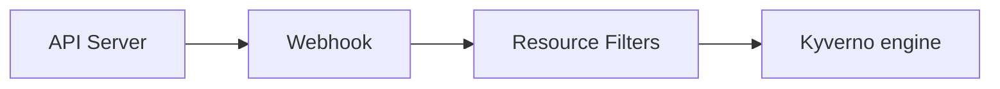

## Customizing Kyverno

Kyverno has many different functions and supports a wide range of possible customizations. This section provides more information on Kyverno's supporting resources and how they can be customized to tune certain behaviors.

### Certificate Management

The Kyverno policy engine runs as an admission webhook and requires a CA-signed certificate and key to setup secure TLS communication with the Kubernetes API server. There are two ways to configure secure communications between Kyverno and the API server.

#### Default certificates

By default, Kyverno will automatically generate self-signed Certificate Authority (CA) and a leaf certificates for use in its webhook registrations. The CA certificate expires after one year. When Kyverno manage its own certificates, it will gracefully handle regeneration upon expiry.

After installing Kyverno, use the [step CLI](https://smallstep.com/cli/) to check and verify certificate details.

Get all Secrets in Kyverno's Namespace. The Secret names are configurable, see the [container flags section](/docs/installation/customization/#container-flags) for more details.

```sh
$ kubectl -n kyverno get secret
NAME                                                      TYPE                 DATA   AGE
kyverno-cleanup-controller.kyverno.svc.kyverno-tls-ca     kubernetes.io/tls    2      21d
kyverno-cleanup-controller.kyverno.svc.kyverno-tls-pair   kubernetes.io/tls    2      21d
kyverno-svc.kyverno.svc.kyverno-tls-ca                    kubernetes.io/tls    2      21d
kyverno-svc.kyverno.svc.kyverno-tls-pair                  kubernetes.io/tls    2      21d
```

Get and decode the CA certificate used by the admission controller.

```sh
$ kubectl -n kyverno get secret kyverno-svc.kyverno.svc.kyverno-tls-ca -o jsonpath='{.data.tls\.crt}' | \
  step base64 -d | step certificate inspect --short
X.509v3 Root CA Certificate (RSA 2048) [Serial: 0]
  Subject:     *.kyverno.svc
  Issuer:      *.kyverno.svc
  Valid from:  2023-04-14T18:33:37Z
          to:  2024-04-13T19:33:37Z
```

Get and decode the certificate used to register the webhooks with the Kubernetes API server (assumes at least one validate policy is installed) and see the same CA root certificate is in use.

```sh
$ kubectl get validatingwebhookconfiguration kyverno-resource-validating-webhook-cfg -o jsonpath='{.webhooks[0].clientConfig.caBundle}' | \
  step base64 -d | step certificate inspect --short
X.509v3 Root CA Certificate (RSA 2048) [Serial: 0]
  Subject:     *.kyverno.svc
  Issuer:      *.kyverno.svc
  Valid from:  2023-04-14T18:33:37Z
          to:  2024-04-13T19:33:37Z
```

#### Certificates rotation

By default, Kyverno will generate and manage certificates. CA certificates validity is one year and TLS certificates validity is 150 days.

At a minimum, managed certificates are checked for validity every 12 hours. Additionally, validity checks are performed when events occur on secrets containing the managed certificates.

The renewal process runs as follows:
1. Remove expired certificates contained in the secret
1. Check if remaining certificates will become invalid in less than 60 hours
1. If needed, generate a new certificate with the validity documented above
1. The new certificates is added to the underlying secret along with current certificatess that are still valid
1. Reconfigure webhooks with the new certificates bundle
1. Update the Kyverno server to use the new certificate

Basically, certificates will be renewed approximately 60 hours before expiry.

#### Custom certificates

You can install your own CA-signed certificate, or generate a self-signed CA and use it to sign certificates for admission and cleanup controllers. Once you have a CA and X.509 certificate-key pairs, you can install these as Kubernetes Secrets in your cluster. If Kyverno finds these Secrets, it uses them, otherwise it will fall back on the default certificate management method. When you bring your own certificates, it is your responsibility to manage the regeneration/rotation process. Only RSA is supported for the CA and leaf certificates.

##### Generate a self-signed CA and signed certificate-key pairs

{}
Using a separate self-signed root CA is difficult to manage and not recommended for production use.
{}

If you already have a CA and a signed certificate, you can directly proceed to Step 2.

Below is a process which shows how to create a self-signed root CA, and generate a signed certificates and keys using [step CLI](https://smallstep.com/cli/):

1. Create a self-signed CA

```sh
step certificate create kyverno-ca rootCA.crt rootCA.key --profile root-ca --insecure --no-password --kty=RSA
```

2. Generate leaf certificates with a five-year expiration

```sh
step certificate create kyverno-svc tls.crt tls.key --profile leaf \
            --ca rootCA.crt --ca-key rootCA.key \
            --san kyverno-svc --san kyverno-svc.kyverno --san kyverno-svc.kyverno.svc --not-after 43200h \
            --insecure --no-password --kty=RSA


step certificate create kyverno-cleanup-controller cleanup-tls.crt cleanup-tls.key --profile leaf \
            --ca rootCA.crt --ca-key rootCA.key \
            --san kyverno-cleanup-controller --san kyverno-cleanup-controller.kyverno --san kyverno-cleanup-controller.kyverno.svc --not-after 43200h \
            --insecure --no-password --kty=RSA
```

3. Verify the contents of the certificate

```sh
step certificate inspect tls.crt --short
```

The certificate must contain the SAN information in the `X509v3 extensions` section:

```sh
X509v3 extensions:
    X509v3 Subject Alternative Name:
        DNS:kyverno-svc, DNS:kyverno-svc.kyverno, DNS:kyverno-svc.kyverno.svc
```

##### Configure Secrets for the CA and TLS certificate-key pair

You can now use the following files to create Secrets:

* `rootCA.crt`
* `tls.crt`
* `tls.key`
* `cleanup-tls.crt`
* `cleanup-tls.key`

To create the required Secrets, use the following commands (do not change the Secret names):

```sh
kubectl create ns <namespace>

kubectl create secret tls kyverno-svc.kyverno.svc.kyverno-tls-pair --cert=tls.crt --key=tls.key -n <namespace>
kubectl create secret generic kyverno-svc.kyverno.svc.kyverno-tls-ca --from-file=rootCA.crt -n <namespace>

kubectl create secret tls kyverno-cleanup-controller.kyverno.svc.kyverno-tls-pair --cert=cleanup-tls.crt --key=cleanup-tls.key -n <namespace>
kubectl create secret generic kyverno-cleanup-controller.kyverno.svc.kyverno-tls-ca --from-file=rootCA.crt -n <namespace>
```

Secret | Data | Content
------------ | ------------- | -------------
`kyverno-svc.kyverno.svc.kyverno-tls-pair` | tls.key & tls.crt  | key and signed certificate (admission controller)
`kyverno-svc.kyverno.svc.kyverno-tls-ca` | rootCA.crt | root CA used to sign the certificate (admission controller)
`kyverno-cleanup-controller.kyverno.svc.kyverno-tls-pair` | tls.key & tls.crt  | key and signed certificate (cleanup controller)
`kyverno-cleanup-controller.kyverno.svc.kyverno-tls-ca` | rootCA.crt | root CA used to sign the certificate (cleanup controller)

Kyverno uses Secrets created above to setup TLS communication with the Kubernetes API server and specify the CA bundle to be used to validate the webhook server's certificate in the admission and cleanup webhook configurations.

##### Install Kyverno

You can now install Kyverno by selecting one of the available methods from the [installation section](/docs/installation/methods/).

### Roles and Permissions

Kyverno creates several Roles, ClusterRoles, RoleBindings, and ClusterRoleBindings some of which may need to be customized depending on additional functionality required. To view all ClusterRoles and Roles associated with Kyverno, use the command `kubectl get clusterroles,roles -A | grep kyverno`.

#### Roles

Kyverno creates the following Roles in its Namespace, one per controller type:

* `kyverno:admission-controller`
  * create, delete, get, patch, and update Leases to handle high availability configurations.
  * get, list, and watch Deployments so it can manage the Kyverno Deployment itself.
  * get, list, watch, create, and update Secrets to manage certificates used for webhook management.
  * get, list, and watch ConfigMaps for configuration changes.
* `kyverno:reports-controller`
  * get, list, and watch ConfigMaps for configuration changes.
  * create, delete, get, patch, and update Leases to handle high availability configurations.
* `kyverno:background-controller`
  * get, list, and watch ConfigMaps for configuration changes.
  * create, delete, get, patch, and update Leases to handle high availability configurations.
* `kyverno:cleanup-controller`
  * get, list, watch, create, and update Secrets to manage certificates used for webhook management.
  * get, list, and watch ConfigMaps for configuration changes.
  * create, delete, get, patch, and update Leases to handle high availability configurations.

#### ClusterRoles

Kyverno uses [aggregated ClusterRoles](https://kubernetes.io/docs/reference/access-authn-authz/rbac/#aggregated-clusterroles) to search for and combine ClusterRoles which apply to Kyverno. Each controller has its own set of ClusterRoles. Those ending in `core` are the aggregate ClusterRoles which are then aggregated by the top-level role without the `core` suffix.

The following `ClusterRoles` provide Kyverno with permissions to policies and other Kubernetes resources across all Namespaces.

* `kyverno:admission-controller:core`: aggregate ClusterRole for the admission controller
* `kyverno:admission-controller`: aggregated (top-level) ClusterRole for the admission controller
* `kyverno:reports-controller:core`: aggregate ClusterRole for the reports controller
* `kyverno:reports-controller`: aggregated (top-level) ClusterRole for the reports controller
* `kyverno:background-controller:core`: aggregate ClusterRole for the background controller
* `kyverno:background-controller`: aggregated (top-level) ClusterRole for the background controller
* `kyverno:cleanup-controller:core`: aggregate ClusterRole for the cleanup controller
* `kyverno:cleanup-controller`: aggregated (top-level) ClusterRole for the cleanup controller
* `kyverno-cleanup-jobs`: used by the helper CronJob to periodically remove excessive/stale admission reports if found
* `kyverno:rbac:admin:policies`: aggregates to admin the ability to fully manage Kyverno policies
* `kyverno:rbac:admin:policyreports`: aggregates to admin the ability to fully manage Policy Reports
* `kyverno:rbac:admin:reports`: aggregates to admin the ability to fully manage intermediary admission and background reports
* `kyverno:rbac:admin:updaterequests`: aggregates to admin the ability to fully manage UpdateRequests, intermediary resource for generate rules
* `kyverno:rbac:view:policies`: aggregates to view the ability to view Kyverno policies
* `kyverno:rbac:view:policyreports`: aggregates to view the ability to view Policy Reports
* `kyverno:rbac:view:reports`: aggregates to view the ability to view intermediary admission and background reports
* `kyverno:rbac:view:updaterequests`: aggregates to view the ability to view UpdateRequests, intermediary resource for generate rules

{}
Most Kyverno controllers' ClusterRoles include a rule which allows for `get`, `list`, and `read` permissions to all resources in the cluster. This is to ensure Kyverno functions smoothly despite the type and subject of future-installed policies. If this rule is removed, users must manually create and manage a number of different ClusterRoles applicable across potentially multiple controllers depending on the type and configuration of installed policies.
{}

#### Customizing Permissions

Because the ClusterRoles used by Kyverno use the [aggregation feature](https://kubernetes.io/docs/reference/access-authn-authz/rbac/#aggregated-clusterroles), extending the permission for Kyverno's use in cases like mutate existing or generate rules or generating ValidatingAdmissionPolicies is a simple matter of creating one or more new ClusterRoles which use the appropriate labels. It is not necessary to modify any existing ClusterRoles created as part of the Kyverno installation. Doing so is not recommended as changes may be lost during an upgrade. Since there are multiple controllers each with their own ServiceAccount, granting Kyverno additional permissions involves identifying the correct controller and using the labels needed to aggregate to that ClusterRole.

For example, if a new Kyverno generate policy requires that Kyverno be able to create or modify Deployments, this is not a permission Kyverno has by default. Generate rules are handled by the background controller and so it will be necessary to create a new ClusterRole and assign it the aggregation labels specific to the background controller in order for those permissions to take effect.

This sample ClusterRole provides the Kyverno background controller additional permissions to create Deployments:

```yaml
apiVersion: rbac.authorization.k8s.io/v1
kind: ClusterRole
metadata:
  labels:
    app.kubernetes.io/component: background-controller
    app.kubernetes.io/instance: kyverno
    app.kubernetes.io/part-of: kyverno
  name: kyverno:create-deployments
rules:
- apiGroups:
  - apps
  resources:
  - deployments
  verbs:
  - create
```

Once a supplemental ClusterRole has been created, get the top-level ClusterRole for that controller to ensure aggregation has occurred.

```sh
kubectl get clusterrole kyverno:background-controller -o yaml
```

Generating Kubernetes ValidatingAdmissionPolicies and their bindings are handled by the admission controller and it will be necessary to grant the controller the required permissions to generate these types. In this scenario, a ClusterRole should be created and assigned the aggregation labels for the admission controller in order for those permissions to take effect.

This sample ClusterRole provides the Kyverno admission controller additional permissions to create ValidatingAdmissionPolicies and ValidatingAdmissionPolicyBindings:

```yaml
apiVersion: rbac.authorization.k8s.io/v1
kind: ClusterRole
metadata:
  labels:
    app.kubernetes.io/component: admission-controller
    app.kubernetes.io/instance: kyverno
    app.kubernetes.io/part-of: kyverno
  name: kyverno:generate-validatingadmissionpolicy
rules:
- apiGroups:
  - admissionregistration.k8s.io
  resources:
  - validatingadmissionpolicies
  - validatingadmissionpolicybindings
  verbs:
  - create
  - update
  - delete
  - list
```

### ConfigMap Keys

The following keys are used to control the behavior of Kyverno and must be set in the Kyverno ConfigMap. Kyverno watches for changes to this ConfigMap and will load any updates which occur.

1. `defaultRegistry`: sets the default image registry to use if one is not specified. Defaults to `docker.io`.
2. `enableDefaultRegistryMutation`: tells Kyverno whether it should update its internal context with the value of the `defaultRegistry` key when the condition is met. Defaults to `"true"`.
3. `excludeGroups`: excludes the provided groups from any processing. Supports a comma-separated list of groups. Defaults to `system:serviceaccounts:kube-system,system:nodes`.
4. `excludeUsernames`: excludes user names from any processing. Supports the `!` operator to negate an entry (ex., `!john` will include the username `john` if it was excluded via another parameter). Default is `'!system:kube-scheduler'`.
5. `excludeRoles`: list of Roles to exclude from processing. Default is undefined.
6. `excludeClusterRoles`: list of ClusterRoles to exclude from processing. Default is undefined.
7. `generateSuccessEvents`: specifies whether (true/false) to generate success events. Default is set to "false".
8. `matchConditions`: uses CEL-based expressions in the webhook configuration to narrow which admission requests are forwarded to Kyverno. Requires Kubernetes 1.27+ with the `AdmissionWebhookMatchConditions` feature gate to be enabled.
9. `resourceFilters`: Kubernetes resources in the format "[kind,namespace,name]" where the policy is not evaluated by the admission webhook. For example --filterKind "[Deployment, kyverno, kyverno]" --filterKind "[Deployment, kyverno, kyverno],[Events, *, *]". Note that resource filters do not apply to background scanning mode. See the [Resource Filters](#resource-filters) section for more complete information.
10. `webhooks`: specifies the Namespace or object exclusion to configure in the webhooks managed by Kyverno. Default is `'[{"namespaceSelector": {"matchExpressions": [{"key":"kubernetes.io/metadata.name","operator":"NotIn","values":["kyverno"]}]}}]'`.
11. `webhookAnnotations`: instructs Kyverno to add annotations to its webhooks for AKS support. Default is undefined. See the [AKS notes](/docs/installation/platform-notes/#notes-for-aks-users) section for details.
12. `webhookLabels`: instructs Kyverno to add labels to its webhooks. Default is undefined.

### Container Flags

The following flags can be used to control the advanced behavior of the various Kyverno controllers and should be set on the main container in the form of arguments. All container flags can be prefaced with one or two dashes (ex., `-admissionReports` or `--admissionReports`). The controller(s) to which a given flag is applicable is shown in parenthesis.

* A: Admission controller
* B: Background controller
* C: Cleanup controller
* R: Reports controller

| Flag                         | Default      | Description                                                            |
|------------------------------|--------------|------------------------------------------------------------------------|
| `add_dir_header` (ABCR) | | Adds the file directory to the header of the log messages. |
| `admissionReports` (AR) | true | Enables the AdmissionReport resource which is created from validate rules in `Audit` mode. Used to factor into a final PolicyReport. |
| `aggregateReports` (R) | true | Enables the report aggregating ability of AdmissionReports (1.10.2+). |
| `allowInsecureRegistry` (ABR)| | Allows Kyverno to work with insecure registries (i.e., bypassing certificate checks) either with [verifyImages](/docs/writing-policies/verify-images/) rules or [variables from image registries](/docs/writing-policies/external-data-sources/#variables-from-image-registries). Only for testing purposes. Not to be used in production situations. |
| `alsologtostderr` (ABCR) | | Log to standard error as well as files (no effect when -logtostderr=true) |
| `autoUpdateWebhooks` (A) | true | Set this flag to `false` to disable auto-configuration of the webhook. With this feature disabled, Kyverno creates a default webhook configuration (which matches ALL resources), therefore, webhooks configuration via the ConfigMap will be ignored. However, the user still can modify it by patching the webhook resource manually. Setting this flag to `false` after it has been set to `true` will retain existing webhooks and automatic updates will cease. All further changes will be manual in nature. If the webhook or webhook configuration resource is deleted, it will be replaced by one matching on a wildcard. |
| `backgroundServiceAccountName` (A) | | The name of the background controller's ServiceAccount name allowing the admission controller to disregard any AdmissionReview requests coming from Kyverno itself. This may need to be removed in situations where, for example, Kyverno needs to mutate a resource it just generated. Default is set to the ServiceAccount for the background controller.|
| `backgroundScan` (R) | true | Enables/disables background reporting scans. Has no effect on background reconciliation by the background controller.|
|`backgroundScanInterval` (R) | 1h | Sets the time interval when periodic background scans for reporting take place. Supports minute durations as well (e.g., `10m`).|
| `backgroundScanWorkers` (R) | 2 | Defines the number of internal worker threads to use when processing background scan reports. More workers means faster report processing at the cost of more resources consumed. Since the reports controller uses leader election, all reports processing will only be done by a single replica at a time. |
| `caSecretName` (AC) | | overwrites the default secret name of the RootCA certificate. See also the related flag `tlsSecretName`.|
| `cleanupServerPort` (C) | 9443 | Defines the port used by the cleanup server. Usually changed in tandem with `webhookServerPort`.|
| `clientRateLimitBurst` (ABCR) | 300 | Configures the maximum burst for throttling. Uses the client default if zero. |
| `clientRateLimitQPS` (ABCR) | 300 | Configures the maximum QPS to the API server from Kyverno. Uses the client default if zero. |
| `eventsRateLimitBurst` (ABCR) | 300 | Configures the maximum burst for throttling for events. Uses the client default if zero. |
| `eventsRateLimitQPS` (ABCR) | 300 | Configures the maximum QPS to the API server from Kyverno for events. Uses the client default if zero. |
| `disableMetrics` (ABCR) | false | Specifies whether to enable exposing the metrics. |
| `dumpPayload` (AC) | false | Toggles debug mode. When debug mode is enabled, the full AdmissionReview payload is logged. Additionally, resources of kind Secret are redacted. Should only be used in policy development or troubleshooting scenarios, not left perpetually enabled. |
| `enableConfigMapCaching` (ABR) | true | Enables the ConfigMap caching feature. |
| `enableDeferredLoading` (A) | true | Enables deferred (lazy) loading of variables (1.10.1+). Set to `false` to disable deferred loading of variables which was the default behavior in versions < 1.10.0. |
| `enablePolicyException` (ABR) | true | Set to `true` to enable the [PolicyException capability](/docs/writing-policies/exceptions/). |
| `enableTracing` (ABCR) | false | Set to enable exposing traces. |
| `enableTuf` (AR) | | Enable tuf for private sigstore deployments. |
| `exceptionNamespace` (ABR) | | Set to the name of a Namespace where [PolicyExceptions](/docs/writing-policies/exceptions/) will only be permitted. PolicyExceptions created in any other Namespace will throw a warning. If not set, PolicyExceptions from all Namespaces will be considered. Implies the `enablePolicyException` flag is set to `true`. Neither wildcards nor multiple Namespaces are currently accepted. |
| `forceFailurePolicyIgnore` (A) | false | Set to force Failure Policy to `Ignore`. |
| `generateValidatingAdmissionPolicy` (A) | false | Specifies whether to enable generating Kubernetes ValidatingAdmissionPolicies. |
| `genWorkers` (B) | 10 | The number of workers for processing generate policies concurrently. |
| `imagePullSecrets` (ABR) | | Specifies secret resource names for image registry access credentials. All referenced secrets must exist in Kyverno's Namespace. Multiple values are accepted but must be comma separated. |
| `imageVerifyCacheEnabled` (A) | true | Enable a TTL cache for verified images. |
| `imageVerifyCacheMaxSize` (A) | 1000 | Maximum number of keys that can be stored in the TTL cache. Keys are a combination of policy elements along with the image reference. `0` sets the value to default. |
| `imageVerifyCacheTTLDuration` (A) | 60m | Maximum TTL value for a cache expressed as duration. `0` sets the value to default. |
| `kubeconfig` (ABCR) | | Specifies the Kubeconfig file to be used when overriding the API server to which Kyverno should communicate. Only used when Kyverno is running outside of the cluster in which it services admission requests. |
| `leaderElectionRetryPeriod` (ABCR) | `2s` | Controls the leader election renewal frequency. |
| `log_backtrace_at` (ABCR) | | When logging hits line file:N, emit a stack trace. May only be specified once. |
| `log_dir` (ABCR) | | If non-empty, write log files in this directory (no effect when -logtostderr=true). |
| `log_file` (ABCR) | | If non-empty, use this log file (no effect when -logtostderr=true). |
| `log_file_max_size` (ABCR) | `1800` | Defines the maximum size a log file can grow to (no effect when -logtostderr=true). Unit is megabytes. If the value is 0, the maximum file size is unlimited. |
| `loggingFormat` (ABCR) | `text` | Determines the output format of logs. Logs can be outputted in JSON or text format by setting the flag to `json` or `text` respectively.
| `loggingtsFormat` (ABCR) | `RFC3339` | Determines the timestamp format of logs. Logs can be formatted to have different timestamps by setting the flag to `iso8601` for ISO8601, `rfc3339` for RFC3339, `rfc3339nano` for RFC3339NANO, `millis` for Epoch Millis, `nanos` for Epoch Nanos time formats. If omitted, defaults to `RFC3339`. |
| `logtostderr` (ABCR) | true | Log to standard error instead of files. |
| `maxAPICallResponseLength` (ABCR) | `10000000` | Sets the maximum length of the response body for API calls. |
| `maxQueuedEvents` (ABR) | `1000` | Defines the upper limit of events that are queued internally. |
| `metricsPort` (ABCR) | `8000` | Specifies the port to expose prometheus metrics. |
| `omit-events` (ABR) | | Specifies the type of Kyverno events which should not be emitted. Accepts a comma-separated string with possible values `PolicyViolation`, `PolicyApplied`, `PolicyError`, and `PolicySkipped`. Default is undefined (all events will be emitted). |
| `one_output` (ABCR) | | If true, only write logs to their native severity level (vs also writing to each lower severity level; no effect when -logtostderr=true). |
| `otelCollector` (ABCR) |  | Sets the OpenTelemetry collector service address. Kyverno will try to connect to this on the metrics port. Default is `opentelemetrycollector.kyverno.svc.cluster.local`. |
| `otelConfig` (ABCR) | `prometheus` | Sets the preference for Prometheus or OpenTelemetry. Set to `grpc` to enable OpenTelemetry. |
| `policyReports` (R) | true | Enables the Policy Reports system (1.10.2+). When enabled, Policy Report Custom Resources will be generated and managed in the cluster. |
| `profile` (ABCR) | false | Setting this flag to `true` will enable profiling. |
| `profileAddress` (ABCR) | `""` | Configures the address of the profiling server. |
| `profilePort` (ABCR) | `6060` | Specifies port to enable profiling. |
| `protectManagedResources` (AC) | false | Protects the Kyverno resources from being altered by anyone other than the Kyverno Service Account. Set to `true` to enable. |
| `registryCredentialHelpers` (ABR) | | Enables cloud-registry-specific authentication helpers. Defaults to `"default,google,amazon,azure,github"`. |
| `renewBefore` (AC) | `15d` | Sets the certificate renewal time before expiration (in days). |
| `reportsChunkSize` (R) | `1000` | Maximum number of results in generated reports before splitting occurs if there are more results to be stored. Deprecated. |
| `serverIP` (AC) | | Like the `kubeconfig` flag, used when running Kyverno outside of the cluster which it serves. |
| `servicePort` (AC) | `443` | Port used by the Kyverno Service resource and for webhook configurations. |
| `skipResourceFilters` (R) | true | Defines whether to obey the ConfigMap's resourceFilters when performing background report scans. When set to `true`, anything defined in the resourceFilters will not be excluded in background reports. Ex., when set to `true` if the resourceFilters contain the `[*/*,kube-system,*]` entry then background scan reports will be produced for anything in the `kube-system` Namespace. Set this value to `false` to obey resourceFilters in background scan reports. Ex., when set to `false` if the resourceFilters contain the `[*/*,kube-system,*]` entry then background scan reports will NOT be produced for anything in the `kube-system` Namespace. |
| `skip_headers` (ABCR) | | If true, avoid header prefixes in the log messages. |
| `skip_log_headers` (ABCR) | | If true, avoid headers when opening log files (no effect when -logtostderr=true). |
| `stderrthreshold` (ABCR) | `2` | Logs at or above this threshold go to stderr when writing to files and stderr (no effect when -logtostderr=true or -alsologtostderr=false). |
| `tlsSecretName` (AC) | | Overwrites the default secret name of the TLS certificate. See also the related flag `caSecretName`. |
|`tracingAddress` (ABCR) | `''` | Tracing receiver address.|
| `tracingCreds` (ABCR) | | Set to the CA secret containing the certificate which is used by the Opentelemetry Tracing Client. If empty string is set, an insecure connection will be used. |
| `tracingPort` (ABCR) | `4137` | Tracing receiver port. |
| `transportCreds` (ABCR) | `""` | Set to the CA secret containing the certificate used by the OpenTelemetry metrics client. Empty string means an insecure connection will be used. |
| `ttlReconciliationInterval` (C) | `1m` | Defines the interval the cleanup controller should perform reconciliation of resources labeled with the cleanup TTL label. See the cleanup documentation [here](/docs/writing-policies/cleanup/#cleanup-label) for details. |
| `tufMirror` (AR) | | Specifies alternate TUF mirror for sigstore. If left blank, public sigstore one is used for cosign verification. |
| `tufRoot` (AR) | | Specifies alternate TUF root.json for sigstore. If left blank, public sigstore one is used for cosign verification. |
| `v` (ABCR) | `2` | Sets the verbosity level of Kyverno log output. Takes an integer from 1 to 6 with 6 being the most verbose. Level 4 shows variable substitution messages. |
| `validatingAdmissionPolicyReports` (R) | false | Specifies whether to enable generating Policy Reports for Kubernetes ValidatingAdmissionPolicies. |
| `vmodule` (ABCR) | | Comma-separated list of pattern=N settings for file-filtered logging. |
| `webhookRegistrationTimeout` (A) | `120s` | Specifies the length of time Kyverno will try to register webhooks with the API server. |
| `webhookServerPort` (AC) | `9443` | Specifies the port to use for webhook call-backs. |
| `webhookTimeout` (A) | `10` | Specifies the timeout for webhooks, in seconds. After the timeout passes, the webhook call will be ignored or the API call will fail based on the failure policy. The timeout value must be an integer number between 1 and 30 (seconds). |

### Policy Report access

During a Kyverno installation, a ClusterRole named `kyverno:rbac:admin:policyreports` is created which has permissions to perform all operations the two main Policy Report custom resources, `policyreport` and `clusterpolicyreport`. To grant access to a Namespace admin, configure the following YAML manifest according to your needs then apply to the cluster.

* Replace `metadata.namespace` with the Namespace where this should be bound.
* Configure the appropriate `subjects` fields to bind the ClusterRole to the admin's ID.

```yaml
apiVersion: rbac.authorization.k8s.io/v1
kind: RoleBinding
metadata:
  name: admin-policyreports
  namespace: default
roleRef:
  apiGroup: rbac.authorization.k8s.io
  kind: ClusterRole
  name: kyverno:rbac:admin:policyreports
subjects:
- apiGroup: rbac.authorization.k8s.io
  kind: User
  name: mynsuser
- apiGroup: rbac.authorization.k8s.io
  kind: Group
  name: mynsgroup
# - kind: ServiceAccount
#   name: default
#   namespace: default
```

### Webhooks

Kyverno requires a few different webhooks to function. The main resource validating and mutating webhooks, those responsible for directing the Kubernetes API server to send the resources which are the subject of policies, are registered and managed dynamically by Kyverno based on the configured policies. With Kyverno-managed webhooks, Kyverno only receives admission requests for the matching resources defined in the policies, thereby preventing unnecessary admission requests being forwarded to Kyverno. For example, after an installation of Kyverno and before installing any policies, the ValidatingWebhookConfiguration named `kyverno-resource-validating-webhook-cfg` will be effectively empty. Creation of the first policy which matches on `Pod` will result in Kyverno configuring its webhook with one rule which instructs the API server to send all Pods to Kyverno. As resources have different scopes (`Namespaced` vs `Cluster`) the [webhook rule scope](https://kubernetes.io/docs/reference/access-authn-authz/extensible-admission-controllers/#matching-requests-rules) is defined by the resource type itself. For `Cluster` scoped resources the default webhook rule scope `*` will be used. For `Namespaced` resources, the rule scope will be set to `Namespaced`. In case of wildcard `*` resources are used in a policy, the scope is derived from the policy type (`ClusterPolicy` will result in `*` and `Policy` will result in `Namespaced` rule scope). The matching of webhooks in general can be further restricted on compatible versions of Kubernetes (v1.27+) by using the `matchConditions` [ConfigMap setting](#configmap-keys).

The dynamic management of resource webhooks is enabled by default but can be turned off by the flag `--autoUpdateWebhooks=false`. If disabled, Kyverno creates the default webhook configurations that forward admission requests for all resources and with `FailurePolicy` set to `Ignore`. In the majority of cases, these dynamically-managed webhooks should not be disabled. Understand that using statically-configured webhooks instead means that you, the operator, are now responsible for their configuration and, if left at their default, will result in the Kubernetes API server sending *every* type of resource (including subresources like `/status`) creates, updates, deletes, and connect operations. This will dramatically increase the processing required by Kyverno, even if few policies exist.

The failure policy of a webhook controls what happens when a request either takes too long to complete or encounters a failure. The default of `Fail` indicates the request will fail. A value of `Ignore` means the request will be allowed regardless of its status. Kyverno by default configures its webhooks in a mode of `Fail` to be more secure by default. This can be changed with a global flag `--forceFailurePolicyIgnore` which forces `Ignore` mode. Additionally, the `failurePolicy` and `webhookTimeoutSeconds` [policy configuration options](/docs/writing-policies/policy-settings/) allow granular control of webhook settings on a per-policy basis.

#### Namespace Selectors

It is possible to instruct the API server to not send AdmissionReview requests at all for certain Namespaces based on labels. Kyverno can filter on these Namespaces using a `namespaceSelector` object in the `webhooks` key of the ConfigMap. For example, in the below snippet, a new object has been added with a `namespaceSelector` object which will filter on Namespaces with the label `kubernetes.io/metadata.name=kyverno`. The effect this will produce is the Kubernetes API server will only send AdmissionReview requests for resources in Namespaces _except_ those labeled with `kubernetes.io/metadata.name` equals `kyverno`. The `webhooks` key only accepts as its value a JSON-formatted `namespaceSelector` object. Note that when installing Kyverno via the Helm chart and setting Namespace exclusions, it will cause the `webhooks` object to be automatically created in the Kyverno ConfigMap. The Kyverno and `kube-system` Namespaces are excluded by default.

```yaml
apiVersion: v1
data:
  webhooks: '[{"namespaceSelector":{"matchExpressions":[{"key":"kubernetes.io/metadata.name","operator":"NotIn","values":["kube-system"]},{"key":"kubernetes.io/metadata.name","operator":"NotIn","values":["kyverno"]}]}}]'
kind: ConfigMap
metadata:
  name: kyverno
  namespace: kyverno
```

#### Match Conditions

In addition to filtering out AdmissionReview requests by namespace selectors and [Kyverno Configmap based match conditions](/docs/installation/customization/#configMap-keys), you can define match conditions in Kyverno policies if you need fine-grained request filtering. These match conditions will be used for registering main resource validating and mutating webhooks that are managed by Kyverno. Match conditions are CEL expressions. All match conditions must evaluate to true for a policy to be applied. Requires Kubernetes 1.27+ with the `AdmissionWebhookMatchConditions` feature gate to be enabled.

```yaml
apiVersion: kyverno.io/v1
kind: ClusterPolicy
spec:
  webhookConfiguration:
    matchConditions:
    # Match requests made by non-node users.
    - name: 'exclude-kubelet-requests'
      expression: '!("system:nodes" in request.userInfo.groups)' 
```

### Resource Filters

Resource filters are a way to instruct the Kyverno engine which AdmissionReview requests sent by the API server to disregard. It is a much more precise way of filtering through unnecessary requests so Kyverno processes only what it needs and can be thought of as a "last line of defense". Resource filters are not the same as webhooks. A logical flow of a request from the API server to the Kyverno engine is shown below. In order for a given request to be fully processed by the Kyverno engine, it must pass webhooks and then all the resource filters.



Resource filters, unlike webhooks, may effect more than just admission requests--they have the ability to effect policy reports in background scans as well. By default, however, the configured resource filters are not taken into account during background reporting scans. This behavior may be configured with the `--skipResourceFilters` container flag as described in the [Container Flags](#container-flags) section. Also note that resource filters do not effect mutations for existing resources.

The Kubernetes kinds that should be ignored by policies can be filtered out by modifying the value of `data.resourceFilters` in Kyverno's ConfigMap stored in its Namespace. The default name of this ConfigMap is `kyverno` but can be changed by modifying the value of the environment variable `INIT_CONFIG` in the Kyverno deployment spec. `data.resourceFilters` must be a sequence of one or more `[<Kind>,<Namespace>,<Name>]` entries with `*` as a wildcard (`*/*` indicates all subresources within all kinds). Thus, an item `[Secret,*,*]` means that admissions of kind `Secret` in any Namespace and with any name will be ignored. Wildcards are also supported in each of these sequences. For example, the sequence `[Pod,foo-system,redis*]` filters out kind `Pod` in Namespace `foo-system` having names beginning with `redis`.

By default, a number of kinds are skipped in the default configuration including Nodes, Events, APIService, SubjectAccessReview, and more. Filters may be added and removed according to your needs.

```yaml
apiVersion: v1
kind: ConfigMap
metadata:
  name: kyverno
  namespace: kyverno
data:
  # resource types to be skipped by Kyverno
  resourceFilters: '[*/*,kyverno,*] [Event,*,*] [*/*,kube-system,*] [*/*,kube-public,*]
    [*/*,kube-node-lease,*] [Node,*,*] [Node/*,*,*] <snip>'
```

Changes to the ConfigMap are read dynamically during runtime. Resource filters may also be configured at installation time via a Helm value.

### Proxy

Kyverno supports using of a proxy by setting the standard environment variables, `HTTP_PROXY`, `HTTPS_PROXY`, and `NO_PROXY`. These variables must be defined for the main container of a given Kyverno Deployment.
