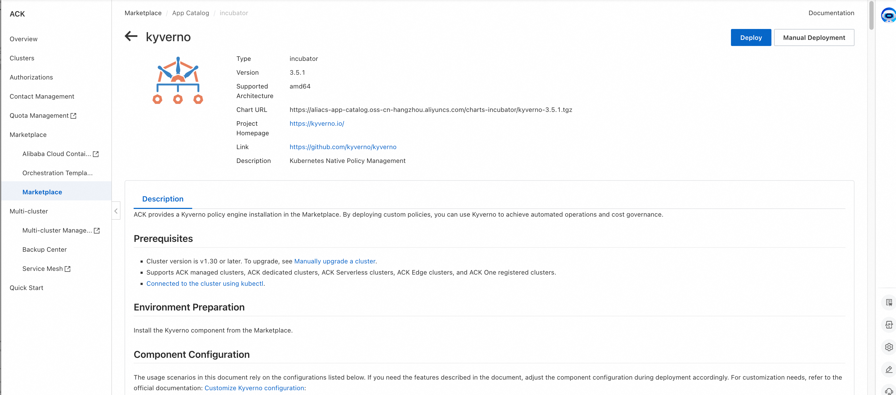
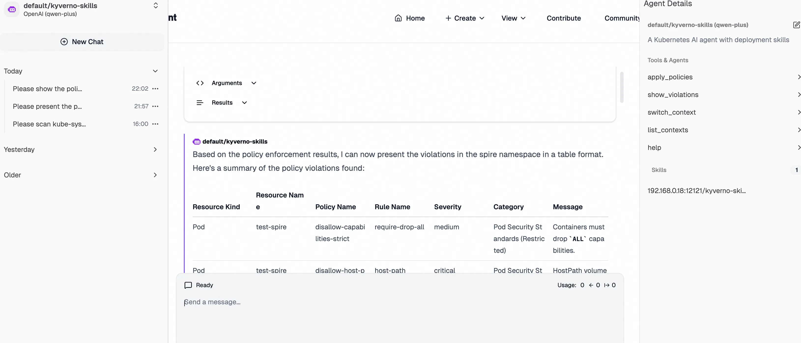
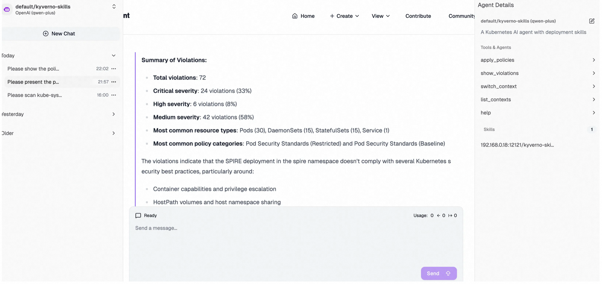

## Overview

Kubernetes has fundamentally transformed how enterprises deploy and manage business workloads. As organizations build production applications at scale on Kubernetes, cluster size and complexity continue to grow—creating unprecedented challenges in ensuring cluster security, compliance, and operational consistency.

Kubernetes natively enables developers to deploy workloads declaratively on demand, scale applications dynamically, and iterate rapidly. Unlike traditional IT governance models that rely on manual approval gates, Kubernetes DevSecOps processes must be automated and embedded directly into application development and delivery workflows to better realize the value of cloud native. Kubernetes also provides policy-based admission control mechanisms such as Admission Controllers and Validating Admission Policy.

Alibaba Cloud [**ACK Policy Governance**](https://www.alibabacloud.com/help/en/ack/ack-managed-and-ack-dedicated/security-and-compliance/configure-and-enforce-ack-pod-security-policies) provides built-in security policy governance based on OPA Gatekeeper by default. Enterprise security and operations teams can implement common governance requirements in a codified and automated manner. In addition, ACK offers a [predefined policy rule library](https://www.alibabacloud.com/help/en/ack/ack-managed-and-ack-dedicated/security-and-compliance/predefined-security-policies-of-ack) to reduce the learning curve of policy languages and improve the efficiency of development and operations handoffs. As Policy-as-Code becomes more widely adopted in production, a more flexible solution is needed to cover more complex scenarios and achieve a better balance between policy enforcement and developer productivity—**Kyverno is the answer**.

------

## Why Kyverno?

Kyverno is a Kubernetes-native policy engine. It uses standard CRDs to define and manage policies, providing a simpler and more user-friendly experience. Key benefits include:

- **Simple policy language:** Policies are written in standard YAML, consistent with Kubernetes manifests. There is no need to learn specialized policy languages such as Rego, lowering the barrier to entry. Kyverno also extends the [CEL function library](https://kyverno.io/docs/policy-types/cel-libraries/).
- **Rich feature set:** Kyverno natively supports **Validate**, **Mutate**, **Generate**, and **Cleanup**, covering a broader range of automation and Policy-as-Code scenarios. It also provides robust caching mechanisms, external data calls, and other capabilities to meet enterprise extension needs in specific Policy-as-Code use cases.
- **Comprehensive policy library:** Kyverno supports Kubernetes-native and multiple [policy types](https://kyverno.io/docs/policy-types/), and the Kyverno community provides [policy libraries](https://github.com/kyverno/policies) covering many common Kubernetes application scenarios.
- **Standardized governance reporting and observability:** While enforcing guardrails, enterprises often place even greater emphasis on the “visibility” of policy governance as a basis for continuously improving cluster security posture. Kyverno provides a Reporting mechanism aligned with the Kubernetes Policy Working Group specifications, helping audit whether workloads deployed in the cluster comply with standards and providing timely feedback to developers. Kyverno also integrates with standard cloud-native observability tools and can seamlessly integrate with [ACK Observability solutions](https://www.alibabacloud.com/help/en/ack/ack-managed-and-ack-dedicated/user-guide/observability-overview).

------

## Real-World Use Cases in ACK

Kyverno is now officially available in the Alibaba Cloud ACK Container Service Marketplace. For installation instructions, see [**Use Kyverno for policy governance**](https://www.alibabacloud.com/help/en/ack/ack-managed-and-ack-dedicated/security-and-compliance/using-kyverno-as-a-policy-governance-engine). Kyverno is recommended as the policy engine in scenarios that require custom policies or resource mutation.





Below are two typical use cases for Kyverno.

### Case 1: Enforcing Custom Resource (CRD) Deletion Protection

Driven by business needs, enterprises often deploy a large number of CRD resources in production clusters. Preventing accidental deletion of critical production CR instances is a key requirement for security and operations teams.

Within Alibaba Cloud’s policy governance framework, as a cloud service provider, the pre-built policy library cannot be aware of users’ CRD resources. This requires extending via an external-provider mechanism and also requires users to write and deploy specific policies to complete the workflow.

With Kyverno, this can be achieved using clear YAML expressions—friendly to cluster operators who are already familiar with Kubernetes manifests. Policies also support fine-grained resource matching and exemption mechanisms:


```yaml
apiVersion: policies.kyverno.io/v1alpha1
kind: ValidatingPolicy
metadata:
  name: protect-critical-database-deletion    
spec:
  autogen:
    podControllers:
      controllers: []
  matchConstraints:
    resourceRules:
      - apiGroups: ["db.example.com"]
        apiVersions: ["*"]
        resources: ["databases"]
        operations: ["DELETE"]
  matchConditions:
    - name: critical-database-instances
      expression: "oldObject.metadata.name in ['critical-db', 'prod-main-db']"
  validationActions: ["Deny"]
  validations:
    - expression: "oldObject.metadata.?annotations['kyverno.io/allow-delete'].orValue('') == 'true'"
      messageExpression: "'Deletion of critical database instance ' + oldObject.metadata.name + ' is not allowed unless annotated with kyverno.io/allow-delete: \"true\"'"
```


### Case 2: Auto-Mutating `runAsNonRoot` & Generating Network Policies

In production operations, automatically applying related resource changes, adding labels/annotations, and dynamically hardening security for specific actions are common requirements. By using a policy engine together with Kubernetes mutating admission capabilities, enterprises can shift these processes from manual operations to automation.

Kyverno provides a more user-friendly mutation experience. Developers can perform resource mutations in a straightforward way using simple YAML patch operations. It also supports:

- **Covering existing resources:** Scan, report on, mutate, and generate for existing resources in the cluster.
- **Automatic generation of related resources:** Automatically create related resources such as NetworkPolicies and ConfigMaps based on policies to enable automated configuration.

The following is a typical example of automating a secure-by-default baseline. With the MutatingPolicy below, `runAsNonRoot` is automatically added to the Pod `securityContext` when Pods are created:


```yaml
apiVersion: policies.kyverno.io/v1alpha1
kind: MutatingPolicy
metadata:
  name: add-pod-run-as-non-root
spec:
  matchConstraints:
    resourceRules:
    - apiGroups: [""]
      apiVersions: ["v1"]
      operations: ["CREATE", "UPDATE"]
      resources: ["pods"]
  mutations:
  - patchType: ApplyConfiguration
    applyConfiguration:
      expression: >-
        Object{
          spec: Object.spec{
            securityContext: Object.spec.securityContext{
              runAsNonRoot: has(object.spec.securityContext) && has(object.spec.securityContext.runAsNonRoot)
                           ? object.spec.securityContext.runAsNonRoot
                           : true          
            }
          }
        }
```


The GeneratingPolicy below enables automatically creating namespace-scoped resources when a Namespace is created or updated:

```yaml
apiVersion: policies.kyverno.io/v1alpha1
kind: GeneratingPolicy
metadata:
  name: add-networkpolicy
  annotations:
    policies.kyverno.io/title: Add Network Policy
    policies.kyverno.io/subject: NetworkPolicy
    policies.kyverno.io/minversion: 1.15.0
spec:
  evaluation:
    synchronize:
      enabled: true
  matchConstraints:
    resourceRules:
      - apiGroups: [""]
        apiVersions: ["v1"]
        operations: ["CREATE", "UPDATE"]
        resources: ["namespaces"]
  variables:
    - name: targetNs
      expression: "object.metadata.name"
    - name: downstream
      expression: >-
        [
          {
            "kind": dyn("NetworkPolicy"),
            "apiVersion": dyn("networking.k8s.io/v1"),
            "metadata": dyn({
              "name": "default-deny",
            }),
            "spec": dyn({
              "podSelector": dyn({}),
              "policyTypes": dyn(["Ingress", "Egress"])
            })
          }
        ]
  generate:
    - expression: generator.Apply(variables.targetNs, variables.downstream)
```

The Kyverno community’s [policies](https://github.com/kyverno/policies) project provides representative policies across a range of Kubernetes application scenarios and best practices. Interested readers can explore it to discover more possibilities with Kyverno.

------

## Intelligent Policies × Security Governance Closed Loop

In the evolution of cloud-native security governance, Kyverno and AI Agents transcend a unidirectional toolchain—they form golden partners in constructing a dynamic "Perceive-Decide-Protect-Evolve" closed-loop system.

### AI Agent Empowers Kyverno: From "Policy Configuration" to "Intelligent Governance"


Leveraging MCP/Skills integrated within the Agent and powered by LLM, SecOps teams can achieve one-click deployment of Kyverno alongside policy sets tailored for typical scenarios. The solution automatically scans workload configurations across defined cluster scopes for diverse compliance and baseline requirements, generating visualized security posture reports to precisely identify high-risk elements (e.g., privileged containers, sensitive volume mounts) and misconfigured authorizations. This transforms traditional "manual inspections" into "minute-level intelligent insights," enabling security policy design with both foresight and precision.

Alibaba Cloud ACK clusters provide automated installation, deployment, and configuration capabilities for [Kagent](https://www.alibabacloud.com/help/en/ack/ack-managed-and-ack-dedicated/use-cases/quickly-build-a-question-and-answer-agent-using-kagent). Cluster security personnel can streamline the end-to-end lifecycle of building, deploying, and managing AI Agents within Kubernetes environments. Based on standardized MCP/Skills specifications, teams flexibly develop and operate Kyverno policy-focused Agents and MCP Servers directly in-cluster.

The figure below illustrates a Kyverno Agent instance deployed in the cluster. Integrated with Tools from [kyverno-mcp](https://github.com/nirmata/kyverno-mcp), it supports context loading and switching across multi-cluster environments and enables policy governance inspection via the kyverno CLI for rapid security and compliance risk detection. Enhanced with Kyverno-specific Skills, the Agent optimizes policy governance workflows: as demonstrated in the interaction snapshot, it swiftly invokes Tools to evaluate namespace-level risks against best-practice policy sets, ultimately delivering tabular compliance reports and consolidated violation summaries.







### Kyverno Safeguards AI Agents: From "Risk Prevention" to "Secure Operation"

When AI Agents, associated MCP Servers, and gateway containers are deployed within the cluster, Kyverno policies instantly step in as the vigilant "security gatekeeper":

- **Real-time interception of high-risk configurations**: Automatically audit or reject Agent Pods launched with privileged mode, root privileges, missing `securityContext`, or mounting sensitive host directories.
- **Fine-grained AI gateway authorization**: Leveraging Envoy's [External Authorization](https://www.envoyproxy.io/docs/envoy/latest/intro/arch_overview/security/ext_authz_filter.html) mechanism, Kyverno policies empower AI gateways to enforce identity-aware authorization, achieving fine-grained access control over AI inbound traffic.
- **Closed-loop hardening and remediation**: Upon risk detection, Kyverno not only blocks non-compliant deployments but also delivers automated hardening and remediation templates—ensuring Agents operate as secure, governed application units within the cluster, not attack vectors.

In today’s era of deep AI and cloud-native convergence, Agents infuse Kyverno policies with contextual intelligence, while Kyverno empowers Agents with operational trust—*together closing the loop* on a dynamically evolving, self-reinforcing security framework.

## Conclusion

In the cloud-native era, security and efficiency are no longer a binary trade-off. Alibaba Cloud ACK Container Service remains committed to delivering a Kubernetes governance experience that combines security, compliance, and development agility for enterprises. By integrating the Kyverno policy engine, ACK further enriches its Policy-as-Code capabilities. Looking ahead, Alibaba Cloud will continue collaborating with the Kyverno community to advance policy governance capabilities—empowering enterprises to enjoy cloud-native agility while strengthening the foundation of security and compliance.


