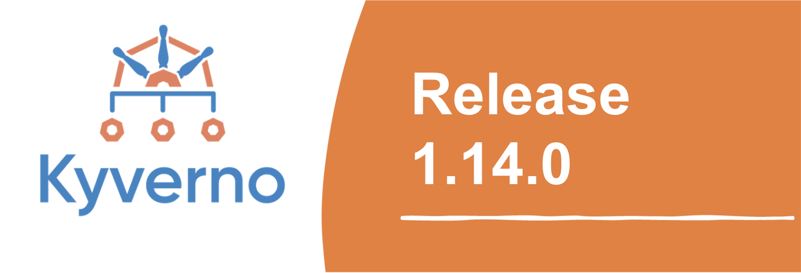

We are excited to announce the release of Kyverno 1.14.0, marking a significant milestone in our journey to make policy management more modular, streamlined, and powerful. This release introduces two new policy types - `ValidatingPolicy` and `ImageValidatingPolicy` - that represent our vision for the future of policy management in Kubernetes environments and beyond.



## TL;DR

- Two new specialized policy types: `ValidatingPolicy` and `ImageValidatingPolicy`
- Streamlined validation with improved Common Expression Language (CEL) support and performance
- Enhanced supply chain security with dedicated image verification
- Policy exceptions now support CEL expressions for fine-grained control
- CLI improvements for shift-left validation of any JSON payload
- Community milestone: 744 changes with 60+ contributors (40 first-time!)

## Why New Policy Types?

Kyverno's evolution has led to a proliferation of overlapping rule types (`validate.pattern`, `validate.cel`, `validate.deny`, etc.) within the `ClusterPolicy` Custom Resource Definition (CRD), creating unnecessary complexity for users. Meanwhile, Kubernetes has introduced its own `ValidatingAdmissionPolicies` and `MutatingAdmissionPolicies` using CEL expressions, presenting an opportunity for closer alignment.

The new policy types address these challenges by migrating each rule type into its own dedicated CRD. This modular approach streamlines the user experience, standardizes on CEL for better Kubernetes compatibility, simplifies maintenance for the project, and provides a clearer, more focused way to define policies according to their specific functions.

## New Policy Types: A Modular Approach

Kyverno 1.14.0 begins a new chapter for Kyverno with the introduction of specialized policy types that separate concerns and confusion about validation checks being written in various patterns by providing a more focused approach to functionality.

### ValidatingPolicy: Streamlined Validation

The new `ValidatingPolicy` CRD simplifies how you write validation rules by centralizing all validation logic into a dedicated resource type. This approach offers several advantages:

- Simplified structure: A clean, focused structure that makes policies easier to write and understand
- CEL-first approach: `ValidatingPolicy` uses CEL as the primary validation method, aligning with Kubernetes' own trajectory for policy management
- Native compatibility: Works seamlessly with Kubernetes `ValidatingAdmissionPolicy`
- Improved performance: Optimized for faster validation checks with reduced overhead

Here is an example of validating deployment replicas (ensuring deployments don't exceed a maximum replica count).

Previous `ClusterPolicy` approach:

```yaml
apiVersion: kyverno.io/v1
kind: ClusterPolicy
metadata:
  name: check-deployment-replicas
spec:
  validationFailureAction: Enforce
  rules:
    - name: check-replicas
      match:
        resources:
          kinds:
            - Deployment
      validate:
        message: 'The number of replicas must not exceed 5'
        pattern:
          spec:
            replicas: '<= 5'
```

New `ValidatingPolicy` approach:

```yaml
apiVersion: policies.kyverno.io/v1
kind: ValidatingPolicy
metadata:
  name: check-deployment-replicas
spec:
  validations:
    - expression: 'object.spec.replicas <= 5'
      message: 'The number of replicas must not exceed 5'
  matchConstraints:
    resourceRules:
      - apiGroups: ['apps']
        apiVersions: ['v1']
        resources: ['deployments']
```

#### ValidatingAdmissionPolicy Generation

This release enhances policy flexibility with the ability to automatically generate Kubernetes `ValidatingAdmissionPolicies` from `ValidatingPolicies`, enabling validations to be performed directly by the Kubernetes API server rather than the Kyverno admission controller. This capability improves performance and resilience by leveraging native Kubernetes validation while maintaining the rich feature set and ease of use provided by Kyverno.

#### Comparison with ValidatingAdmissionPolicy

| Feature          | K8s ValidatingAdmissionPolicy | Kyverno ValidatingPolicy                         |
| ---------------- | ----------------------------- | ------------------------------------------------ |
| Enforcement      | Admission                     | Admission, Background, Pipelines, …              |
| Payloads         | Kubernetes                    | Kubernetes, Any JSON or YAML                     |
| Distribution     | Kubernetes API server         | Helm, CLI, Web Service, API, SDK                 |
| CEL Library      | Basic                         | Extended                                         |
| Bindings         | Manual                        | Automatic                                        |
| Auto-generation  | ⛔                            | Pod Controllers, ValidatingAdmissionPolicy       |
| External Data    | ⛔                            | Kubernetes resources or API calls                |
| Caching          | ⛔                            | Global Context, image verification results       |
| Background scans | ⛔                            | Periodic, On policy creation or updates          |
| Exceptions       | ⛔                            | Fine-grained exclusions                          |
| Reporting        | ⛔                            | Policy WG Reports, Policy Reporter, etcd offload |
| Testing          | ⛔                            | Kyverno CLI (unit), Chainsaw (e2e)               |

For more details of ValidatingPolicy, check the official document [here](https://main.kyverno.io/docs/policy-types/validating-policy/).

### ImageValidatingPolicy: Advanced Supply Chain Security

The `ImageValidatingPolicy` is a dedicated policy type that focuses exclusively on container image verification, significantly enhancing software supply chain security capabilities. By decoupling the image verification rule from ClusterPolicy into its own CRD, it provides a more modular and streamlined approach to image security. This policy type can also extract images from any JSON payload, allowing for comprehensive and flexible image verification.

Key features include:

- Comprehensive Image Verification: Verify signatures, Software Bill of Materials (SBOMs), attestations, and other artifacts to ensure the integrity and authenticity of container images.
- Flexible Matching: Match images using glob patterns or powerful CEL expressions, providing versatility in defining verification criteria.
- Enhanced CEL Functions: Leverages specialized CEL functions for verifying image signatures and attestations, making complex validation logic easier to implement.

The following `ImageValidatingPolicy` verifies that all container images from ghcr.io meet strict supply chain security requirements before pods are created, ensuring all images are properly signed.

```yaml
apiVersion: policies.kyverno.io/v1
kind: ImageValidatingPolicy
metadata:
  name: ivpol-sample
spec:
  webhookConfiguration:
    timeoutSeconds: 20
  failurePolicy: Ignore
  validationActions:
    - Deny
  matchConstraints:
    resourceRules:
      - apiGroups: ['']
        apiVersions: ['v1']
        operations: ['CREATE']
        resources: ['pods']
  matchImageReferences:
    - glob: ghcr.io/*
  attestors:
    - name: notary
      notary:
        certs:
          value: |-
            -----BEGIN CERTIFICATE-----
            …
            …
            -----END CERTIFICATE-----
  attestations:
    - name: sbom
      referrer:
        type: sbom/cyclone-dx
  validations:
    - expression: >-
        images.containers.map(image, verifyImageSignatures(image, [attestors.notary])).all(e, e > 0)
      message: failed to verify image with notary cert
```

The following policy enhances security posture by dynamically fetching Notary certificates from a ConfigMap:

```yaml
apiVersion: policies.kyverno.io/v1
kind: ImageValidatingPolicy
metadata:
  name: check-images
spec:
  matchConstraints:
    resourceRules:
      - apiGroups: ['']
        apiVersions: ['v1']
        operations: ['CREATE']
        resources: ['pods']
  variables:
    - name: cm
      expression: >-
        resource.Get("v1", "configmaps", object.metadata.namespace, "keys")
  matchImageReferences:
    - glob: ghcr.io/*
  attestors:
    - name: notary
      notary:
        certs:
          expression: variables.cm.data.certificate
  validations:
    - expression: >-
        images.containers.map(image, verifyImageSignatures(image, [attestors.notary])).all(e, e > 0)
      message: failed to verify image with notary cert
```

For more details of `ImageValidatingPolicy`, check the official document [here](https://main.kyverno.io/docs/policy-types/image-validating-policy/).

## Other Features and Enhancements

### PolicyExceptions in CEL

Kyverno 1.14.0 extends the powerful [PolicyException](/docs/guides/exceptions#policyexceptions-with-cel-expressions) feature to work seamlessly with the new policy types. This enhancement provides granular control over policy enforcement, allowing administrators to define specific exemptions from policy rules when needed.

Policy exceptions enable teams to:

- Create targeted exemptions for specific workloads or resources
- Define precise conditions under which policies should not be applied
- Balance strict security controls with practical operational needs
- Support migration paths and special use cases

For example, you can create an exception that excludes a specific deployment from an `ImageValidatingPolicy`:

```yaml
apiVersion: policies.kyverno.io/v1
kind: PolicyException
metadata:
  name: exclude-skipped-deployment
spec:
  policyRefs:
    - name: 'ivpol-report-background-sample'
      kind: ImageValidatingPolicy
  matchConditions:
    - name: 'check-name'
      expression: "object.metadata.name == 'skipped-deployment'"
```

In this example, the `PolicyException` exempts any resource named "skipped-deployment" from the "ivpol-report-background-sample" `ImageValidatingPolicy`. The matchConditions field uses a CEL expression to precisely define when the exception applies, giving administrators fine-grained control over policy enforcement.

### Advanced CEL Libraries

Kyverno 1.14.0 includes powerful CEL libraries that extend beyond standard Kubernetes capabilities. These libraries work seamlessly with new policy types while maintaining backward compatibility with established Kyverno features.

Here are example signatures for each library. For a full list, please see [here](https://main.kyverno.io/docs/policy-types/validating-policy/#kyverno-cel-libraries):

#### Resource Library

The Resource library retrieves Kubernetes resources for real-time validations against the current cluster state.

```yaml
resource.Get("v1", "configmaps", "default", "my-config")
resource.List("apps/v1", "deployments", "default").items
```

#### HTTP Library

The HTTP library enables external API calls for integrating third-party validations into policy decisions.

```yaml
http.Send("GET", "https://api.example.com/data", {}).body
http.Post("https://audit.api/log", {"kind": object.kind}, {"Content-Type": "application/json"}).logged == true
```

#### User Library

The User library includes functions like parseServiceAccount() to extract metadata from the user or service account that triggered the admission request. These expressions help enforce policies based on user identity, namespace association, or naming conventions of service accounts.

```yaml
parseServiceAccount(request.userInfo.username)
```

#### GlobalContext Library

The GlobalContext library provides access to cached data in `GlobalContextEntry` that's shared across multiple policies, improving performance by avoiding redundant API calls.

```yaml
globalcontext.Get("gctxentry-apicall-correct", "") != 0
globalcontext.Get("allowed-registries", "").registries.exists(r, image.registry == r)
```

#### Image Library

The Image library parses container image references, enabling validation of image components like registry, repository, tag, and digest.

```yaml
image("nginx:latest").registry == "docker.io"
image("ghcr.io/company/app:v1.2.3").containsDigest()
```

#### Image Data Library

The Image Data library enables deep inspection of container image metadata from OCI registries, including architecture, OS, layers, and manifest details.

```yaml
imagedata.Get("nginx:1.21").config.architecture == "amd64"
imagedata.Get("my-image:latest").manifest.layers.size() > 0
```

### CLI & Reporting

Kyverno 1.14.0 enhances the CLI experience by extending support for the new `ValidatingPolicy` and `ImageValidatingPolicy` types, making it easier to test and validate policies before applying them to your cluster. The CLI is beneficial for shift-left testing of policies during development or CI/CD pipelines.

For example, you can validate a Dockerfile (represented as JSON) against security policies before building images. In the following ValidatingPolicy snippet, it uses CEL expressions to examine the Dockerfile structure and scans for prohibited commands like curl:

```yaml
validations:
  - message: 'curl is not allowed'
    expression: >-
      !object.Stages.exists(s, 
        s.Commands.exists(c, 
          has(c.CmdLine) && c.CmdLine.exists(cmd, string(cmd).contains('curl'))
        )
      )
```

Complementing these CLI capabilities, Kyverno also integrates the new policy types with the `PolicyReport` framework. While the CLI helps you validate resources during development, `PolicyReports` provide ongoing visibility into compliance status across your environment. These reports clearly identify which policy type generated the results (`source: KyvernoImageValidatingPolicy`), link to evaluated resources via owner references, and provide actionable messages for remediation.

```yaml
apiVersion: wgpolicyk8s.io/v1alpha2
kind: PolicyReport
metadata:
  labels:
    app.kubernetes.io/managed-by: kyverno
  ownerReferences:
    - apiVersion: apps/v1
      kind: Deployment
      name: test-deployment
scope:
  apiVersion: apps/v1
  kind: Deployment
  name: test-deployment
results:
  - message: failed to verify image with notary cert
    policy: ivpol-report-admission-sample
    result: fail
    scored: true
    source: KyvernoImageValidatingPolicy
```

The new policy types are also fully supported in Kyverno [Playground](https://playground.kyverno.io/next/#/), allowing users to experiment with and test these policies in a web interface before deploying them to production environments. [Policy Reporter](https://github.com/kyverno/policy-reporter) has also been enhanced to visualize and manage the specialized reports generated by these policy types, providing intuitive dashboards and alerts that help teams monitor image verification status and validation results across their clusters.

## Getting Started & Backward Compatibility

### Upgrading to Kyverno 1.14

To upgrade to Kyverno 1.14, you can use Helm:

```bash
helm repo update
helm upgrade kyverno kyverno/kyverno -n kyverno --version v1.14.0
```

### Backward Compatibility

Kyverno 1.14 maintains full backward compatibility with existing `ClusterPolicy` resources. You can continue using your current policies while gradually migrating to the new policy types as needed. The original `ClusterPolicy` type will continue to be supported, giving you time to evaluate and adopt the new specialized policy types at your own pace.

## Roadmap

The introduction of `ValidatingPolicy` and `ImageValidatingPolicy` is just the beginning of our vision to make policy management in Kubernetes more modular, streamlined, and powerful. Looking ahead, we plan to complete the policy family with dedicated `MutatingPolicy` for targeted resource modifications, `GeneratingPolicy` for creating dependent resources, and `DeletingPolicy` for controlled resource cleanup - each designed to excel at specific functions while maintaining a consistent user experience. This modular approach will simplify policy definition and management, reducing complexity while expanding capabilities. We're also enhancing cross-cutting features, such as event generation, to provide detailed audit trails of policy actions and comprehensive metrics support, giving operators visibility into policy performance and effectiveness.

## Conclusion

Kyverno 1.14.0 represents a significant evolution in Kubernetes policy management, offering more focused, efficient ways to implement policies. The new ValidatingPolicy and ImageValidatingPolicy types provide powerful capabilities while simplifying how users write and manage policies.

In this release cycle, there were [744 changes](https://github.com/kyverno/kyverno/compare/release-1.13...v1.14.0), showcasing the extensive work and improvements made to the project. We are incredibly grateful to the over 60 contributors who participated in this release, with 40 of them being first-time contributors. This highlights the vibrant and growing community behind Kyverno, and we are thrilled to see such a collaborative effort. We extend our heartfelt thanks to everyone who contributed, and we encourage even more community involvement. Your contributions are vital to the continued success and evolution of Kyverno.

We're excited to see how the community leverages these new capabilities and welcome your feedback as we continue to enhance Kyverno's policy management capabilities. For the complete list of changes, check out the [release notes](https://github.com/kyverno/kyverno/releases/tag/v1.14.0) on GitHub. Join us in shaping the future of policy management in Kubernetes!
