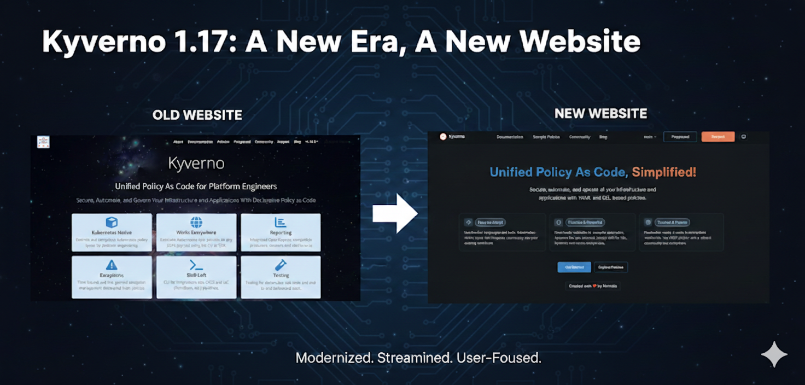

# Announcing Kyverno Release 1.17!

Kyverno 1.17 is a landmark release that marks the stabilization of our next-generation Common Expression Language (CEL) policy engine.

While 1.16 introduced the "CEL-first" vision in beta, 1.17 promotes these capabilities to **`v1`**, offering a high-performance, future-proof path for policy as code.

This release focuses on "completing the circle" for CEL policies by introducing namespaced mutation and generation, expanding the available function libraries for complex logic, and enhancing supply chain security with upcoming Cosign v3 support.

## A New Look for kyverno.io

The first thing you’ll notice with 1.17 is our completely redesigned website.
We’ve moved beyond a simple documentation site to create a modern, high-performance portal for platform engineers.

Let's be honest: **the Kyverno website redesign was long overdue**.
As the project evolved into the industry standard for unified policy as code, our documentation needs to reflect that maturity.
We are proud to finally unveil the new experience at https://kyverno.io.



- **Modern Redesign**

  Built on the [Starlight](https://starlight.astro.build/) framework, the new site is faster, fully responsive, and features a clean, professional aesthetic that makes long-form reading much easier on the eyes.

- **Enhanced Documentation Structure**

  We’ve reorganized our [docs](/docs/introduction/) from the ground up. Information is now tiered by "User Journey"—from a simplified Quick Start for beginners to deep-dive Reference material for advanced policy authors.

- **Fully Redesigned Policy Catalog**

  Our library of 300+ [sample policies](/policies/) has a new interface. It features improved filtering and a dedicated search that allows you to find policies by Category (Best Practices, Security, etc.) or Type (CEL vs. JMESPath) instantly.

- **Enhanced Search Capabilities**

  We’ve integrated a more intelligent search engine that indexes both documentation and policy code, ensuring you get the right answer on the first try.

- **Brand New Blog**

  The Kyverno [blog](/blog/) has been refreshed to better showcase technical deep dives, community case studies, and release announcements like this one!

## Namespaced Mutating and Generating Policies

In 1.16, we introduced **namespaced variants** for validation, cleanup, and image verification.

Kyverno 1.17 completes this by adding:

- **NamespacedMutatingPolicy**
- **NamespacedGeneratingPolicy**

This enables true multi-tenancy.
Namespace owners can now define their own mutation and generation logic (e.g., automatically injecting sidecars or creating default `ConfigMaps`) without requiring cluster-wide permissions or affecting other tenants.

## CEL Policy Types reach v1 (GA)

The headline for 1.17 is the promotion of CEL-based policy types to **v1**.
This signifies that the API is now **stable and production-ready**.

The promotion includes:

- **ValidatingPolicy** and **NamespacedValidatingPolicy**
- **MutatingPolicy** and **NamespacedMutatingPolicy**
- **GeneratingPolicy** and **NamespacedGeneratingPolicy**
- **ImageValidatingPolicy** and **NamespacedImageValidatingPolicy**
- **DeletingPolicy** and **NamespacedDeletingPolicy**
- **PolicyException**

With this graduation, platform teams can confidently migrate from JMESPath-based policies to CEL to take advantage of significantly improved evaluation performance and better alignment with upstream Kubernetes `ValidatingAdmissionPolicies` / `MutatingAdmissionPolicies`.

## New CEL Capabilities and Functions

To ensure CEL policies are as powerful as the original Kyverno engine, 1.17 introduces several new function libraries:

- **Hash Functions**

  Built-in support for `md5(value)`, `sha1(value)`, and `sha256(value)` hashing.

- **Math Functions**

  Use `math.round(value, precision)` to round numbers to a specific decimal or integer precision.

- **X509 Decoding**

  Policies can now inspect and validate the contents of x509 certificates directly within a CEL expression using `x509.decode(pem)`.

- **Random String Generation**

  Generate random strings with `random()` (default pattern) or `random(pattern)` for custom regex-based patterns.

- **Transform Utilities**

  Use `listObjToMap(list1, list2, keyField, valueField)` to merge two object lists into a map.

- **JSON Parsing**

  Parse JSON strings into structured data with `json.unmarshal(jsonString)`.

- **YAML Parsing**

  Parse YAML strings into structured data with `yaml.parse(yamlString)`.

- **Time-based Logic**

  New `time.now()`, `time.truncate(timestamp, duration)`, and `time.toCron(timestamp)` functions allow for time-since or "maintenance window" style policies.


## The Deprecation of Legacy APIs

As Kyverno matures and aligns more closely with upstream Kubernetes standards, we are making the strategic shift to a **CEL-first** architecture.
This means that the legacy `Policy` and `ClusterPolicy` types (which served the community for years using JMESPath) are now entering their sunset phase.

### The Deprecation Schedule

Kyverno 1.17 officially marks `ClusterPolicy` and `CleanupPolicy` as **Deprecated**.
While they remain functional in this release, the clock has started on their removal to make way for the more performant, standardized CEL-based engines.

| Release | Date (estimated) | Status                 |
| ------- | ---------------- | ---------------------- |
| v1.17   | Jan 2026         | Marked for deprecation |
| v1.18   | Apr 2026         | Critical fixes only    |
| v1.19   | Jul 2026         | Critical fixes only    |
| v1.20   | Oct 2026         | Planned for removal    |

### Why the Change?

By standardizing on the Common Expression Language (CEL), Kyverno significantly improves its performance and aligns with the native validation logic used by the Kubernetes API server itself.

For platform teams, this means **one less language to learn** and a more predictable and scalable policy-as-code experience.

### Note for Authors

From this point forward, we strongly recommend that **every new policy you write be based on the new CEL APIs**.
Choosing the legacy APIs for new work today simply adds to your migration workload later this year.

### Migration Tips

We understand that many of you have hundreds of existing policies.
To ensure a smooth transition, we have provided comprehensive resources:

- **[The Migration Guide](/docs/guides/migration-to-cel)**

  Our new Migration to CEL Guide provides a side-by-side mapping of legacy `ClusterPolicy` fields to their new equivalents (e.g., mapping `validate.pattern` to `ValidatingPolicy` expressions).

- **[New Policy Types](/docs/policy-types/overview/)**

  You can now begin moving your rules into specialized types like `ValidatingPolicy`, `MutatingPolicy`, and `GeneratingPolicy`. You can see the full breakdown of these new v1 APIs in the Policy Types Overview.

## Enhanced Supply Chain Security

Supply chain security remains a core pillar of Kyverno.

- **Cosign v3 Support**

  1.17 adds support for the latest Cosign features, ensuring your image verification remains compatible with the evolving Sigstore ecosystem.

- **Expanded Attestation Parsing**

  New capabilities to deserialize YAML and JSON strings within CEL policies make it easier to verify complex metadata and SBOMs.

## Observability and Reporting Upgrades

We have refined how Kyverno communicates policy results:

- **Granular Reporting Control**

  A new `--allowedResults` flag allows you to filter which results (e.g., only "Fail") are stored in reports, significantly reducing ETCD pressure in large clusters.

- **Enhanced Metrics**

  More detailed latency and execution metrics for CEL policies are now included by default to help you monitor the "hidden" cost of policy enforcement.

## Getting Started & Backward Compatibility

Upgrading from 1.16 is straightforward. However, since the CEL policy types have moved to `v1`, we recommend updating your manifests to the new API version. Kyverno will continue to support `v1beta1` for a transition period.

```bash
helm repo update
helm upgrade --install kyverno kyverno/kyverno -n kyverno --version 3.7.0
```

## Looking Ahead: The Kyverno Roadmap

As we move past the 1.17 milestone, our focus shifts toward long-term sustainability and the "Kyverno Platform" experience. Our goal is to ensure that Kyverno remains the most user-friendly and performant governance tool in the cloud-native ecosystem.

- **Growing the Community**

  We are doubling down on our commitment to the community. Expect more frequent office hours, improved contributor onboarding, and a renewed focus on making the Kyverno community the most welcoming space in CNCF.

- **A Unified Tooling Experience**

  Over the years, we’ve built several powerful sub-projects (like the CLI, Policy Reporter, and Kyverno-Authz). A major goal on our roadmap is to **unify these tools into a cohesive experience**, reducing fragmentation and making it easier to manage the entire policy lifecycle from a single vantage point.

- **Performance & Scalability Guardrails**

  As clusters grow, performance becomes paramount. We are shifting our focus toward rigorous automated performance testing and will be providing more granular metrics regarding throughput and latency. We want to give platform engineers the data they need to understand exactly what Kyverno can handle in high-scale production environments.

- **Continuous UX Improvement**

  The website redesign was just the first step. We will continue to iterate on our user interfaces, documentation, and error messaging to ensure that Kyverno remains "Simplified" by design, not just in name.

## Conclusion

Kyverno 1.17 is the most robust version yet, blending the flexibility of our original engine with the performance and standardization of CEL.

But this release is about more than just code—it’s about the total user experience. Whether you’re browsing the new policy catalog or scaling thousands of CEL-based rules, we hope this release makes your Kubernetes journey smoother.

A massive thank you to our contributors for making this release (and the new website!) a reality.
