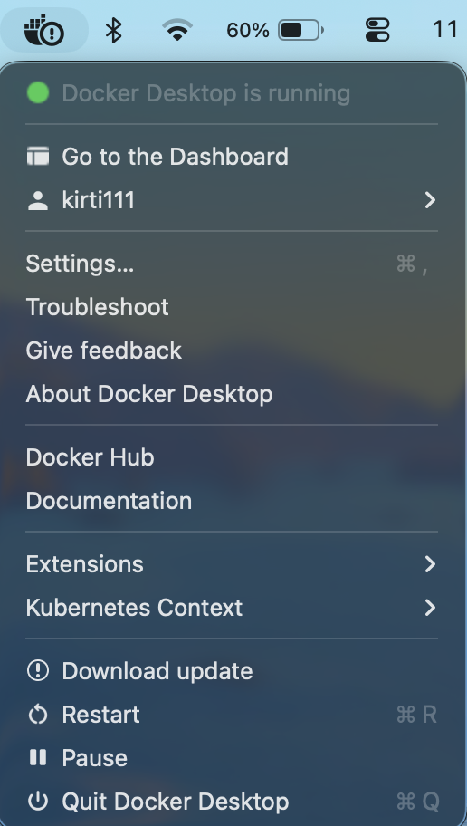
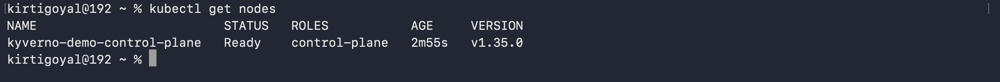
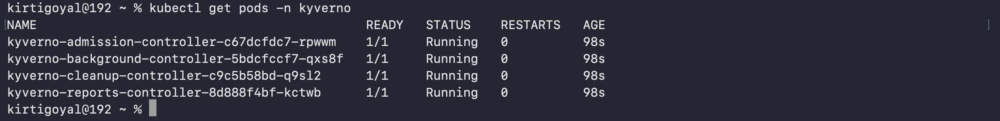
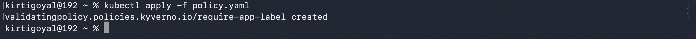
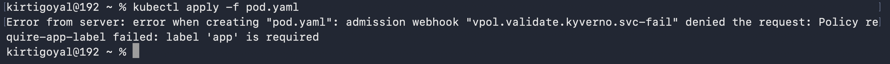
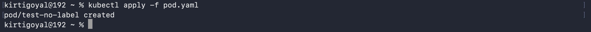

When newcomers start exploring Kyverno, may have reported that they had to jump between different docs, tools and setup steps to gain an understanding of how things connect.

This guide is intended to make that experience simpler for new users getting started locally on macOS.

By the end, there will be a running Kubernetes cluster, Kyverno installed, and your first policy enforcing rules in real time.

> **Note:** This guide uses Kyverno v1.17.x (compatible with Kubernetes v1.32–v1.35) and
> the `policies.kyverno.io/v1` APIs.

## What you'll have by the end

- A local Kubernetes cluster running on your Mac
- Kyverno installed and active
- A working policy that blocks non-compliant resources in real time

Let's go.

## Before you start

Open your terminal. On Mac: press Cmd + Space, type "Terminal", hit enter. You'll be
running all the commands in this guide from here.

## The tools you need

Here's everything we're installing and what each one actually does:

1. [**Docker Desktop**](https://docs.docker.com/get-docker/): Runs the containers that make up your local cluster
2. **Homebrew**: Package manager for your terminal — like the App Store but for dev tools
3. [**kubectlCLI**](https://kubernetes.io/docs/tasks/tools/): for talking to your Kubernetes cluster
4. [**kind**](https://kind.sigs.k8s.io/docs/user/quick-start/): Spins up a real Kubernetes cluster locally inside Docker
5. [**Helm**](https://helm.sh/docs/intro/install/): Package manager for Kubernetes — like Homebrew but for Kubernetes tools

## Step 1: Install Docker Desktop

kind uses Docker containers as Kubernetes nodes, so Docker has to come first. Everything
else depends on it.
Download and install [Docker Desktop](https://docs.docker.com/get-docker/).
After installation, open Docker Desktop and wait for the engine to start. The green dot in your menu bar confirms it's ready.



Verify it's working in your terminal:

```bash
docker --version
```

Expected output:
`Docker version 27.x.x, build xxxxxxx`

```bash
docker ps
```

If Docker is running, this returns an empty table. If it errors, Docker isn't running yet, open Docker Desktop first.

## Step 2: Install Homebrew

Homebrew is basically the App Store for your terminal. Instead of downloading installers and clicking through setup wizards, `brew install` handles everything.

Check if it's already installed:

```bash
brew --version
```

If it's not installed:

```bash
/bin/bash -c "$(curl -fsSL https://raw.githubusercontent.com/Homebrew/install/HEAD/install.sh)"
```

## Step 3: Install kubectl

kubectl is the command-line tool for talking to the Kubernetes cluster. Think of it like a remote control, it sends instructions to the cluster. It's used for everything:
applying policies, checking resources, reading output.

```bash
brew install kubectl
```

Verify:

```bash
kubectl version --client
```

## Step 4: Install kind

kind stands for **Kubernetes IN Docker**. It spins up a real Kubernetes cluster locally using Docker containers as nodes. There is no need of cloud account, virtual machines, infrastructure setup. Think of it like a pocket-sized Kubernetes cluster that lives entirely on the laptop.

```bash
brew install kind
```

Verify:

```bash
kind version
```

## Step 5: Install Helm

Helm is a package manager for Kubernetes. Like Homebrew but for Kubernetes tools. Instead of manually applying a bunch of YAML files to install something, one Helm command handles everything like the install, the configuration, the namespace setup.

```bash
brew install helm
```

Verify:

```bash
helm version
```

## Step 6: Create a local cluster

All the tools are now ready. Time to spin up a cluster.

```bash
kind create cluster --name kyverno-demo
```

This takes about a minute. kind pulls the Kubernetes node image and sets everything up inside Docker. Once it's done, verify the cluster is up:

```bash
kubectl cluster-info
kubectl get nodes
```



One node should appear in `Ready` state. If it shows `NotReady`, wait 30 seconds and run it again as it just needs a moment to fully initialize.
At this point there's a real, working Kubernetes cluster running entirely on the Mac.

## Step 7: Install Kyverno

Now the main event.
First, add the Kyverno Helm repository. This is like adding a new source in Homebrew so it knows where to find Kyverno's packages:

```bash
helm repo add kyverno https://kyverno.github.io/kyverno/
helm repo update
```

Then install Kyverno into its own dedicated namespace:

```bash
helm install kyverno kyverno/kyverno \
  -n kyverno --create-namespace
```

## Step 8: Verify the installation

```bash
kubectl get pods -n kyverno
```

Don't worry if things take a little time at first. That's completely normal. Because Kubernetes spins up containers in stages, so the pods move through different states before they settle:

### What you'll see while it's starting up:

```text
kyverno-admission-controller-xxx    0/1   Init:0/1            0   5s
kyverno-background-controller-xxx   0/1   ContainerCreating   0   5s
kyverno-cleanup-controller-xxx      0/1   PodInitializing     0   8s
kyverno-reports-controller-xxx      0/1   PodInitializing     0   8s
```

Give it 30–60 seconds and run the command again. Once everything is ready, all four pods should show `Running`:

### Wait Until



Here's what each component does:

- **admission-controller** — This is the main one. It intercepts every incoming resource request before Kubernetes accepts it. This is where the policies actually run.

- **background-controller** — It handles generate and mutate-existing policies that run outside of the admission flow

- **cleanup-controller** — It handles scheduled deletion policies

- **reports-controller** — It manages policy reports so one can see what passed and failed

If all four are `Running`, Kyverno is active and ready.

**Something not right?**
If any pod is stuck in `Pending` or `Error` after a few minutes, run:

```bash
kubectl describe pod <pod-name> -n kyverno
```

_Most common cause:_ Docker isn't running or the cluster didn't start cleanly.
Try deleting and recreating the cluster:

```bash
kind delete cluster --name kyverno-demo
kind create cluster --name kyverno-demo
```

Kyverno is now running as an **admission controller** inside the cluster. Think of it like a bouncer at the door and every resource that tries to enter your cluster has to get past Kyverno first.
That means every time you run:

```bash
kubectl apply -f something.yaml
```

That request goes to the Kubernetes API server and Kyverno intercepts it before Kubernetes accepts it. The resource only gets created if Kyverno allows it.

At that checkpoint, Kyverno can:

- Allow the resource through
- Block it if it breaks a rule
- Modify it automatically before it's stored

## Step 9: Apply your first policy

Here's a real rule: every Pod must have a label called `app`.

Create a file called `policy.yaml`:

```yaml
apiVersion: policies.kyverno.io/v1
kind: ValidatingPolicy
metadata:
  name: require-app-label
spec:
  validationActions:
    - Deny # Block the request if the rule isn't met
      # Swap to Audit if you want to observe without blocking
  matchConstraints:
    resourceRules:
      - apiGroups: ['']
        apiVersions: ['v1']
        operations: ['CREATE']
        resources: ['pods'] # This policy only applies to Pods
  validations:
    - message: "label 'app' is required"
      expression: "'app' in object.metadata.?labels.orValue([])"
      # object = the resource being evaluated, this is always your starting point in CEL
      # .?labels safely handles pods that have no labels at all
      # .orValue([]) returns an empty list instead of erroring if labels don't exist
```

Apply it:

```bash
kubectl apply -f policy.yaml
```

Expected output:



## Step 10: Test it

First create a Pod without the required label and watch Kyverno block it.

Create `pod.yaml`:

```yaml
apiVersion: v1
kind: Pod
metadata:
  name: test-no-label
spec:
  containers:
    - name: nginx
      image: nginx
```

```bash
kubectl apply -f pod.yaml
```

**You should see:**

```text
Error from server: admission webhook "validate.kyverno.svc" denied the request:
label 'app' is required
```



Kyverno intercepted the request and blocked it before the Pod was ever created.

## Step 11: Fix it and try again

Update `pod.yaml` to add the missing label:

```yaml
apiVersion: v1
kind: Pod
metadata:
  name: test-no-label
  labels:
    app: demo # required label — now it's here
spec:
  containers:
    - name: nginx
      image: nginx
```

```bash
kubectl apply -f pod.yaml
```

**Expected output:**



Pod goes through.

### What just happened?

A complete policy lifecycle just ran:

1. Tried to create a resource → **denied**
2. Fixed the resource → **allowed**

This is exactly how Kyverno works in real clusters. The rule is written once. Every resource that comes in gets checked automatically, every time, no exceptions. Nobody has to remember anything manually.

### Want to try this without a local cluster?

Kyverno policies can be tested directly in the browser:
[playground.kyverno.io](https://playground.kyverno.io)

Paste any policy and resource and see exactly what Kyverno would do. Great for quickly
testing CEL expressions before applying them to a real cluster.

### What's next - the five policy types

This guide covered `ValidatingPolicy` which the most fundamental one. Kyverno can do a lot more than just validate.

- **ValidatingPolicy:** Enforce rules like allow or deny resources
- **MutatingPolicy:** Automatically modify resources before they're stored
- **GeneratingPolicy:** Create new resources when something happens
- **DeletingPolicy:** Clean up resources on a schedule
- **ImageValidatingPolicy:** Verify container image signatures for supply chain security

## The best way to learn from here

Don't just follow guides. Intentionally break things.
You can change the **CEL expression**. Create resources that should fail. Create ones that should pass.
Watch what Kyverno does at each step. That's genuinely how it clicks and not just from reading, but from seeing the deny and allow cycle play out in your own terminal.
The cluster is local. Nothing is at risk. Feel free to break things.
