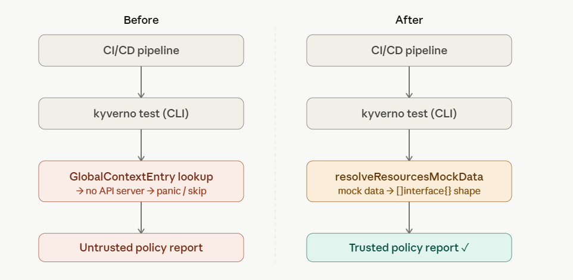
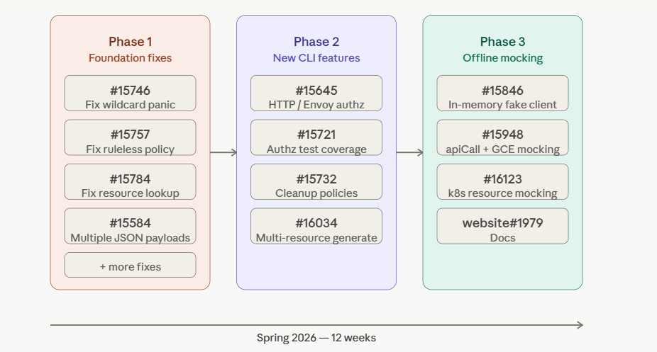

Kyverno is a Kubernetes-native policy engine that validates, mutates, and generates resources before workloads reach your cluster, enforcing security and compliance rules as code, without requiring a separate policy language. Enterprise teams running Kyverno policies in production face a specific, painful problem. Their policies use GlobalContextEntry references — at evaluation time, the engine looks up live Kubernetes resources to make decisions. In a real cluster, this works perfectly. In CI/CD, without a live API server, the CLI has nowhere to resolve those lookups. Tests panic. Rules are silently skipped. Policy reports show results that bear no relationship to what will actually happen in production. This was not a theoretical gap. It was the documented, open state of the Kyverno CLI at the start of 2026. And closing it was the problem I was handed as a Spring 2026 LFX Mentee.

---

## Week One: The Codebase Wins

I am a final-year Computer Engineering undergraduate. When I was selected under the Unified CLI project ([#15264](https://github.com/kyverno/kyverno/issues/15264)), mentored by Shuting Zhao and Frank Jogeleit, I understood the problem clearly enough on paper. What I did not understand was what it would feel like to open `policy_processor.go` for the first time — thousands of lines of Go handling dynamic clients, REST mappers, CEL evaluation engines, and fake discovery clients — and realize that every single one of those systems was involved in the problem I needed to solve. My first instinct was to ask for help immediately. Instead, I spent the entire first week only reading CLI test fixtures. If I couldn't understand the engine yet, I could at least understand what the engine was expected to produce. That worked. It also taught me my most important lesson for the whole mentorship: when you ask a senior maintainer for help, don't ask "how does this work?" Ask "I traced this to `resolveResource()` — is this where the offline RESTMapping fails for MutatingPolicy?" Make it possible for them to unblock you in sixty seconds. That discipline is what gets you taken seriously.

---

## Clearing the Ground

Before any new architecture could be built, the existing CLI had to stop crashing. Over the first four weeks, I worked through a series of bugs that ranged from hard panics to silent failures. The CLI was crashing with `panic: coding error: you must register resource to list kind` when wildcard `mutateExisting` rules triggered `.List()` calls against a fake dynamic client whose scheme was missing `*List` GVK registrations. Modern CEL policy types (`ValidatingPolicy`, `MutatingPolicy`, `GeneratingPolicy`) were having their test results silently swallowed because the engine was applying rule-name matching logic to policy types that don't have named rules by design. And `MutatingPolicy`, `GeneratingPolicy`, and `DeletingPolicy` had all been added to the engine without the surrounding CLI plumbing ever being updated to match `ValidatingPolicy`'s resource lookup behavior — which manifested as six distinct, interlocking bugs in a single PR. None of this was glamorous work. But it was necessary. You cannot build reliable offline infrastructure on top of an engine that panics unpredictably and silently drops results. The foundation had to be solid before the architecture could begin.

---

## The Wrong Approach (And Why It Mattered)

When I finally turned to the core problem — making `kubernetesResource`-backed `GlobalContextEntry` objects work offline — my first instinct was completely wrong. I thought it was a data-passing problem. A user provides a YAML file mocking a Deployment. I unmarshal that YAML into a standard `map[string]interface{}` and pass it into the CEL engine's global context. Simple. It blew up instantly. The moment any policy expression tried to access `object.metadata.namespace` or traverse the resource structure, the CEL engine threw `no such overload`. I spent hours fighting the compiler, trying different type coercions, considering whether I needed to write custom CEL macros just for the CLI path. I went deep into a rabbit hole of trying to force the engine to accept my data shape. That entire approach was wrong — and more importantly, it was dangerous. Modifying the core policy engine to accommodate CLI test files would have risked diverging offline behavior from production behavior. The point of offline testing is that it should be identical to what runs in the cluster. Any special-casing in the engine would have undermined that guarantee entirely.

---

## The Disguise

I stopped looking at the CLI and started looking at the Kubernetes informer cache. When Kyverno runs in a real cluster and resolves a `kubernetesResource` lookup, the cache does not return a single JSON object. It always returns a slice of unstructured objects — `[]interface{}`, where each element is a `map[string]interface{}` mirroring `unstructured.Unstructured.Object`. That is the shape the CEL engine and JMESPath projections are built to expect. That is the shape they have always received in production. I was feeding the engine a single object, and it was failing because it expected a list it could iterate over.

The breakthrough was realizing I should not touch the policy engine at all. Instead of forcing the engine to understand my test files, I needed to make my test files look exactly like what the engine had always seen. I built `resolveResourcesMockData`: a translation layer that lives entirely in the CLI. When a user declares mock resources in their `kyverno-test.yaml`, this function uses `runtime.RawExtension` to decode each manifest, forces it into an unstructured map, and wraps the result into an `[]interface{}` slice. By the time the mock data reaches the CEL compilers or the JMESPath projections, its shape is structurally identical to what a live Kubernetes informer cache would have returned. The policy engine has no idea it's running offline. It receives the shape it has always expected, evaluates the policy exactly as it would in production, and produces a result the user can trust. The CLI is not simulating offline testing — it is disguising offline test data as live cluster data, at the precise layer where the distinction stops mattering.

This landed in two PRs: [#15948](https://github.com/kyverno/kyverno/pull/15948), which introduced `apiCallResponses` and `globalContextEntries` fields to `kyverno-test.yaml` along with the HTTP mock infrastructure, and [#16123](https://github.com/kyverno/kyverno/pull/16123), which extended `GlobalContextEntryValue` with `resources` and `resourceFiles` fields specifically for Kubernetes resource-backed entries — completing the offline mock layer end to end.

---

## When the Work Became Real

Partway through the mentorship, a community member posted a public comment on [PR #15846](https://github.com/kyverno/kyverno/pull/15846), the PR that had built the in-memory fake dynamic client enabling cross-resource offline evaluation. He explained that the issue had been blocking his team's offline tests since Kyverno v1.17, and asked whether the fix could be backported to v1.18 because their CI/CD pipelines had an active dependency on it. That comment reframed everything. His team had been working around this gap for multiple release cycles, and my PR was what they were waiting for. The work had crossed from mentorship project to production dependency, and that distinction is the one that actually matters in open source.

---

## What Else I Shipped

The architecture story above is the center of this mentorship, but it didn't happen in isolation. Here is every other contribution from the twelve weeks:

### Foundation Fixes

- Fixed hard CLI panic caused by missing `*List` GVK registrations in the fake dynamic client scheme — [#15746](https://github.com/kyverno/kyverno/pull/15746)
- Fixed silent test result swallowing for ruleless CEL policy types when a rule name was specified in the test manifest — [#15757](https://github.com/kyverno/kyverno/pull/15757)
- Fixed six interlocking resource lookup bugs for `MutatingPolicy`, `GeneratingPolicy`, and `DeletingPolicy`, including a missing `DynamicTypeResolver` in the `DeletingPolicy` CEL compiler — [#15784](https://github.com/kyverno/kyverno/pull/15784)

### New Offline Capabilities

- Built the in-memory fake dynamic client for `kyverno apply`, enabling cross-resource offline evaluation including LIST-style API paths — [#15846](https://github.com/kyverno/kyverno/pull/15846)
- Added `generatedResources` plural field to `TestResultData`, enabling multi-resource verification for ruleless `GeneratingPolicy` tests — [#16034](https://github.com/kyverno/kyverno/pull/16034)
- Added `CleanupPolicy` and `ClusterCleanupPolicy` support to `kyverno apply`, enabling dry-run policy reports without touching the Kubernetes delete API — [#15732](https://github.com/kyverno/kyverno/pull/15732)

### New CLI Flags and Policy Type Support

- Added `--http-payload` and `--envoy-payload` flags to `kyverno apply`, enabling offline testing of HTTP and Envoy authorization policies — [#15645](https://github.com/kyverno/kyverno/pull/15645)
- Added processor-level unit tests achieving 100% patch coverage for HTTP and Envoy authz evaluation paths — [#15721](https://github.com/kyverno/kyverno/pull/15721)
- Added `jsonPayloads` array field to the CLI test manifest, eliminating test file duplication for multi-payload scenarios, with full backward compatibility — [#15584](https://github.com/kyverno/kyverno/pull/15584)

### Documentation

- Documented offline mock and cross-resource testing capabilities on the Kyverno website — [website#1979](https://github.com/kyverno/website/pull/1979)

---

## What I Would Tell Someone Starting Out

Stop trying to understand the whole repository. You will never fully comprehend a production-grade CNCF codebase in your first month, and trying to before writing a single line will paralyze you. Find one broken thing — a panic, a silent failure, a missing flag — and become the domain expert of that one specific function. That depth compounds quickly and earns you the trust to take on larger problems. Apply to LFX if the project genuinely interests you and fits your current skillset. The program works when you treat it not as a learning exercise, but as real engineering work with real stakes, because that is exactly what it is.

_Thank you to my mentors, the Kyverno community, and the Linux Foundation for this incredible opportunity._

---

## Getting Involved

- [Kyverno Documentation](https://kyverno.io/docs/)
- [Kyverno Slack Community](https://slack.k8s.io/#kyverno)
- [Kyverno Weekly Community Meetings](https://kyverno.io/community/)
- [LFX Mentorship Program](https://mentorship.lfx.linuxfoundation.org/)
- [CNCF Slack](https://communityinviter.com/apps/cloud-native/cncf)
