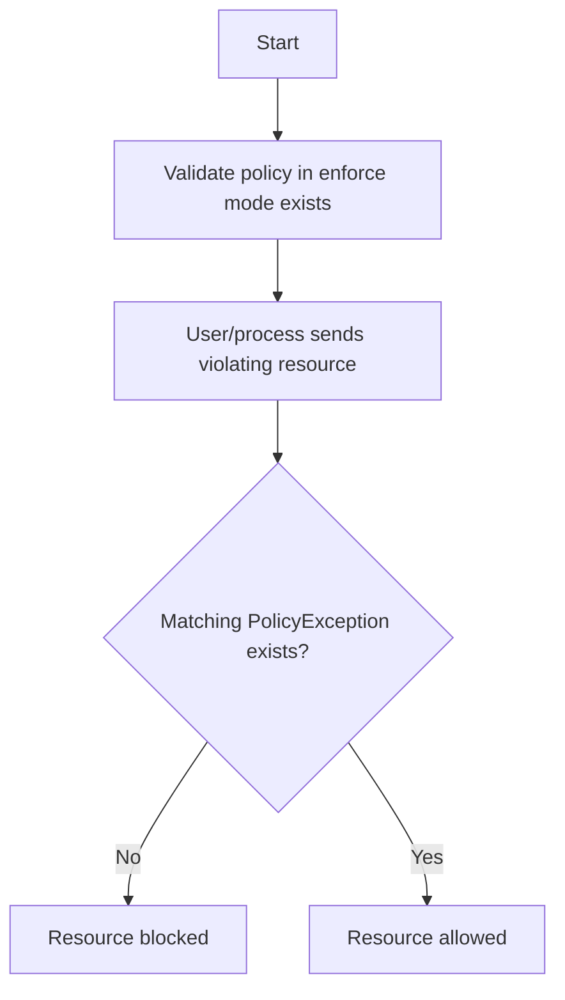

:::caution[Warning]
PolicyExceptions are disabled by default. To enable them, set the `enablePolicyException` flag to `true`. When enabling PolicyExceptions, you must also specify which namespaces they can be used in by setting the `exceptionNamespace` flag.
For more information, see [Container Flags](/docs/installation/customization#container-flags).
:::

Although Kyverno policies contain multiple methods to provide fine-grained control as to which resources they act upon in the form of [`match`/`exclude` blocks](/docs/policy-types/cluster-policy/match-exclude#match-statements), [preconditions](/docs/policy-types/cluster-policy/preconditions) at multiple hierarchies, [anchors](/docs/policy-types/cluster-policy/validate#anchors), and more, all these mechanisms have in common that the resources which they are intended to exclude must occur in the same rule definition. This may be limiting in situations where policies may not be directly editable, or doing so imposes an operational burden.

For example, in organizations where multiple teams must interact with the same cluster, a team responsible for policy authoring and administration may not be the same team responsible for submission of resources. In these cases, it can be advantageous to decouple the policy definition from certain exclusions. Additionally, there are often times where an organization or team must allow certain exceptions which would violate otherwise valid rules but on a one-time basis if the risks are known and acceptable.

Imagine a validate policy exists in `Enforce` mode which mandates all Pods must not mount host namespaces. A separate team has a legitimate need to run a specific tool in this cluster for a limited time which violates this policy. Normally, the policy would block such a "bad" Pod if the policy was not previously altered in such a way to allow said Pod to run. Rather than making adjustments to the policy, an exception may be granted. Both of these examples are use cases for a **PolicyException** resource described below.

A `PolicyException` is a Namespaced Custom Resource which allows a resource(s) to be allowed past a given policy and rule combination. It can be used to exempt any resource from any Kyverno rule type although it is primarily intended for use with validate rules. A PolicyException encapsulates the familiar `match`/`exclude` statements used in `Policy` and `ClusterPolicy` resources but adds an `exceptions{}` object to select the policy and rule name(s) used to form the exception. A `conditions{}` block (optional) uses common expressions similar to those found in [preconditions](/docs/policy-types/cluster-policy/preconditions) and [deny rules](/docs/policy-types/cluster-policy/validate#deny-rules) to query the contents of the selected resources in order to refine the selection process. The logical flow of how a PolicyException works in tandem with a validate policy is depicted below.



An example set of resources is shown below.

A ClusterPolicy exists containing a single validate rule in `Enforce` mode which requires all Pods must not use any host namespaces via the fields `hostPID`, `hostIPC`, or `hostNetwork`. If any of these fields are defined, they must be set to a value of `false`.

```yaml
apiVersion: kyverno.io/v2beta1
kind: ClusterPolicy
metadata:
  name: disallow-host-namespaces
spec:
  background: false
  rules:
    - name: host-namespaces
      match:
        any:
          - resources:
              kinds:
                - Pod
      validate:
        failureAction: Enforce
        message: >-
          Sharing the host namespaces is disallowed. The fields spec.hostNetwork,
          spec.hostIPC, and spec.hostPID must be unset or set to `false`.
        pattern:
          spec:
            =(hostPID): 'false'
            =(hostIPC): 'false'
            =(hostNetwork): 'false'
```

A cluster administrator wishes to grant an exception to a Pod or Deployment named `important-tool` which will be created in the `delta` Namespace. A PolicyException resource is created which specifies the policy name and rule name which should be bypassed as well as the resource kind, Namespace, and name which may bypass it.

:::note[Note]
Auto-generated rules for Pod controllers must be specified along with the Pod controller requesting exception, if applicable. Since Kyverno's auto-generated rules are additive in nature, when specifying specific resource names of Pod controllers, it may be necessary to use a wildcard (`*`) to allow the Pods emitted from those controllers to be exempted as components of the Pod name include ReplicaSet hash and Pod hash.
:::

```yaml
apiVersion: kyverno.io/v2
kind: PolicyException
metadata:
  name: delta-exception
  namespace: delta
spec:
  exceptions:
    - policyName: disallow-host-namespaces
      ruleNames:
        - host-namespaces
        - autogen-host-namespaces
  match:
    any:
      - resources:
          kinds:
            - Pod
            - Deployment
          namespaces:
            - delta
          names:
            - important-tool*
  conditions:
    any:
      - key: "{{ request.object.metadata.labels.app || '' }}"
        operator: Equals
        value: busybox
```

A Deployment matching the characteristics defined in the PolicyException, shown below, will be allowed creation even though it technically violates the rule's definition.

```yaml
apiVersion: apps/v1
kind: Deployment
metadata:
  name: important-tool
  namespace: delta
  labels:
    app: busybox
spec:
  replicas: 1
  selector:
    matchLabels:
      app: busybox
  template:
    metadata:
      labels:
        app: busybox
    spec:
      hostIPC: true
      containers:
        - image: busybox:1.35
          name: busybox
          command: ['sleep', '1d']
```

PolicyExceptions are always Namespaced yet may provide an exception for a cluster-scoped resource as well. There is no correlation between the Namespace in which the PolicyException exists and the Namespace where resources may be excepted.

Exceptions against a ClusterPolicy and those against a (Namespaced) Policy can be disambiguated by specifying the value of the `exceptions[].policyName` field in the format `<namespace>/<policy-name>`.

```yaml
exceptions:
  - policyName: team-a/disallow-host-namespaces
    ruleNames:
      - host-namespaces
```

PolicyExceptions also support background scanning, enabled by default. An exception which either explicitly defines `spec.background=true` or does not define the field at all, will influence [Policy Reports](/docs/guides/reports) when the exception is processed, allowing report results to change from a `Fail` to a `Skip` result. When background scans are enabled, PolicyExceptions forbid matching on the same types of fields as those forbidden by validate rules including Roles, ClusterRoles, and user information.

Wildcards (`"*"`) are supported in the value of the `ruleNames[]` field allowing exception from any/all rules in the policy without having to name them explicitly.

Since PolicyExceptions are just another Custom Resource, their use can and should be controlled by a number of different mechanisms to ensure their creation in a cluster is authorized including:

- Kubernetes RBAC
- Specific Namespace for PolicyExceptions (see [Container Flags](/docs/installation/customization#container-flags))
- Existing GitOps governance processes
- [Kyverno validate rules](/docs/policy-types/cluster-policy/validate)
- [YAML manifest validation](/docs/policy-types/cluster-policy/validate#manifest-validation)

PolicyExceptions may be subjected to Kyverno validate policies which can be used to provide additional guardrails around how they may be crafted. For example, it is considered a best practice to only allow very narrow exceptions to a much broader rule. Given the case shown earlier, only a Pod or Deployment with the name `important-tool` would be allowed by the exception, not any Pod or Deployment. Kyverno policy can help ensure, both in the cluster and in a CI/CD process via the [CLI](/docs/subprojects/kyverno-cli), that PolicyExceptions conform to your design standards. Below is an example of a sample policy to illustrate how a Kyverno validate rule ensure that a specific name must be used when creating an exception. For other samples, see the [policy library](/policies/).

```yaml
apiVersion: kyverno.io/v2beta1
kind: ClusterPolicy
metadata:
  name: policy-for-exceptions
spec:
  background: false
  rules:
    - name: require-match-name
      match:
        any:
          - resources:
              kinds:
                - PolicyException
      validate:
        failureAction: Enforce
        message: >-
          An exception must explicitly specify a name for a resource match.
        pattern:
          spec:
            match:
              =(any):
                - resources:
                    names: '?*'
              =(all):
                - resources:
                    names: '?*'
```

## Pod Security Exemptions

Kyverno policies can be used to apply Pod Security Standards profiles and controls via the [validate.podSecurity](/docs/policy-types/cluster-policy/validate#pod-security) subrule. However, there are cases where certain Pods need to be exempted from these policies. For example, a Pod may need to run as `root` or require privileged access. In such cases, a PolicyException can be used to define an exemption for the Pod through the `podSecurity{}` block. It can be used to define controls that are exempted from the policy.

Given the following policy that enforces the latest version of the Pod Security Standards restricted profile in a single rule across the entire cluster.

```yaml
apiVersion: kyverno.io/v1
kind: ClusterPolicy
metadata:
  name: psa
spec:
  background: true
  rules:
    - name: restricted
      match:
        any:
          - resources:
              kinds:
                - Pod
      validate:
        failureAction: Enforce
        podSecurity:
          level: restricted
          version: latest
```

In this use case, all Pods in the `delta` Namespace need to run as a root. A PolicyException can be used to exempt all Pods whose Namespace is `delta` from the policy by excluding the `runAsNonRoot` control.

```yaml
apiVersion: kyverno.io/v2
kind: PolicyException
metadata:
  name: pod-security-exception
  namespace: policy-exception-ns
spec:
  exceptions:
    - policyName: psa
      ruleNames:
        - restricted
  match:
    any:
      - resources:
          namespaces:
            - delta
  podSecurity:
    - controlName: 'Running as Non-root'
```

The following Pod satisfies all controls in the restricted profile except the `Running as Non-root` control but it matches the exception. Hence, it will be successfully created.

```yaml
apiVersion: v1
kind: Pod
metadata:
  name: nginx-pod
  namespace: delta
spec:
  containers:
    - name: nginx
      image: nginx
      args:
        - sleep
        - 1d
      securityContext:
        seccompProfile:
          type: RuntimeDefault
        runAsNonRoot: false
        allowPrivilegeEscalation: false
        capabilities:
          drop:
            - ALL
```

PolicyExceptions `podSecurity{}` block has the same functionality as the [validate.podSecurity.exclude](/docs/policy-types/cluster-policy/validate#exemptions) block in the policy itself. They can be used to exempt controls that can only be defined in the container level fields.

For example, the following PolicyException exempts the containers running either the `nginx` or `redis` image from following the Capabilities control.

```yaml
apiVersion: kyverno.io/v2
kind: PolicyException
metadata:
  name: pod-security-exception
  namespace: policy-exception-ns
spec:
  exceptions:
    - policyName: psa
      ruleNames:
        - restricted
  match:
    any:
      - resources:
          namespaces:
            - delta
  podSecurity:
    - controlName: Capabilities
      images:
        - nginx*
        - redis*
```

There might be a case where it is required to have specific values for the controls in the PodSecurity profile. In such cases, the `podSecurity.restrictedField` field can be used to define these values for the controls that are exempted from the policy.

For example, service meshes like Istio and Linkerd employ an `initContainer` that requires some privileges which are very often problematic in security-conscious clusters. Minimally, these initContainers must add two [Linux capabilities](https://man7.org/linux/man-pages/man7/capabilities.7.html) which allow them to make modifications to the networking stack: `NET_ADMIN` and `NET_RAW`. These initContainers may go even further by running as a root user, something which is a big no-no in the world of containers.

In this case, the `podSecurity.restrictedField` can be used to enforce the entire baseline profile of the Pod Security Standards but only exclude Istio's and Linkerd's images from specifically the initContainers list.

The following PolicyException grants an exemption to the `initContainers` that use Istio or Linkerd images, allowing them to bypass the `Capabilities` control. This is achieved by permitting the values of `NET_ADMIN` and `NET_RAW` in the `securityContext.capabilities.add` field.

```yaml
apiVersion: kyverno.io/v2
kind: PolicyException
metadata:
  name: pod-security-exception
  namespace: policy-exception-ns
spec:
  exceptions:
    - policyName: psa
      ruleNames:
        - baseline
  match:
    any:
      - resources:
          kinds:
            - Pod
  podSecurity:
    - controlName: Capabilities
      images:
        - '*/istio/proxyv2*'
        - '*/linkerd/proxy-init*'
      restrictedField: spec.initContainers[*].securityContext.capabilities.add
      values:
        - NET_ADMIN
        - NET_RAW
```

The following Pod meets all requirements outlined in the baseline profile, except the `Capabilities` control in the `initContainer`. However, it matches the exception that permits the configuration of `spec.initContainers[*].securityContext.capabilities.add` to include `NET_ADMIN` and `NET_RAW`. Hence, it will be successfully created.

```yaml
apiVersion: v1
kind: Pod
metadata:
  name: istio-pod
spec:
  initContainers:
    - name: istio-init
      image: docker.io/istio/proxyv2:1.20.2
      args:
        - istio-iptables
        - -p
        - '15001'
        - -z
        - '15006'
        - -u
        - '1337'
        - -m
        - REDIRECT
        - -i
        - '*'
        - -x
        - ''
        - -b
        - '*'
        - -d
        - 15090,15021,15020
        - --log_output_level=default:info
      securityContext:
        allowPrivilegeEscalation: false
        capabilities:
          add:
            - NET_ADMIN
            - NET_RAW
          drop:
            - ALL
        privileged: false
        readOnlyRootFilesystem: false
        runAsGroup: 0
        runAsNonRoot: false
        runAsUser: 0
  containers:
    - name: busybox
      image: busybox:1.35
      args:
        - sleep
        - infinity
```

The following Pod meets all requirements outlined in the baseline profile, except the `Capabilities` control in the `initContainer` and it matches the exception but it sets the `spec.initContainers[*].securityContext.capabilities.add` to `SYS_ADMIN` which isn't an allowed value. Hence, it will be rejected.

```yaml
apiVersion: v1
kind: Pod
metadata:
  name: istio-pod
spec:
  initContainers:
    - name: istio-init
      image: docker.io/istio/proxyv2:1.20.2
      args:
        - istio-iptables
        - -p
        - '15001'
        - -z
        - '15006'
        - -u
        - '1337'
        - -m
        - REDIRECT
        - -i
        - '*'
        - -x
        - ''
        - -b
        - '*'
        - -d
        - 15090,15021,15020
        - --log_output_level=default:info
      securityContext:
        allowPrivilegeEscalation: false
        capabilities:
          add:
            - NET_ADMIN
            - NET_RAW
            - SYS_ADMIN
          drop:
            - ALL
        privileged: false
        readOnlyRootFilesystem: false
        runAsGroup: 0
        runAsNonRoot: false
        runAsUser: 0
  containers:
    - name: busybox
      image: busybox:1.35
      args:
        - sleep
        - infinity
```

### Using PolicyException with (Namespace-)Selectors

Using selectors inside `match` statements (`selector` and `namespaceSelector`) of a PolicyException offers an even more granular approach, for example to exclude the initContainers of Istio.

:::note[Note]
Due to a bug in the past (see [#13941](https://github.com/kyverno/kyverno/issues/13941)), `namespaceSelector` are now fully working since **Kyverno 1.15.2**.
:::

```yaml
apiVersion: kyverno.io/v2
kind: PolicyException
metadata:
  name: pod-security-exception
  namespace: policy-exception-ns
spec:
  exceptions:
    - policyName: psa
      ruleNames:
        - baseline
  match:
    any:
      # Istio Sidecar injection at namespace level
      # https://istio.io/latest/docs/setup/additional-setup/sidecar-injection/#controlling-the-injection-policy
      - resources:
          kinds:
            - Pod
        namespaceSelector:
          matchLabels:
            istio-injection: enabled
      # Sidecar injection can also be controlled on a per-pod basis, by configuring
      # the `sidecar.istio.io/inject` label on a pod
      - resources:
          kinds:
            - Pod
        selector:
          matchLabels:
            sidecar.istio.io/inject: 'true'
  podSecurity:
    - controlName: Capabilities
      images:
        - '*/istio/proxyv2*'
      restrictedField: spec.initContainers[*].securityContext.capabilities.add
      values:
        - NET_ADMIN
        - NET_RAW
```

## PolicyExceptions with CEL Expressions

Since Kyverno 1.14.0, **PolicyExceptions**, introduced in the new group `policies.kyverno.io`, support **CEL expressions** to selectively skip policy enforcement for policy types like `ValidatingPolicy` and `ImageValidatingPolicy` in both **admission** and **background** modes.

- A **CEL expression** under `matchConditions` dynamically matches target resources (e.g., by name, namespace, or labels).
- The `policyRefs` field specifies the **policy name** and **policy kind** being excluded from enforcement.
- If the match condition evaluates to `true`, the referenced rule is **skipped** and logged accordingly in **PolicyReports**.

### Using PolicyException with ValidatingPolicy in Admission Mode

The following `ValidatingPolicy` enforce that all `Deployment` resources must include the label `env=prod`. If this condition is not met, the policy denies the request.

```yaml
apiVersion: policies.kyverno.io/v1
kind: ValidatingPolicy
metadata:
  name: require-prod-label
spec:
  validationActions:
    - Deny
  matchConstraints:
    resourceRules:
      - apiGroups: ['apps']
        apiVersions: ['v1']
        resources: ['deployments']
        operations: ['CREATE', 'UPDATE']
  validations:
    - expression: >-
        has(object.metadata.labels) && object.metadata.labels.env == 'prod'
      messageExpression: "'Deployment must have label env=prod.'"
```

To exclude a specific `Deployment` from the above policy enforcement, a `PolicyException` can be defined. This example uses a CEL expression to match the `Deployment` named `skipped-deployment`, allowing it to bypass the validation.

```yaml
apiVersion: policies.kyverno.io/v1
kind: PolicyException
metadata:
  name: exclude-skipped-deployment
  namespace: default
spec:
  policyRefs:
    - name: require-prod-label
      kind: ValidatingPolicy
  matchConditions:
    - name: skip-by-name
      expression: "object.metadata.name == 'skipped-deployment'"
```

When the exception is triggered during a live admission request, Kyverno logs the decision in a `PolicyReport`. Below is an example showing the policy rule was skipped due to the matching `PolicyException`.

```yaml
apiVersion: wgpolicyk8s.io/v1alpha2
kind: PolicyReport
metadata:
  namespace: default
  labels:
    app.kubernetes.io/managed-by: kyverno
  ownerReferences:
    - apiVersion: apps/v1
      kind: Deployment
      name: skipped-deployment
results:
  - policy: vpol-report-background-sample
    rule: exception
    result: skip
    message: 'rule is skipped due to policy exception: default/exclude-skipped-deployment'
    properties:
      exceptions: exclude-skipped-deployment
      process: admission review
    source: KyvernoValidatingPolicy
    scored: true
scope:
  apiVersion: apps/v1
  kind: Deployment
  name: skipped-deployment
  namespace: default
summary:
  pass: 0
  fail: 0
  warn: 0
  error: 0
  skip: 1
```

#### Interpreting PolicyReport Results from PolicyException

- **result: skip** — indicates the rule was not applied.
- **process: admission review** — confirms the evaluation occurred during a live admission request.
- **exceptions: exclude-skipped-deployment** — references the applied `PolicyException`.

Just like in admission mode, `PolicyException` also functions in background mode and supports other policy type `ImageValidatingPolicy`.

### Using PolicyException with ImageValidatingPolicy in Background Mode

In this example, a Pod named `skipped-pod` meets the match criteria of the policy. It is located in the default namespace, includes the label `prod: true`, and references an unsigned image from ghcr.io. as result,this image should fail the background policy evaluation due to missing or invalid attestations and signatures.

```yaml
apiVersion: v1
kind: Pod
metadata:
  name: skipped-pod
  namespace: default
  labels:
    prod: 'true'
spec:
  containers:
    - name: nginx
      image: 'ghcr.io/kyverno/test-verify-image:unsigned'
```

The `ImageValidatingPolicy` shown below is configured to run only during background scans, not during admission. It targets Pod resources have the label `prod: true`. When such a resource is encountered, the policy performs three layers of validation: it verifies the image signature using a provided notary certificate, checks for the presence of an SBOM attestation of type `CycloneDX`, and confirms that the payload format matches the expected structure.

```yaml
apiVersion: policies.kyverno.io/v1
kind: ImageValidatingPolicy
metadata:
  name: ivpol-sample
spec:
  webhookConfiguration:
    timeoutSeconds: 20
  failurePolicy: Ignore
  evaluation:
    admission:
      enabled: false
    background:
      enabled: true
  validationActions:
    - Audit
  matchConstraints:
    resourceRules:
      - apiGroups: ['']
        apiVersions: ['v1']
        operations: ['CREATE']
        resources: ['pods']
  matchConditions:
    - name: 'check-prod-label'
      expression: >-
        has(object.metadata.labels) && has(object.metadata.labels.prod) && object.metadata.labels.prod == 'true'
  matchImageReferences:
    - glob: ghcr.io/*
  attestors:
    - name: notary
      notary:
        certs:
          value: |-
            -----BEGIN CERTIFICATE-----
            MIIDTTCCAjWgAwIBAgIJAPI+zAzn4s0xMA0GCSqGSIb3DQEBCwUAMEwxCzAJB
            ...
            -----END CERTIFICATE-----
  attestations:
    - name: sbom
      referrer:
        type: sbom/cyclone-dx
  validations:
    - expression: >-
        images.containers.map(image, verifyImageSignatures(image, [attestors.notary])).all(e, e > 0)
      message: failed to verify image with notary cert
    - expression: >-
        images.containers.map(image, verifyAttestationSignatures(image, attestations.sbom, [attestors.notary])).all(e, e > 0)
      message: failed to verify attestation with notary cert
    - expression: >-
        images.containers.map(image, extractPayload(image, attestations.sbom).bomFormat == 'CycloneDX').all(e, e)
      message: sbom is not a cyclone dx sbom
```

This `PolicyException` is defined to exempt this pod from enforcement. The exception uses a CEL `expression—object.metadata.name == 'skipped-pod'`to identify the specific resource. It links to the `ImageValidatingPolicy` named `ivpol-sample`, and when the reports controller processes the pod, it detects that the exception applies. As a result, none of the image validation rules are executed for this resource.

```yaml
apiVersion: policies.kyverno.io/v1
kind: PolicyException
metadata:
  name: check-name
spec:
  policyRefs:
    - name: ivpol-sample
      kind: ImageValidatingPolicy
  matchConditions:
    - name: 'check-name'
      expression: "object.metadata.name == 'skipped-pod'"
```

Kyverno reports controller evaluates the pod as a result of [background scan](/docs/guides/reports). It detects that the resource matches the `PolicyException` and Kyverno logs the decision in a `PolicyReport`

```yaml
apiVersion: wgpolicyk8s.io/v1alpha2
kind: PolicyReport
metadata:
  namespace: default
  labels:
    app.kubernetes.io/managed-by: kyverno
  ownerReferences:
    - apiVersion: v1
      kind: Pod
      name: skipped-pod
results:
  - policy: ivpol-sample
    rule: exception
    result: skip
    message: 'rule is skipped due to policy exception: '
    properties:
      exceptions: check-name
      process: background scan
    source: KyvernoImageValidatingPolicy
    scored: true
scope:
  apiVersion: v1
  kind: Pod
  name: skipped-pod
  namespace: default
summary:
  pass: 0
  fail: 0
  warn: 0
  error: 0
  skip: 1
```

#### Interpreting PolicyReport Results from PolicyException

- **result: skip** — indicates the rule was not applied.
- **process: background scan** — confirms the evaluation occurred during a background policy check.
- **exceptions: check-name** — references the applied `PolicyException`.

This enables fine-grained, declarative exemptions without modifying the core policy logic, keeping your security posture strong while allowing flexibility for exceptional cases.

### Using PolicyException with GeneratingPolicy

`PolicyException` can also be used to selectively skip `GeneratingPolicy`. This is useful for preventing resource generation in specific contexts, such as certain namespaces or for resources with particular labels, without altering the base policy.

The following `GeneratingPolicy` is designed to automatically create a ConfigMap named `zk-kafka-address` in any newly created Namespace.

```yaml
apiVersion: policies.kyverno.io/v1
kind: GeneratingPolicy
metadata:
  name: generate-configmap
spec:
  matchConstraints:
    resourceRules:
      - apiGroups: ['']
        apiVersions: ['v1']
        operations: ['CREATE', 'UPDATE']
        resources: ['namespaces']
  variables:
    - name: nsName
      expression: 'object.metadata.name'
    - name: configmap
      expression: >-
        [
          {
            "kind": dyn("ConfigMap"),
            "apiVersion": dyn("v1"),
            "metadata": dyn({
              "name": "zk-kafka-address",
              "namespace": string(variables.nsName),
            }),
            "data": dyn({
              "KAFKA_ADDRESS": "192.168.10.13:9092,192.168.10.14:9092,192.168.10.15:9092",
              "ZK_ADDRESS": "192.168.10.10:2181,192.168.10.11:2181,192.168.10.12:2181"
            })
          }
        ]
  generate:
    - expression: generator.Apply(variables.nsName, variables.configmap)
```

To prevent this `ConfigMap` from being created in a specific namespace (e.g., a "testing" namespace), we can define a `PolicyException`. This exception uses a CEL expression to match any Namespace with the name `testing` and skips the `generate-configmap` policy for it.

```yaml
apiVersion: policies.kyverno.io/v1
kind: PolicyException
metadata:
  name: exclude-namespace-by-name
spec:
  policyRefs:
    - name: generate-configmap
      kind: GeneratingPolicy
  matchConditions:
    - name: 'check-namespace-name'
      expression: "object.metadata.name == 'testing'"
```

When three namespaces—`testing`, `production`, and `staging`—are created, the `GeneratingPolicy` is triggered for each.

```yaml
apiVersion: v1
kind: Namespace
metadata:
  name: testing
---
apiVersion: v1
kind: Namespace
metadata:
  name: production
---
apiVersion: v1
kind: Namespace
metadata:
  name: staging
```

However, the `PolicyException` matches the `testing` namespace, causing the `GeneratingPolicy` to be skipped. As a result, the `zk-kafka-address` ConfigMap is only created in the `production` and `staging` namespaces. The resulting `ConfigMaps` are shown below; note that no `ConfigMap` was created for the `testing` namespace.

```yaml
apiVersion: v1
data:
  KAFKA_ADDRESS: 192.168.10.13:9092,192.168.10.14:9092,192.168.10.15:9092
  ZK_ADDRESS: 192.168.10.10:2181,192.168.10.11:2181,192.168.10.12:2181
kind: ConfigMap
metadata:
  name: zk-kafka-address
  namespace: staging
---
apiVersion: v1
data:
  KAFKA_ADDRESS: 192.168.10.13:9092,192.168.10.14:9092,192.168.10.15:9092
  ZK_ADDRESS: 192.168.10.10:2181,192.168.10.11:2181,192.168.10.12:2181
kind: ConfigMap
metadata:
  name: zk-kafka-address
  namespace: production
```

When the namespaces are created, the Kyverno admission controller queues the work by creating an intermediate object called an `UpdateRequest`. The background controller then processes these `UpdateRequests` to perform the final resource generation. It successfully creates the `ConfigMap` in the `production` and `staging` namespaces. However, due to the matching `PolicyException`, the controller skips the generation step for the `testing` namespace. The reports controller then creates a `ClusterPolicyReport` for each event, showing a `pass` result for the successful generation in the `production` and `staging` namespaces and a `skip` result for the `testing` namespace, correctly identifying the applied exception.

```yaml
apiVersion: wgpolicyk8s.io/v1alpha2
kind: ClusterPolicyReport
metadata:
  labels:
    app.kubernetes.io/managed-by: kyverno
  ownerReferences:
    - apiVersion: v1
      kind: Namespace
      name: production
results:
  - message: policy evaluated successfully
    policy: generate-configmap
    properties:
      generated-resources: /v1, Kind=ConfigMap Name=zk-kafka-address Namespace=production
      process: admission review
    result: pass
    rule: generate-configmap
    scored: true
    source: KyvernoGeneratingPolicy
scope:
  apiVersion: v1
  kind: Namespace
  name: production
summary:
  error: 0
  fail: 0
  pass: 1
  skip: 0
  warn: 0
---
apiVersion: wgpolicyk8s.io/v1alpha2
kind: ClusterPolicyReport
metadata:
  labels:
    app.kubernetes.io/managed-by: kyverno
  ownerReferences:
    - apiVersion: v1
      kind: Namespace
      name: testing
results:
  - policy: generate-configmap
    properties:
      exceptions: exclude-namespace-by-name
      process: admission review
    result: skip
    rule: generate-configmap
    scored: true
    source: KyvernoGeneratingPolicy
scope:
  apiVersion: v1
  kind: Namespace
  name: testing
summary:
  error: 0
  fail: 0
  pass: 0
  skip: 1
  warn: 0
```

### Fine-Grained Policy Exceptions

Kyverno supports narrowly scoped, CEL-aware exceptions so you can permit specific deviations without weakening entire policies. Exceptions can supply structured allowlists into CEL (for example, `exceptions.allowedImages` and `exceptions.allowedValues`) and can also control how results appear in PolicyReports via `reportResult`.

#### Image-based exceptions

This exception allows Pods in the `ci` namespace to use images matching the provided patterns while keeping the “no latest tag” guardrail enforced for all others. The match condition narrows the bypass to a specific team for auditability.

```yaml
apiVersion: policies.kyverno.io/v1beta1
kind: PolicyException
metadata:
  name: allow-ci-latest-images
  namespace: ci
spec:
  policyRefs:
    - name: restrict-image-tag
      kind: ValidatingPolicy
  images:
    - 'ghcr.io/kyverno/*:latest'
  matchConditions:
    - expression: "has(object.metadata.labels.team) && object.metadata.labels.team == 'platform'"
```

The following `ValidatingPolicy` references `exceptions.allowedImages` to skip validation checks for whitelisted image(s).

```yaml
apiVersion: policies.kyverno.io/v1beta1
kind: ValidatingPolicy
metadata:
  name: restrict-image-tag
spec:
  rules:
    - name: broker-config
      matchConstraints:
        resourceRules:
          - apiGroups: [apps]
            apiVersions: [v1]
            operations: [CREATE, UPDATE]
            resources: [pods]
      validations:
        - message: 'Containers must not allow privilege escalation unless they are in the allowed images list.'
          expression: >-
            object.spec.containers.all(container,
              string(container.image) in exceptions.allowedImages ||
              (
                has(container.securityContext) &&
                has(container.securityContext.allowPrivilegeEscalation) &&
                container.securityContext.allowPrivilegeEscalation == false
              )
            )
```

#### Value-based exceptions

This exception supplies a list of values via `allowedValues` that a CEL validation may accept for a constrained set of targets so teams can proceed without weakening the entire policy.

```yaml
apiVersion: policies.kyverno.io/v1beta1
kind: PolicyException
metadata:
  name: allow-debug-annotation
  namespace: dev
spec:
  policyRefs:
    - name: check-security-context
      kind: ValidatingPolicy
  allowedValues:
    - 'debug-mode-temporary'
  matchConditions:
    - expression: "object.metadata.name.startsWith('experiments-')"
```

Here’s the policy leveraging the above allowed values. It denies resources unless the annotation/capability value is present in `exceptions.allowedValues`.

```yaml
apiVersion: policies.kyverno.io/v1beta1
kind: ValidatingPolicy
metadata:
  name: check-security-context
spec:
  matchConstraints:
    resourceRules:
      - apiGroups: [apps]
        apiVersions: [v1]
        operations: [CREATE, UPDATE]
        resources: [deployments]
  variables:
    - name: allowedCapabilities
      expression: "['AUDIT_WRITE','CHOWN','DAC_OVERRIDE','FOWNER','FSETID','KILL','MKNOD','NET_BIND_SERVICE','SETFCAP','SETGID','SETPCAP','SETUID','SYS_CHROOT']"
  validations:
    - expression: >-
        object.spec.containers.all(container,
          container.?securityContext.?capabilities.?add.orValue([]).all(capability,
            capability in exceptions.allowedValues ||
            capability in variables.allowedCapabilities))
      message: >-
        Any capabilities added beyond the allowed list (AUDIT_WRITE, CHOWN, DAC_OVERRIDE, FOWNER,
        FSETID, KILL, MKNOD, NET_BIND_SERVICE, SETFCAP, SETGID, SETPCAP, SETUID, SYS_CHROOT)
        are disallowed.
```

#### Configurable reporting status

Use `reportResult` in a `PolicyException` to control how matches appear in PolicyReports. Setting `reportResult: pass` marks exceptions as “pass” instead of the default “skip”.

```yaml
apiVersion: policies.kyverno.io/v1beta1
kind: PolicyException
metadata:
  name: exclude-skipped-deployment-2
  labels:
    polex.kyverno.io/priority: '0.2'
spec:
  policyRefs:
    - name: 'with-multiple-exceptions'
      kind: ValidatingPolicy
  matchConditions:
    - name: 'check-name'
      expression: "object.metadata.name == 'skipped-deployment'"
  reportResult: pass
```

#### Interpreting PolicyReport Results

- The report for the `production` namespace shows a `result: pass`, and the `properties.generated-resources` field confirms that the `ConfigMap` was successfully created.

- Conversely, the report for the `testing` namespace shows a `result: skip`. The `properties.exceptions` field references `exclude-namespace-by-name`, indicating that the `PolicyException` was successfully applied, and no resource was generated.
