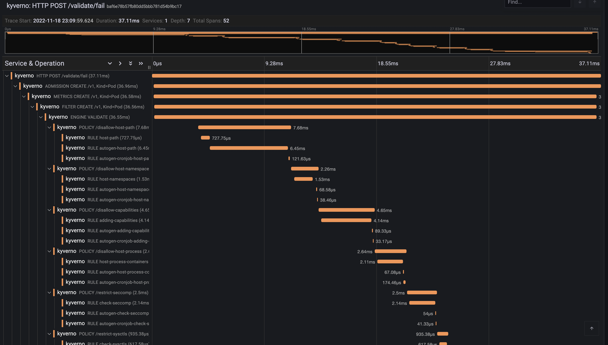

## Introduction

Tracing is a method of tracking application requests as they are processed by the application software. When a software is instrumented it produces traces, traces are made of spans hierarchically organised to form a trace. Spans are defined by a start and end time, eventually a parent span, and a number of properties that define the span characteristics (client spans, server spans, etc...).

Tracing is not limited to a single application, as the tracing context can be transmitted on the wire it is possible to collect spans from multiple applications and reconcile them in a single trace.

In the context of Kyverno, requests are usually sent by the Kubernetes API server to the Kyverno service during the admission phase. Kyverno receives and processes admission requests according to the configured policies. Every step in the admission pipeline and during the engine policy processing will produce spans. All clients (Kubernetes client, registry client and cosign client) have also been instrumented to produce client spans and transmit the tracing context on the wire.

## Trace example

Below is a trace for a validating admission request.



## Installation and Setup

Tracing requires a backend where Kyverno will send traces. Kyverno uses OpenTelemetry for instrumentation and supports various backends like [Jaeger](https://www.jaegertracing.io/), [Grafana Tempo](https://grafana.com/oss/tempo/) or [Datadog](https://docs.datadoghq.com/tracing/) to name a few.

When you install Kyverno via Helm, you need to set a couple of values to enable tracing.

```shell
$ values.yaml

# ...

# Enable tracing in the admission controller
admissionController:
  tracing:
    # -- Enable tracing
    enabled: true
    # -- Traces receiver address
    address: <backend url>
    # -- Traces receiver port
    port: 4317

# ...

# Enable tracing in the background controller
backgroundController:
  tracing:
    # -- Enable tracing
    enabled: true
    # -- Traces receiver address
    address: <backend url>
    # -- Traces receiver port
    port: 4317

# ...

# Enable tracing in the cleanup controller
cleanupController:
  tracing:
    # -- Enable tracing
    enabled: true
    # -- Traces receiver address
    address: <backend url>
    # -- Traces receiver port
    port: 4317

# ...

# Enable tracing in the reports controller
reportsController:
  tracing:
    # -- Enable tracing
    enabled: true
    # -- Traces receiver address
    address: <backend url>
    # -- Traces receiver port
    port: 4317

# ...
```

Tracing is disabled by default and depending on the backend the associated cost can be significant.

Currently, Kyverno tracing is configured to sample all incoming requests, there's no way to configure the tracing sampler directly in Kyverno. [OpenTelemetry Collector](https://opentelemetry.io/docs/collector/) can be used to take better sampling decision at the cost of a more advanced setup.

## Tracing with Jaeger

This walkthrough shows how to create a local cluster and deploy a number of components, including an [ingress-nginx](https://github.com/kubernetes/ingress-nginx) ingress controller, and [Jaeger](https://www.jaegertracing.io) to store, query and visualise traces.

On the prepared cluster we will deploy Kyverno with tracing enabled and a couple of policies.

Finally we will exercise the Kyverno webhooks by creating a Pod, then we will use Jaeger to find and examine the corresponding trace.

Please note that **this walkthrough uses [kind](https://kind.sigs.k8s.io) to create a local cluster** with a specific label on the control plane node.
This is necessary as we are using an [ingress-nginx](https://github.com/kubernetes/ingress-nginx) deployment specifically crafted to work with kind.
All other components setup should not be kind specific but may require different configuration depending on the target cluster.

### Cluster Setup

In this first step we are going to create a local cluster using [kind](https://kind.sigs.k8s.io).

The created cluster will have two nodes, one master node and one worker node.
Note that the master node maps host ports `80` and `443` to the container node.
If those ports are already in use they can be changed by editing the `hostPort` stanza in the config manifest below.

To create the local cluster, run the following command:

```shell
kind create cluster --config - <<EOF
kind: Cluster
apiVersion: kind.x-k8s.io/v1alpha4
nodes:
  - role: control-plane
    kubeadmConfigPatches:
      - |-
        kind: InitConfiguration
        nodeRegistration:
          kubeletExtraArgs:
            node-labels: "ingress-ready=true"
    extraPortMappings:
      - containerPort: 80
        hostPort: 80
        protocol: TCP
      - containerPort: 443
        hostPort: 443
        protocol: TCP
  - role: worker
EOF
```

### Ingress NGINX Setup

In order to access Grafana from our browser, we need to deploy an ingress controller.

We are going to install [ingress-nginx](https://github.com/kubernetes/ingress-nginx) with the following command:

```shell
kubectl apply -f https://raw.githubusercontent.com/kubernetes/ingress-nginx/main/deploy/static/provider/kind/deploy.yaml
sleep 15
kubectl wait --namespace ingress-nginx --for=condition=ready pod --selector=app.kubernetes.io/component=controller --timeout=90s
```

### Jaeger Setup

[Jaeger](https://www.jaegertracing.io) will allow us to store, search and visualise traces.

Jaeger is made of multiple components and is capable of using multiple storage solutions like Elasticsearch or Cassandra. In this tutorial, we will deploy the all-in-one version of Jaeger and storage will be done in memory.

We can deploy Jaeger using Helm with the following command:

```shell
helm install jaeger --namespace monitoring --create-namespace --wait \
  --repo https://jaegertracing.github.io/helm-charts jaeger \
  --values - <<EOF
storage:
  type: none
provisionDataStore:
  cassandra: false
agent:
  enabled: false
collector:
  enabled: false
query:
  enabled: false
allInOne:
  enabled: true
  ingress:
    enabled: true
    hosts:
      - localhost
EOF
```

At this point, the Jaeger UI should be available at http://localhost.

### Kyverno Setup

We now need to install Kyverno with tracing enabled and pointing to our Jaeger collector.

We can deploy Kyverno using Helm with the following command:

```shell
helm install kyverno --namespace kyverno --create-namespace --wait \
  --repo https://kyverno.github.io/kyverno kyverno \
  --values - <<EOF
admissionController:
  tracing:
    # enable tracing
    enabled: true
    # jaeger backend url
    address: jaeger-collector.monitoring
    # jaeger backend port for opentelemetry traces
    port: 4317

backgroundController:
  tracing:
    # enable tracing
    enabled: true
    # jaeger backend url
    address: jaeger-collector.monitoring
    # jaeger backend port for opentelemetry traces
    port: 4317

cleanupController:
  tracing:
    # enable tracing
    enabled: true
    # jaeger backend url
    address: jaeger-collector.monitoring
    # jaeger backend port for opentelemetry traces
    port: 4317

reportsController:
  tracing:
    # enable tracing
    enabled: true
    # jaeger backend url
    address: jaeger-collector.monitoring
    # jaeger backend port for opentelemetry traces
    port: 4317
EOF
```

### Kyverno policies Setup

Finally we need to deploy some policies in the cluster so that Kyverno can configure admission webhooks accordingly.

We are going to deploy the `kyverno-policies` Helm chart (with the `Baseline` profile of PSS) using the following command:

```shell
helm install kyverno-policies --namespace kyverno --create-namespace --wait \
  --repo https://kyverno.github.io/kyverno kyverno-policies \
  --values - <<EOF
validationFailureAction: Enforce
EOF
```

Note that we are setting `validationFailureAction` to `Enforce` because `Audit`-mode policies are processed asynchronously and will produce a separate trace from the main one (both traces are linked together though, but not with a parent/child relationship).

### Create a Pod and observe the corresponding trace

With everything in place we can exercise the Kyverno admission webhooks by creating a Pod and locating the corresponding trace in Jaeger.

Run the following command to create a Pod:

```shell
kubectl run nginx --image=nginx
```

After that, navigate to the [Jaeger UI](http://localhost) and search for traces with the following criteria:

- Service: `kyverno`, every trace defines a service name and all traces coming from Kyverno will use the `kyverno` service name
- Operation: `ADMISSION POST /validate/fail`, every span defines a span name and root spans created by Kyverno when receiving an admission request have their name computed from the http operation and path (`ADMISSION <HTTP OPERATION> <HTTP PATH>`. The `/validate/fail` path indicates that it's a validating webhook that was configured to fail the admission request in case of error. Fail mode is the default).

The list should show the trace for the previous Pod creation request:


Clicking on the trace will take you to the trace details, showing all spans covered by the Pod admission request:


The trace shows individual spans of all the policies that were just installed, with child spans for every rule that was checked (but not necessarily evaluated). The sum of all spans equals the trace time or the entire time Kyverno spent processing the Pod admission request.

## Tracing with Grafana Tempo

This walkthrough shows how to create a local cluster and deploy a number of components, including an [ingress-nginx](https://github.com/kubernetes/ingress-nginx) ingress controller, [Grafana](https://grafana.com/grafana) and the [Tempo](https://grafana.com/oss/tempo) backend to store traces.

On the prepared cluster we will deploy Kyverno with tracing enabled and a couple of policies.

Finally we will exercise the Kyverno webhooks by creating a Pod, then we will use Grafana to find and examine the corresponding trace.

Please note that **this walkthrough uses [kind](https://kind.sigs.k8s.io) to create a local cluster** with a specific label on the control plane node. This is necessary as we are using an [ingress-nginx](https://github.com/kubernetes/ingress-nginx) deployment specifically crafted to work with kind. All other components setup should not be kind specific but may require different configuration depending on the target cluster.

### Cluster Setup

In this first step we are going to create a local cluster using [kind](https://kind.sigs.k8s.io).

The created cluster will have two nodes, one master node and one worker node. Note that the master node maps host ports `80` and `443` to the container node. If those ports are already in use they can be changed by editing the `hostPort` stanza in the config manifest below.

To create the local cluster, run the following command:

```shell
kind create cluster --config - <<EOF
kind: Cluster
apiVersion: kind.x-k8s.io/v1alpha4
nodes:
  - role: control-plane
    kubeadmConfigPatches:
      - |-
        kind: InitConfiguration
        nodeRegistration:
          kubeletExtraArgs:
            node-labels: "ingress-ready=true"
    extraPortMappings:
      - containerPort: 80
        hostPort: 80
        protocol: TCP
      - containerPort: 443
        hostPort: 443
        protocol: TCP
  - role: worker
EOF
```

### Ingress NGINX Setup

In order to access Grafana from our browser, we need to deploy an ingress controller.

We are going to install [ingress-nginx](https://github.com/kubernetes/ingress-nginx) with the following command:

```shell
kubectl apply -f https://raw.githubusercontent.com/kubernetes/ingress-nginx/main/deploy/static/provider/kind/deploy.yaml
sleep 15
kubectl wait --namespace ingress-nginx --for=condition=ready pod --selector=app.kubernetes.io/component=controller --timeout=90s
```

### Grafana Setup

[Grafana](https://grafana.com/grafana) will allow us to explore, search and examine traces.

We can deploy Grafana using Helm with the following command:

```shell
helm install grafana --namespace monitoring --create-namespace --wait \
  --repo https://grafana.github.io/helm-charts grafana \
  --values - <<EOF
adminPassword: admin
sidecar:
  enableUniqueFilenames: true
  dashboards:
    enabled: true
    searchNamespace: ALL
    provider:
      foldersFromFilesStructure: true
  datasources:
    enabled: true
    searchNamespace: ALL
grafana.ini:
  server:
    root_url: "%(protocol)s://%(domain)s:%(http_port)s/grafana"
    serve_from_sub_path: true
ingress:
  enabled: true
  path: /grafana
  hosts: []
EOF
```

At this point Grafana should be available at http://localhost/grafana (log in with `admin` / `admin`).

### Tempo Setup

[Tempo](https://grafana.com/oss/tempo) is a tracing backend capable of receiving traces in OpenTelemetry format. It is developed and maintained by the Grafana team and integrates very well with it.

We can deploy Tempo using Helm with the following command:

```shell
helm install tempo --namespace monitoring --create-namespace --wait \
  --repo https://grafana.github.io/helm-charts tempo \
  --values - <<EOF
tempo:
  searchEnabled: true
EOF
```

To make Tempo available in Grafana, we need to register it as a Grafana data source:

```shell
kubectl apply -f - <<EOF
apiVersion: v1
kind: ConfigMap
metadata:
  labels:
    grafana_datasource: "1"
  name: tempo-datasource
  namespace: monitoring
data:
  tempo-datasource.yaml: |-
    apiVersion: 1
    datasources:
    - name: Tempo
      type: tempo
      access: proxy
      url: "http://tempo.monitoring:3100"
      version: 1
      isDefault: true
EOF
```

At this point we have a running cluster with Grafana and Tempo backend installed and we can access Grafana using an ingress controller.

### Kyverno Setup

We now need to install Kyverno with tracing enabled and pointing to our Tempo backend.

We can deploy Kyverno using Helm with the following command:

```shell
helm install kyverno --namespace kyverno --create-namespace --wait \
  --repo https://kyverno.github.io/kyverno kyverno \
  --values - <<EOF
admissionController:
  tracing:
    # enable tracing
    enabled: true
    # tempo backend url
    address: tempo.monitoring
    # tempo backend port for opentelemetry traces
    port: 4317

backgroundController:
  tracing:
    # enable tracing
    enabled: true
    # tempo backend url
    address: tempo.monitoring
    # tempo backend port for opentelemetry traces
    port: 4317

cleanupController:
  tracing:
    # enable tracing
    enabled: true
    # tempo backend url
    address: tempo.monitoring
    # tempo backend port for opentelemetry traces
    port: 4317

reportsController:
  tracing:
    # enable tracing
    enabled: true
    # tempo backend url
    address: tempo.monitoring
    # tempo backend port for opentelemetry traces
    port: 4317
EOF
```

### Kyverno policies Setup

Finally we need to deploy some policies in the cluster so that Kyverno can configure admission webhooks accordingly.

We are going to deploy the `kyverno-policies` Helm chart (with the `Baseline` profile of PSS) using the following command:

```shell
helm install kyverno-policies --namespace kyverno --create-namespace --wait \
  --repo https://kyverno.github.io/kyverno kyverno-policies \
  --values - <<EOF
validationFailureAction: Enforce
EOF
```

Note that we are setting `validationFailureAction` to `Enforce` because `Audit`-mode policies are processed asynchronously and will produce a separate trace from the main one (both traces are linked together though, but not with a parent/child relationship).

### Create a Pod and observe the corresponding trace

With everything in place we can exercise the Kyverno admission webhooks by creating a Pod and locating the corresponding trace in Grafana.

Run the following command to create a Pod:

```shell
kubectl run nginx --image=nginx
```

After that, navigate to the [Grafana explore page](http://localhost/grafana/explore), select `Tempo` in the top left drop down list, click on the `Search` tab, and search for traces with the following criteria:

- Service name: `kyverno`, every trace defines a service name and all traces coming from Kyverno will use the `kyverno` service name
- Span name: `ADMISSION POST /validate/fail`, every span defines a span name and root spans created by Kyverno when receiving an admission request have their name computed from the http operation and path (`ADMISSION <HTTP OPERATION> <HTTP PATH>`. The `/validate/fail` path indicates that it's a validating webhook that was configured to fail the admission request in case of error. Fail mode is the default).

The list should show the trace for the previous Pod creation request:


Clicking on the trace will take you to the trace details, showing all spans covered by the Pod admission request:


The trace shows individual spans of all the policies that were just installed, with child spans for every rule that was checked (but not necessarily evaluated). The sum of all spans equals the trace time or the entire time Kyverno spent processing the Pod admission request.
