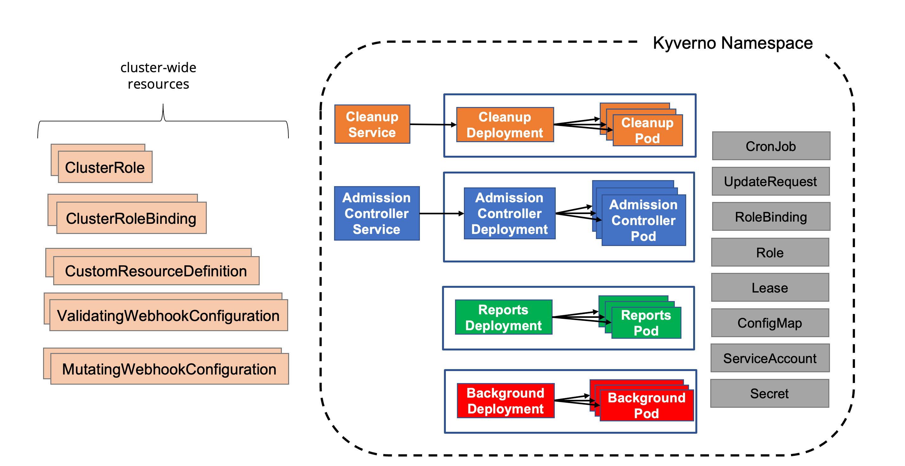

Kyverno provides multiple methods for installation: Helm and YAML manifest. When installing in a production environment, Helm is the recommended and most flexible method as it offers convenient configuration options to satisfy a wide range of customizations. Regardless of the method, Kyverno must always be installed in a dedicated Namespace; it must not be co-located with other applications in existing Namespaces including system Namespaces such as `kube-system`. The Kyverno Namespace should also not be used for deployment of other, unrelated applications and services.

The diagram below shows a typical Kyverno installation featuring all available controllers.


<br/><br/>

A standard Kyverno installation consists of a number of different components, some of which are optional.

- **Deployments**
  - Admission controller (required): The main component of Kyverno which handles webhook callbacks from the API server for verification, mutation, [Policy Exceptions](/docs/guides/exceptions), and the processing engine.
  - Background controller (optional): The component responsible for processing of generate and mutate-existing rules.
  - Reports controller (optional): The component responsible for handling of [Policy Reports](/docs/guides/reports).
  - Cleanup controller (optional): The component responsible for processing of [Cleanup Policies](/docs/policy-types/cleanup-policy).
- **Services**
  - Services needed to receive webhook requests.
  - Services needed for monitoring of metrics.
- **ServiceAccounts**
  - One ServiceAccount per controller to segregate and confine the permissions needed for each controller to operate on the resources for which it is responsible.
- **ConfigMaps**
  - ConfigMap for holding the main Kyverno configuration.
  - ConfigMap for holding the metrics configuration.
- **Secrets**
  - Secrets for webhook registration and authentication with the API server.
- **Roles and Bindings**
  - Roles and ClusterRoles, Bindings and ClusterRoleBindings authorizing the various ServiceAccounts to act on the resources in their scope.
- **Webhooks**
  - ValidatingWebhookConfigurations for receiving both policy and resource validation requests.
  - MutatingWebhookConfigurations for receiving both policy and resource mutating requests.
- **CustomResourceDefinitions**
  - CRDs which define the custom resources corresponding to policies, reports, and their intermediary resources.

## Compatibility Matrix

Kyverno follows the same support policy as the Kubernetes project (N-2 policy) in which the current release and the previous two minor versions are maintained. Although prior versions may work, they are not tested and therefore no guarantees are made as to their full compatibility. The below table shows the compatibility matrix.

| Kyverno Version | Kubernetes Min | Kubernetes Max |
| --------------- | -------------- | -------------- |
| 1.15.x          | 1.30           | 1.33           |
| 1.16.x          | 1.31           | 1.34           |
| 1.17.x          | 1.32           | 1.35           |

**NOTE:** For long term compatibility Support select a [commercially supported Kyverno distribution](https://kyverno.io/support/).

## Helm Chart

The Helm chart is the recommended method of installing Kyverno in a production-grade, highly-available fashion as it provides all the necessary Kubernetes resources and configuration options to meet most production needs including platform-specific controls.

Kyverno can be deployed via a Helm chart--the recommended and preferred method for a production install--which is accessible either through the Kyverno repository or on [Artifact Hub](https://artifacthub.io/). Both generally available and pre-releases are available with Helm.

Choose one of the installation configuration options based upon your environment type and availability needs.

- For a production installation, see below [High Availability](#high-availability-installation) section.
- For a non-production installation, see below [Non-Production Installation](#non-production-installation) section..

### Non-Production Installation

To install Kyverno using Helm in a non-production environment use:

```sh
helm repo add kyverno https://kyverno.github.io/kyverno/
helm repo update
helm install kyverno kyverno/kyverno -n kyverno --create-namespace
```

### High Availability Installation

Use Helm to create a Namespace and install Kyverno in a highly-available configuration.

```sh
helm install kyverno kyverno/kyverno -n kyverno --create-namespace \
--set admissionController.replicas=3 \
--set backgroundController.replicas=2 \
--set cleanupController.replicas=2 \
--set reportsController.replicas=2
```

Since Kyverno is comprised of different controllers where each is contained in separate Kubernetes Deployments, high availability is achieved on a per-controller basis. A default installation of Kyverno provides four separate Deployments each with a single replica. Configure high availability on the controllers where you need the additional availability. Be aware that multiple replicas do not necessarily equate to higher scale or performance across all controllers. Please see the [high availability page](/docs/guides/high-availability) for more complete details.

The Helm chart offers parameters to configure multiple replicas for each controller. For example, a highly-available, complete deployment of Kyverno would consist of the following values.

```yaml
admissionController:
  replicas: 3
backgroundController:
  replicas: 3
cleanupController:
  replicas: 3
reportsController:
  replicas: 3
```

For all of the available values and their defaults, please see the Helm chart [README](https://github.com/kyverno/kyverno/tree/release-1.13/charts/kyverno). You should carefully inspect all available chart values and their defaults to determine what overrides, if any, are necessary to meet the particular needs of your production environment.

:::caution[Note]
All Kyverno installations require the admission controller be among the controllers deployed. For a highly-available installation, at least 2 or more replicas are required. Based on scalability requirements, and cluster topology, additional replicas can be configured for each controller.
:::

By default, the Kyverno Namespace will be excluded using a namespaceSelector configured with the [immutable label](https://kubernetes.io/docs/concepts/overview/working-with-objects/_print/#automatic-labelling) `kubernetes.io/metadata.name`. Additional Namespaces may be excluded by configuring chart values. Both namespaceSelector and objectSelector may be used for exclusions.

See also the [Namespace selectors](/docs/installation/customization#namespace-selectors) section and especially the [Security vs Operability](/docs/installation/installation#security-vs-operability) section.

### Reports Server (Optional)

You can optionally enable the Reports Server as a subchart during installation. This deploys the Reports Server alongside Kyverno, configures Kyverno to use it for policy reports, and includes readiness checks (via `reportsServer.waitForReady` and `reportsServer.readinessTimeout`) to ensure Kyverno waits for the Reports Server to be operational before starting.

To enable it with default settings:

```sh
helm install kyverno kyverno/kyverno -n kyverno --create-namespace --set reportsServer.enabled=true
```

### Platform Specific Settings

When deploying Kyverno to certain Kubernetes platforms such as EKS, AKS, or OpenShift; or when using certain GitOps tools such as ArgoCD, additional configuration options may be needed or recommended. See the [Platform-Specific Notes](/docs/installation/platform-notes) section for additional details.

### Pre-Release (RC) Installations

To install pre-release versions, such as `alpha`, `beta`, and `rc` (release candidates) versions, add the `--devel` switch to Helm:

```sh
helm install kyverno kyverno/kyverno -n kyverno --create-namespace --devel
```

### Pod Security Policies (Optional)

After Kyverno is installed, you may choose to also install the Kyverno [Pod Security Standard policies](/docs/guides/pod-security), an optional chart containing the full set of Kyverno policies which implement the Kubernetes [Pod Security Standards](https://kubernetes.io/docs/concepts/security/pod-security-standards/).

```sh
helm install kyverno-policies kyverno/kyverno-policies -n kyverno
```

## Install Kyverno using YAMLs

Kyverno can also be installed using a single installation manifest, however for production installations the Helm chart is the preferred and recommended method.

Although Kyverno uses release branches, only YAML manifests from a tagged release are supported. Pull from a tagged release to install Kyverno using the YAML manifest.

```sh
kubectl create -f https://github.com/kyverno/kyverno/releases/download/v1.16.2/install.yaml
```

## Install main (latest)

In some cases, you may wish to trial yet unreleased Kyverno code in a quick way. Kyverno provides an experimental installation manifest for these purposes which reflects the current state of the codebase as it is known on the `main` development branch.

:::caution[Warning]
DO NOT use this manifest for anything other than testing or experimental purposes!
:::

```sh
kubectl create -f https://github.com/kyverno/kyverno/raw/main/config/install-latest-testing.yaml
```

## Security vs Operability

For a production installation, Kyverno should be installed in [high availability mode](/docs/installation/installation#high-availability-installation). Regardless of the installation method used for Kyverno, it is important to understand the risks associated with any webhook and how it may impact cluster operations and security especially in production environments. Kyverno configures its resource webhooks by default (but [configurable](/docs/policy-types/cluster-policy/policy-settings)) in [fail closed mode](https://kubernetes.io/docs/reference/access-authn-authz/extensible-admission-controllers/#failure-policy). This means if the API server cannot reach Kyverno in its attempt to send an AdmissionReview request for a resource that matches a policy, the request will fail. For example, a validation policy exists which checks that all Pods must run as non-root. A new Pod creation request is submitted to the API server and the API server cannot reach Kyverno. Because the policy cannot be evaluated, the request to create the Pod will fail. Care must therefore be taken to ensure that Kyverno is always available or else configured appropriately to exclude certain key Namespaces, specifically that of Kyverno's, to ensure it can receive those API requests. There is a tradeoff between security by default and operability regardless of which option is chosen.

The following combination may result in cluster inoperability if the Kyverno Namespace is not excluded:

1. At least one Kyverno rule matching on `Pods` is configured in fail closed mode (the default setting).
2. No Namespace exclusions have been configured for at least the Kyverno Namespace, possibly other key system Namespaces (ex., `kube-system`). This is not the default as of Helm chart version 2.5.0.
3. All Kyverno Pods become unavailable due to a full cluster outage or improper scaling in of Nodes (for example, a cloud PaaS destroying too many Nodes in a node group as part of an auto-scaling operation without first cordoning and draining Pods).

If this combination of events occurs, the only way to recover is to manually delete the ValidatingWebhookConfigurations thereby allowing new Kyverno Pods to start up. Recovery steps are provided in the [troubleshooting section](/docs/guides/troubleshooting#api-server-is-blocked).

:::note[Note]
Kubernetes will not send ValidatingWebhookConfiguration or MutatingWebhookConfiguration objects to admission controllers, so therefore it is not possible to use a Kyverno policy to validate or mutate these objects.
:::

By contrast, these operability concerns can be mitigated by making some security concessions. Specifically, by excluding the Kyverno and other system Namespaces during installation, should the aforementioned failure scenarios occur Kyverno should be able to recover by itself with no manual intervention. This is the default behavior as of the Helm chart version 2.5.0. However, configuring these exclusions means that subsequent policies will not be able to act on resources destined for those Namespaces as the API server has been told not to send AdmissionReview requests for them. Providing controls for those Namespaces, therefore, lies in the hands of the cluster administrator to implement, for example, Kubernetes RBAC to restrict who and what can take place in those excluded Namespaces.

:::note[Note]
Namespaces and/or objects within Namespaces may be excluded in a variety of ways including namespaceSelectors and objectSelectors. The Helm chart provides options for both, but by default the Kyverno Namespace will be excluded.
:::

:::caution[Note]
When using objectSelector, it may be possible for users to spoof the same label key/value used to configure the webhooks should they discover how it is configured, thereby allowing resources to circumvent policy detection. For this reason, a namespaceSelector using the `kubernetes.io/metadata.name` immutable label is recommended.
:::

The choices and their implications are therefore:

1. Do not exclude system Namespaces, including Kyverno's, (not default) during installation resulting in a more secure-by-default posture but potentially requiring manual recovery steps in some outage scenarios.
2. Exclude system Namespaces during installation (default) resulting in easier cluster recovery but potentially requiring other methods to secure those Namespaces, for example with Kubernetes RBAC.

You should choose the best option based upon your risk aversion, needs, and operational practices.

:::note[Note]
If you choose to _not_ exclude Kyverno or system Namespaces/objects and intend to cover them with policies, you may need to modify the Kyverno [resourceFilters](/docs/installation/customization#resource-filters) entry in the [ConfigMap](/docs/installation/customization#configmap-keys) to remove those items.
:::
