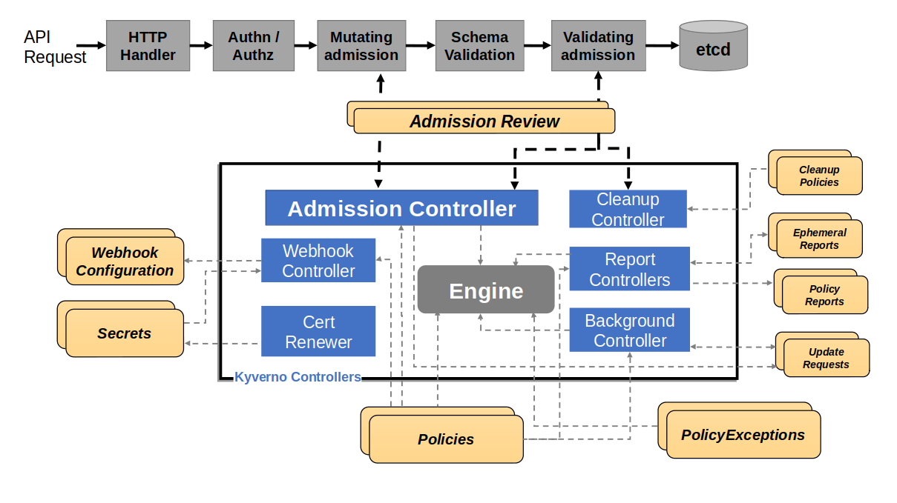

## Kubernetes Controllers

Kyverno runs as a [dynamic admission controller](/docs/guides/admission-controllers), and other optional controllers, in a Kubernetes cluster. Kyverno receives validating and mutating admission webhook HTTP callbacks from the Kubernetes API server and applies matching policies to return results that enforce admission policies or reject requests. Kyverno also perfoms runtime scans on matching resources.

Kyverno policies can match resources using the resource kind, name, label selectors, and much more.

Mutating policies can be written as overlays (similar to [Kustomize](https://kubernetes.io/docs/tasks/manage-kubernetes-objects/kustomization/#bases-and-overlays)) or as a [RFC 6902 JSON Patch](http://jsonpatch.com/). Validating policies also use an overlay style syntax, with support for pattern matching and conditional (if-then-else) processing.

Policy enforcement is captured using Kubernetes events. For requests that are either allowed or existed prior to introduction of a Kyverno policy, Kyverno creates Policy Reports in the cluster which contain a running list of resources matched by a policy, their status, and more.

The diagram below shows the high-level logical architecture of Kyverno.

  

The **Webhook** is the server which handles incoming AdmissionReview requests from the Kubernetes API server and sends them to the **Engine** for processing. It is dynamically configured by the **Webhook Controller** which watches the installed policies and modifies the webhooks to request only the resources matched by those policies. The **Cert Renewer** is responsible for watching and renewing the certificates, stored as Kubernetes Secrets, needed by the webhook. The **Background Controller** handles all generate and mutate-existing policies by reconciling UpdateRequests, an intermediary resource. And the **Report Controllers** handle creation and reconciliation of Policy Reports from their intermediary resources, Admission Reports and Background Scan Reports.

Kyverno also supports high availability. A highly-available installation of Kyverno is one in which the controllers selected for installation are configured to run with multiple replicas. Depending on the controller, the additional replicas may also serve the purpose of increasing the scalability of Kyverno. See the [high availability page](/docs/guides/high-availability) for more details on the various Kyverno controllers, their components, and how availability is handled in each one.

## Command Line Interface (CLI)

Kyverno policies can be applied to clusters or resource files (Kubernetes resource manifests, Terraform JSON plans, Deockerfiles, etc.) using a Command Line Interface (CLI). The policies can be applied to Kubernetes resource manifests

For more details see the [Kyverno CLI](/docs/subprojects/kyverno-cli/) documentation.

## Authorization Server

Kyverno policies can be used for application authorization. It suppports Envoy and HTTP payloads, and can be run as a central service or as a sidecar container.

For more details see the <a href="https://kyverno.github.io/kyverno-authz/latest/" target="_blank" rel="noopener">Kyverno Authz</a> documentation.

## Kyverno SDK

The Kyverno SDK allows building and running Kyverno engines in your own application or service.
